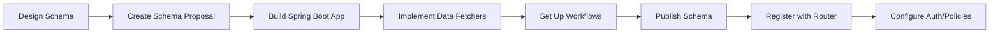

# GraphQL Documentation

## Overview

This documentation covers everything you need to know about building, deploying, and managing GraphQL subgraphs within the NXOP platform using Apollo Federation.

We use **Apollo GraphOS** as our federated GraphQL platform and **Netflix DGS** as the framework for building subgraphs with Spring Boot.

---

## Quick Start

1. **[Schema Design](schema-design.md)** - Start by designing your schema and creating a proposal
2. **[Creating a GraphQL Application](creating-graphql-application.md)** - Set up your Spring Boot subgraph
3. **[Reusable Workflows](reusable-workflows.md)** - Publish your schema to Apollo GraphOS
4. **[Authentication & Authorization](authentication-authorization.md)** - Secure your subgraph
5. **[Federation & Entities](federation-entities.md)** - Share entities across subgraphs

---

## Documentation Index

| Document | Description |
|----------|-------------|
| [Schema Design](schema-design.md) | Guidelines for designing GraphQL schemas and creating schema proposals in Apollo Studio |
| [Creating a GraphQL Application](creating-graphql-application.md) | Setting up a Spring Boot GraphQL subgraph using Netflix DGS framework |
| [Reusable Workflows](reusable-workflows.md) | GitHub Actions workflows for schema publishing and schema checks |
| [Authentication & Authorization](authentication-authorization.md) | Setting up Apigee authentication and Runway policy authorization |
| [Federation & Entities](federation-entities.md) | Sharing and extending entities across multiple subgraphs |

---

## Key Technologies

| Technology | Purpose | Documentation |
|------------|---------|---------------|
| **Apollo GraphOS** | Federated GraphQL platform | [Apollo Docs](https://www.apollographql.com/docs/) |
| **Apollo Router** | Federated gateway for query routing | [Router Docs](https://www.apollographql.com/docs/router/) |
| **Netflix DGS** | Spring Boot GraphQL framework | [DGS Docs](https://netflix.github.io/dgs/) |
| **Apigee** | API gateway for authentication | Internal Portal |
| **Runway** | Policy management for authorization | [Policy Portal](https://developer.aa.com/graphql/policy-management) |

---

## Workflow Summary

### Building a New Subgraph

1. **Design Schema** - Define types, queries, and mutations
2. **Create Schema Proposal** - Submit for review in Apollo Studio
3. **Build Application** - Use Netflix DGS with Spring Boot
4. **Implement Data Fetchers** - Write resolvers for your schema
5. **Set Up Workflows** - Add schema publish/check GitHub Actions
6. **Publish Schema** - Deploy to Apollo GraphOS
7. **Register with Router** - Contact Apollo team to add subgraph URL
8. **Configure Auth** - Set up Apigee consumer app and Runway policies

---

## Team Subgraphs

See **[NXOP Team Subgraphs](team-subgraphs.md)** for the list of subgraphs owned by the Next Gen Operations Platform team.

---

## External Resources

- [AA Developer Portal - GraphQL](https://developer.aa.com/docs/default/component/graphql-software-templates/)
- [Apollo Federation Documentation](https://www.apollographql.com/docs/federation/)
- [Netflix DGS Documentation](https://netflix.github.io/dgs/)
- [GraphQL Best Practices](https://graphql.org/learn/best-practices/)

---

## Support

For questions or issues related to GraphQL at AA:

- **Apollo Enterprise Team** - For router registration and federation issues
- **Data Movement Team** - For policy approvals in [graphql-policies](https://github.com/AAInternal/graphql-policies)
