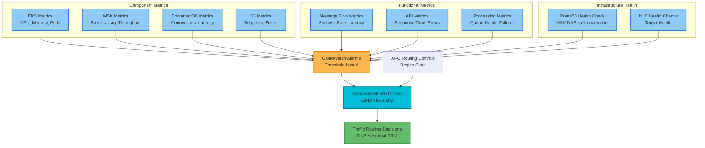
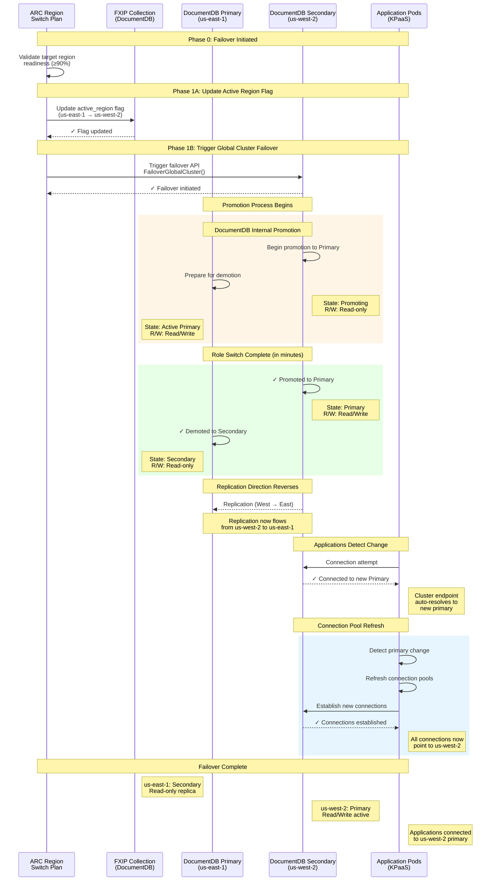
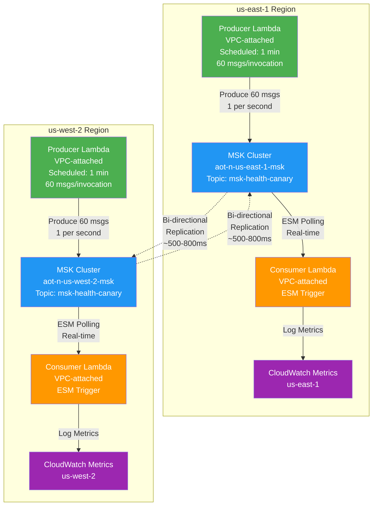

# NXOP Architecture Overview

**Part of**: [NXOP Resilience Analysis](../NXOP-Resilience-Analysis-v3.md)  
**Foundation**: [NXOP Message Flow Analysis](00-NXOP-Message-Flow-Analysis.md)

---

## Purpose

This document provides a comprehensive overview of the NXOP multi-region architecture, including:
- Multi-region infrastructure design (AWS East/West + Azure)
- Integration patterns and data flows
- Traffic routing and failover mechanisms
- Cross-account security architecture

**Audience**: Architects, new team members, leadership, technical stakeholders

---

## Multi-Region Architecture

### Complete System Architecture

---

### Multi-Account Architecture Detail

**Caption**: "EKS Architecture - Cluster in Separate/Shared Account with Cross-Account Service Access"

This diagram shows the detailed account separation model:
- **KPaaS Account**: Hosts EKS clusters with application workloads
- **Network Account**: Hosts AWS Transit Gateway for cross-account connectivity
- **NXOP Account**: Hosts MSK, DocumentDB, and S3 services

**Note**: In the NXOP production architecture, external API clients route through Akamai GTM before reaching the NLB in the KPaaS account. DocumentDB is configured as a Global Cluster with primary (us-east-1) and secondary (us-west-2) instances. Similarly, MSK is setup in both Regions with bi-directional replication enabled.

## Integration Patterns

### Simplified Integration Patterns

| Layer | Pattern | Description | Key Components | Protocols |
|-------|---------|-------------|----------------|-----------|
| **External API Access** | Clients → Akamai GTM | Global traffic management with health-based routing | External Clients → Akamai GTM → NLB → EKS Pods | HTTPS |
| **Data Ingestion** | FlightKeys → KPaaS | AMQP message consumption from vendor | FlightKeys → MicroServices (both regions) | AMQP |
| **API Exposure** | Akamai → KPaaS | Regional API endpoint exposure via GTM (inbound to EKS) | Akamai → NLB → EKS Pods (API endpoints) | HTTPS |
| **Cross-Account Access** | KPaaS → NXOP | Pod Identity role chaining for service access | MicroServices → IAM Roles → NXOP Resources | IAM/STS |
| **Data Services** | IAM → Services | Access to MSK, DocumentDB, S3 via unified IAM | IAM → MSK/DocumentDB/S3 MRAP | Kafka/MongoDB/S3 |
| **MSK Bootstrap** | EKS → MSK | MSK clients use Route53 DNS for bootstrap discovery | Route53 (kafka.nxop.com) → NLB → MSK brokers | Kafka |
| **Data Replication** | East ↔ West | Bi-directional synchronization across regions | MSK Replicator, DocumentDB Global Cluster, S3 CRR | Internal AWS |
| **Database Failover** | DocumentDB Global Cluster | Automated primary/secondary role switching | DocumentDB Primary ↔ Secondary (ARC-triggered) | MongoDB Wire Protocol |
| **Traffic Control** | ARC → Route53/Akamai | Automated disaster recovery orchestration | ARC → Route53 (MSK) + Akamai (APIs) + DocumentDB | DNS/HTTP/API |
| **Data Distribution** | MSK → Downstream | Multi-protocol distribution to external systems | MSK → Azure/OnPrem/FXIP via connectors | Kafka/MQ/HTTPS |
| **On-Prem Integration** | FOS → NXOP | On-premises systems bridge to NXOP MSK | FOS (MQ) → MQ-Kafka adapter → MSK → EKS adapters | MQ/Kafka |

**Note**: Akamai GTM fronts **inbound** API endpoints exposed by EKS apps. **Outbound** HTTPS calls from EKS apps to external systems (FOS, CCI, IBM Fusion, etc.) are direct connections, not through Akamai.

---

## Health Check Hierarchy

### Health Check Flow

**Health Check Layers**:

1. **Component Metrics**: Infrastructure-level metrics from EKS, MSK, DocumentDB, S3
   - CPU, memory, disk utilization
   - Connection counts, throughput
   - Error rates, latency

2. **Functional Metrics**: Application-level metrics measuring business functionality
   - Message flow success rates
   - API response times and error rates
   - Processing queue depths and failure rates

3. **Infrastructure Health Checks**:
   - **Route53 Health Check**: MSK DNS endpoint (kafka.nxop.com) availability
   - **NLB Health Checks**: EKS pod target health

4. **CloudWatch Alarms**: Threshold-based alarms on all metrics
   - Component alarms (infrastructure)
   - Functional alarms (application)
   - Infrastructure health check alarms

5. **Composite Health Checks**: Multi-layer hierarchical health aggregation (L1-L4)
   - Combines component, functional, and infrastructure health
   - Weighted scoring based on criticality
   - ARC routing control state integration

6. **Traffic Routing**: Final routing decisions based on composite health
   - DNS routing for MSK traffic
   - Akamai GTM routing for API traffic

**Key Points**:
- Route53 health check is **only** for MSK DNS endpoint (kafka.nxop.com)
- All metrics (component + functional) feed into CloudWatch Alarms
- Alarms are threshold-based and feed into composite health checks
- Composite health checks aggregate all signals for routing decisions

---

## ARC Control States

### Regional Control States

| State | East ARC | West ARC | MSK Traffic | API Traffic (Akamai) | DocumentDB State | Use Case |
|-------|----------|----------|-------------|---------------------|------------------|----------|
| **Active-Standby** | ON | OFF | All → East | Primary → East, Backup → West | East = Primary (R/W) West = Secondary (R) | Normal operations |
| **Disaster Recovery** | OFF | ON | All → West | Primary → West, Backup → East | West = Primary (R/W) East = Secondary (R) | East region failure |
| **Maintenance** | OFF | ON | All → West | Primary → West, Backup → East | West = Primary (R/W) East = Secondary (R) | Planned maintenance |
| **Active-Active** | ON | ON | Geographic split | Geographic routing | East = Primary (R/W) West = Secondary (R) | Future enhancement |

**Note**: ARC orchestrates Route53 (MSK routing), Akamai GTM (API routing), and DocumentDB Global Cluster failover during region switch operations. DocumentDB failover is triggered as part of Phase 1B (Concurrent Infrastructure Isolation) in the [Region Switch Orchestration](06-Region-Switch-Orchestration.md).

---

## Key Architectural Benefits

1. **Global Traffic Management**: Akamai GTM provides intelligent routing for external API clients with health-based failover
2. **Dual Traffic Control**: ARC manages MSK routing (internal), Akamai manages API routing (external)
3. **Simplified Visual Flow**: Clear top-to-bottom data flow with distinct ingress patterns
4. **Logical Grouping**: Account-based organization with clear boundaries  
5. **Reduced Complexity**: Fewer crossing lines and visual clutter
6. **Clear Relationships**: Solid lines for data flow, dotted for control/replication
7. **Hierarchical Structure**: Global → Regional → Service organization
8. **Multi-Protocol Support**: AMQP (ingestion), HTTPS (APIs), Kafka (internal), MQ (downstream)

---

## Traffic Routing Layers

### Routing Hierarchy

| Layer | Component | Purpose | Scope | Failover Mechanism |
|-------|-----------|---------|-------|-------------------|
| **External API** | Akamai GTM | Route external API clients to healthy region | Global | Health-based routing, automatic failover |
| **Internal MSK** | Route53 DNS | Route MSK clients to active cluster | Regional | ARC-controlled health checks, DNS failover |
| **Database** | DocumentDB Global Cluster | Primary/Secondary role management | Global | ARC-triggered failover, automatic promotion (< 1 min) |
| **Load Balancing** | Network Load Balancer | Distribute traffic across EKS pods | Zonal | Target health checks, automatic deregistration |
| **Pod Routing** | Kubernetes Service | Route to healthy pods within cluster | Cluster | Readiness probes, service mesh |

---

### Cross-Account IAM Role Chain Flow

**Key Points**:
1. NXOP Application pod starts in EKS cluster with assigned service account for MSK access
2. EKS Pod Identity agent exchanges service account token for AWS credentials
3. Pod Identity assumes KPaaS account IAM role with permissions for cross-account access
4. Final role in workload account with specific MSK topic permissions, and cross-account trust policy for KPaaS IAM Role
5. STS provides temporary credentials for workload account resource access
6. NXOP application accesses MSK topics using temporary credentials for consuming/producing messages

This diagram illustrates the complete authentication chain from EKS pods in the KPaaS account to MSK resources in the NXOP account, showing the role chaining mechanism that enables secure cross-account access.

---

### DocumentDB Global Cluster Failover Sequence

**Caption**: "DocumentDB Global Cluster Failover - ARC-Triggered Primary/Secondary Role Switch"

**Key Phases**:

1. **Pre-Failover**: 
   - ARC validates target region readiness
   - FXIP collection updated with new active region flag
   - Failover API triggered on secondary cluster

2. **Promotion Phase**:
   - DocumentDB promotes us-west-2 from Secondary to Primary (in minutes)
   - us-east-1 demoted from Primary to Secondary
   - Replication direction reverses (now West → East)
   - **RTO Achievement**: Primary promotion completes in minutes

3. **Application Reconnection**:
   - Applications detect primary change via cluster endpoint
   - Connection pools automatically refresh
   - New connections established to us-west-2
   - **Automatic Recovery**: No manual intervention required

**Important Notes**:
- **Cluster Endpoint**: Applications use the cluster endpoint (not instance endpoint) which automatically resolves to the current primary
- **Connection Retry**: Application connection libraries handle automatic retry and reconnection
- **Replication Lag**: Pre-failover validation ensures lag < 15 seconds to minimize data loss risk
- **Read Availability**: Secondary remains available for reads during promotion
- **Write Availability**: Brief write unavailability (< 1 minute) during promotion

**Related Documentation**: See [Region Switch Orchestration](06-Region-Switch-Orchestration.md) Phase 1B for complete failover procedures.

---

## Cross-Account Data Dependencies

### Authentication Flow

**Pod Identity Architecture**:
- **Pod Identity**: EKS pods use Pod Identity (IRSA successor) with service account tokens
- **Role Chaining**: Pod Identity → KPaaS IAM Role → Cross-Account AssumeRole → NXOP IAM Role
- **Temporary Credentials**: AWS STS provides time-limited credentials for NXOP resource access

### Resource Access Patterns

#### MSK Access
**KPaaS → NXOP MSK**: 
- Pod Identity assumes KPaaS role → cross-account assumes NXOP role with granular MSK topic permissions (produce/consume/describe)
- **Bootstrap Connection**: MSK clients use Route53 DNS (`kafka.nxop.com`) → NLB → MSK brokers for initial discovery, then connect directly to brokers
- **EKS Producers**: Flows 2, 5, 10, 19 - EKS services produce messages to MSK
- **EKS Consumers**: Flows 1, 18 - EKS services consume messages from MSK
- **On-Prem Integration**: Flows 1, 2, 10, 18, 19 - MQ-Kafka adapter (On-Prem) bridges FOS MQ to/from NXOP MSK
- **Azure Integration**: Flow 5 - Kafka Connector (Azure) consumes from NXOP MSK and publishes to OpsHub Event Hubs
- See [Message Flow Analysis](00-NXOP-Message-Flow-Analysis.md) for detailed flow architectures

#### DocumentDB Access
**KPaaS → NXOP DocumentDB**: 
- Pod Identity role chaining to NXOP role with specific DocumentDB cluster access and collection-level permissions
- **Normal State**: Applications connect to Primary cluster (us-east-1) for read/write operations
- **Failover State**: ARC triggers DocumentDB Global Cluster failover → Secondary (us-west-2) promoted to Primary → Applications reconnect to new Primary
- **Connection String**: Uses cluster endpoint (not instance endpoint) for automatic failover support
- **Failover Time**: < 1 minute for promotion, applications retry connections automatically
- **Usage**: Flows 1, 8, 10, 18, 19 - Reference data enrichment, briefing package metadata, signature validation
- See [Message Flow Analysis](00-NXOP-Message-Flow-Analysis.md) for detailed DocumentDB usage patterns

#### S3 Access
**KPaaS → NXOP S3**: 
- Pod Identity role chaining to NXOP role with MRAP and bucket-specific permissions (read/write/list)
- Access via S3 MRAP for automatic regional routing
- Cross-region replication ensures data availability
- **Usage**: Flow 8 - Document storage for pilot briefing packages (PDFs, charts, weather data)

### External API Access

**External Clients → Akamai GTM**:
- Public HTTPS endpoints with TLS termination
- Geographic and health-based routing
- **Inbound Traffic**: External systems (Flightkeys, IBM Fusion, etc.) call NXOP API endpoints

**Akamai → NLB**:
- Health-based routing to regional NLBs in KPaaS account
- Automatic failover on health check failure
- **Fronts Inbound APIs**: Akamai GTM only fronts API endpoints exposed by EKS apps

**NLB → EKS Pods**:
- Target group health checks route to healthy pods exposing API endpoints
- Automatic deregistration of unhealthy targets

**EKS → External Systems**:
- **Outbound HTTPS Calls**: EKS apps make direct HTTPS calls to external systems (FOS, CCI, IBM Fusion, Ops Engineering Apps, etc.)
- **Not Through Akamai**: Outbound calls from EKS apps bypass Akamai GTM
- **Examples**: Flow 1 (to Flightkeys), Flow 7 (to FOS/CCI), Flow 8 (to FOS/CCI), Flow 14 (to FOS), Flow 18 (to Flightkeys), Flow 19 (to FOS), Flow 20 (to IBM Fusion), Flow 22 (to FOS)

### DocumentDB Failover Coordination

**Phase 1B (Concurrent Infrastructure Isolation)**:
- ARC Region Switch Plan triggers DocumentDB Global Cluster failover API call
- FXIP Collection Update: Active region flag updated in DocumentDB before failover (ensures consistency)
- Connection Pool Refresh: Applications detect primary change and refresh connection pools to new primary
- Replication Lag Check: Pre-failover validation ensures replication lag < 15 seconds to minimize data loss risk

See [Region Switch Orchestration](06-Region-Switch-Orchestration.md) for complete failover procedures.

---

## MSK Health Canary Architecture

### Purpose and Design

The MSK Health Canary provides continuous validation of MSK cluster health, cross-region replication, and end-to-end message flow. This independent monitoring system runs in both regions to validate infrastructure readiness even when a region is in standby mode.

### Canary Components

### Canary Metrics Flow

| Component | Metrics Published | Purpose | Frequency |
|-----------|------------------|---------|-----------|
| **Producer Lambda** | `BatchSuccessRate`, `ProducerLatency`, `BatchMessagesProduced` | Validate MSK produce capability | Every 1 minute |
| **Consumer Lambda** | `ConsumerHealth`, `ProcessingLatency`, `ReplicationLatency`, `MessagesProcessed` | Validate MSK consume and replication | Real-time (ESM-triggered) |
| **CloudWatch** | Composite health scores (L4 Canary Health) | Aggregate canary health for region readiness | Continuous |

### Key Characteristics

| Characteristic | Value | Impact |
|----------------|-------|--------|
| **Producer Frequency** | 1 minute (60 messages per invocation) | Continuous validation |
| **Message Rate** | 1 message per second | Realistic load simulation |
| **Replication Latency** | ~500-800ms (P95 ~850ms) | Sub-second cross-region sync |
| **Consumer Processing** | Real-time (ESM-triggered) | Immediate failure detection |
| **Messages per Region** | 120/minute (60 local + 60 replicated) | Bi-directional validation |
| **Health Score Weight** | 25% of L4 Application Layer | Influences failover decisions |

### Integration with Region Readiness

The MSK Health Canary contributes to the **L4 Application Layer** readiness score:
- **Canary-Producer Score** (35% weight): Producer success rate > 95%
- **Canary-Consumer Score** (35% weight): Consumer health = 1 (healthy)
- **Canary-Replication Score** (30% weight): P95 replication latency < 2 seconds

**L4 Canary Health** = `(Producer × 0.35) + (Consumer × 0.35) + (Replication × 0.30)`

This canary health score is combined with Service Health and End-to-End Health to calculate the overall L4 Application Layer readiness, which influences regional failover decisions.

**Detailed Documentation**: See [Region Readiness Assessment - MSK Health Canary Architecture](05-Region-Readiness-Assessment.md#msk-health-canary-architecture) for complete implementation details.

---

## Related Documentation

- **[NXOP Message Flow Analysis](00-NXOP-Message-Flow-Analysis.md)** - Foundation document with 25 flows and 7 patterns
- **[Integration Pattern Resilience](02-Integration-Pattern-Resilience.md)** - Pattern-specific failure modes
- **[Infrastructure Failures](03-Infrastructure-Failures.md)** - Component failure catalog
- **[Region Switch Orchestration](06-Region-Switch-Orchestration.md)** - Failover procedures

---

**Document Owner**: NXOP Platform Team  
**Last Updated**: 2026-01-21  
**Review Frequency**: Quarterly
