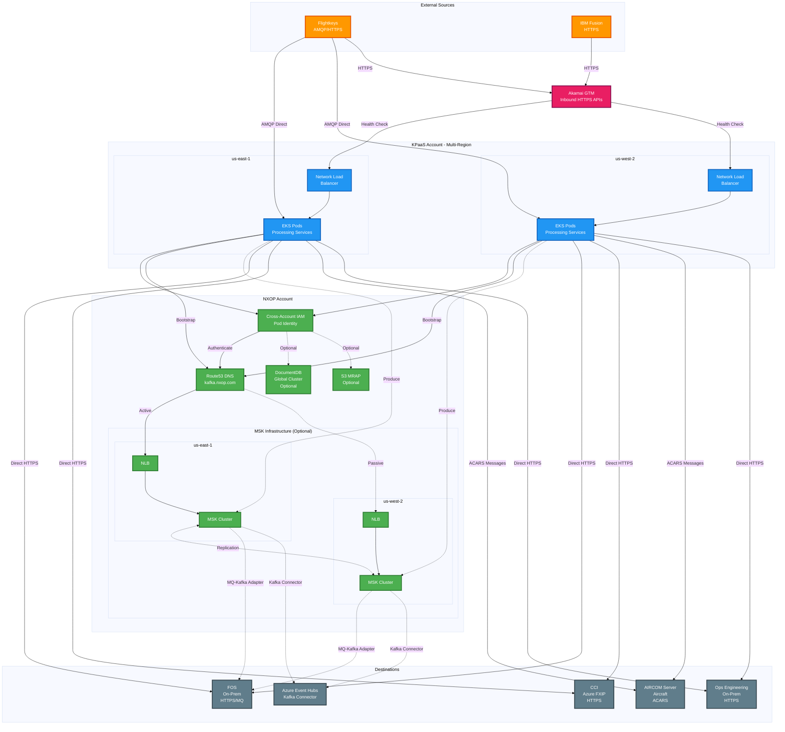

# NXOP Integration Pattern Resilience

**Part of**: [NXOP Resilience Analysis](../NXOP-Resilience-Analysis-v3.md)  
**Foundation**: [NXOP Message Flow Analysis](00-NXOP-Message-Flow-Analysis.md)

---

## Purpose

This document analyzes resilience characteristics for each of the 7 integration patterns identified in the Message Flow Analysis. For each pattern, we examine:
- Common failure modes and their impact
- Recovery strategies and RTO targets
- Pattern-specific variations
- Resilience recommendations

**Audience**: Application developers, integration engineers, solution architects

**Prerequisites**: Familiarity with the [25 message flows and 7 integration patterns](00-NXOP-Message-Flow-Analysis.md)

---

## Pattern Resilience Overview

### Integration Pattern Resilience Matrix

**Caption**: "NXOP Integration Pattern Resilience Matrix - Recovery Time vs Complexity"

**Pattern Analysis**:

| Pattern | Flows | Complexity | RTO Target | Recovery Type | Quadrant |
|---------|-------|------------|------------|---------------|----------|
| **Outbound Publishing** | 4 | Low | < 5 min | HA Automated | Target Zone ✓ |
| **Document Assembly** | 1 | Medium-Low | < 5 min | HA Automated | Target Zone ✓ |
| **Notification/Alert** | 3 | Medium | < 5 min | HA Automated | Target Zone ✓ |
| **Inbound Data Ingestion** | 10 | Medium | < 5 min | HA Automated (80%) Regional Switchover (20%) | Target Zone ✓ |
| **Authorization** | 2 | High | 15+ min | Manual Intervention | Acceptable |
| **Bidirectional Sync** | 4 | High | < 5 min | HA Automated (50%) Manual (50%) | Manageable |

**Complexity Rationale**:
- **Outbound Publishing** (0.15): Simple MQ → Kafka → HTTPS or HTTPS → HTTPS flow, 4 flows
- **Document Assembly** (0.35): Multi-service coordination (S3, DocumentDB, EKS) but single flow
- **Notification/Alert** (0.50): Event-driven, multiple destinations, 3 flows
- **Inbound Data Ingestion** (0.68): Multiple variations (AMQP, HTTPS, MSK, direct), 10 flows
- **Authorization** (0.78): Complex compliance requirements, manual validation, 2 flows
- **Bidirectional Sync** (0.88): Two-way communication, state management, conflict resolution, 4 flows

**Key Insights**:
- **Target Zone (Q3)**: 17 flows (89%) - Low to medium complexity with fast automated recovery
- **Acceptable (Q2)**: 2 flows (11%) - High complexity with manual intervention for compliance
- **Manageable (Q4)**: 6 flows (32%) - High complexity but automated recovery keeps RTO low
- **Most Patterns**: 17 of 19 flows (89%) have RTO < 5 minutes with HA automated recovery

**Resilience Summary**:
- **89% of NXOP flows** (17/19) have RTO < 5 minutes with HA automated recovery
- **11% of NXOP flows** (2/19) require manual intervention for compliance (Authorization pattern)
- **Priority**: Maintain automated recovery for all patterns except Authorization (compliance-driven)

---

## Pattern Summary

| Pattern | Flow Count | Primary Recovery | RTO Target | Complexity |
|---------|------------|------------------|------------|------------|
| **Inbound Data Ingestion** | 10 flows | HA Automated (80%) Regional Switchover (20%) | < 5 min (HA) 5-15 min (Regional) | Medium |
| **Outbound Data Publishing** | 4 flows | HA Automated (100%) | < 5 min | Low |
| **Bidirectional Synchronization** | 4 flows | HA Automated (50%) Manual Intervention (50%) | < 5 min (HA) 15+ min (Manual) | High |
| **Notification/Alert** | 3 flows | HA Automated (100%) | < 5 min | Medium |
| **Document Assembly** | 1 flow | HA Automated (100%) | < 5 min | Medium-Low |
| **Authorization** | 2 flows | Manual Intervention (100%) | 15+ min | High |

**Total NXOP-Managed Flows**: 19 of 25 (76%)  
**Flows Without NXOP**: 6 of 25 (24%) - Flows 11, 12, 13, 15, 21, 25

**Recovery Distribution**:
- **HA Automated**: 15 flows (79% of NXOP-active)
- **Regional Switchover**: 2 flows (11% of NXOP-active) - Flows 3, 4
- **Manual Intervention**: 2 flows (11% of NXOP-active) - Flows 9, 10 (Authorization)

**Note**: 
- Flows 3, 4 require Regional Switchover due to HTTPS proxy dependencies that need ARC orchestration for cross-region failover
- Flows 23, 24 are outbound publishing (On-Prem → NXOP → Flightkeys), not bidirectional

---

## Pattern 1: Inbound Data Ingestion

**Pattern Description**: External sources → NXOP → On-Prem/External systems (unidirectional inbound)  
**Flow Count**: 10 flows (2, 3, 4, 5, 6, 7, 8, 14, 19, 20)  
**Primary Communication**: AMQP/HTTPS → Processing → HTTPS/Kafka/MQ/ACARS  
**Recovery Distribution**: 
- HA Automated: 8 flows (80%) - Flows 2, 5, 6, 7, 8, 14, 19, 20
- Regional Switchover: 2 flows (20%) - Flows 3, 4

**Included Flows**:
- **Flightkeys Ingestion**: Flows 2, 3, 4, 5, 6, 7, 8, 14 (Flightkeys → NXOP → On-Prem)
- **IBM Fusion Ingestion**: Flows 19, 20 (IBM Fusion → NXOP → On-Prem/Aircraft)

**Note**: Flows 11, 12 have no NXOP involvement (direct Flightkeys/FXIP On-Prem to CyberJet FMS)

### Pattern Architecture

**Architecture Flow**:
1. **External Sources** (Flightkeys, IBM Fusion) send data via AMQP (direct) or HTTPS (via Akamai GTM)
2. **Akamai GTM** fronts inbound HTTPS API endpoints exposed by EKS apps
3. **NXOP Processing** (EKS Pods) receives and processes messages in both regions
4. **Cross-Account IAM** (Pod Identity) authenticates access to NXOP resources
5. **Optional MSK** for event streaming (flows 2, 5, 19) via Route53/NLB bootstrap, then direct broker connection
6. **Optional DocumentDB** for reference data enrichment (flow 8, 19)
7. **Optional S3 MRAP** for document storage (flow 8)
8. **Direct Outbound** via HTTPS to FOS, CCI, Ops Engineering (bypasses Akamai - direct from EKS)
9. **ACARS Delivery** via AIRCOM Server to aircraft
10. **MSK to Destinations** via MQ-Kafka adapter (On-Prem) or Kafka Connector (Azure)

**Key Traffic Patterns**:
- **AMQP Ingestion**: Bypasses Akamai, goes directly to EKS pods
- **HTTPS Ingestion**: Routes through Akamai GTM for health-based routing
- **Outbound HTTPS**: Direct from EKS to destinations (bypasses Akamai)
- **MSK Bootstrap**: Route53 DNS → NLB → MSK brokers for initial connection
- **MSK Direct**: After bootstrap, producers/consumers connect directly to MSK brokers (not through NLB)

### Common Failure Modes

| Failure Mode | Impact | Likelihood | Recovery Strategy | Recovery Type | Affected Flows |
|--------------|--------|------------|-------------------|---------------|----------------|
| **External Source Connection Loss** | Critical - No data ingestion | Medium | Connection retry with exponential backoff, multiple endpoint config | HA - Automated | All 10 flows |
| **AMQP/HTTPS Ingestion Failure** | Critical - Data not entering platform | Medium | Health check-based pod restart, HPA scaling | HA - Automated | All 10 flows |
| **Message Processing Errors** | High - Data transformation failures | Medium | Dead letter queue, error handling, retry logic | HA - Automated | All 10 flows |
| **MSK Topic Unavailability** | High - Cannot stream events | Low | Cross-region MSK failover, message buffering | HA - Automated | Flows 2, 5 |
| **DocumentDB Enrichment Failure** | Medium - Degraded data quality | Low | Cached reference data, graceful degradation | HA - Automated | None (pattern doesn't use) |
| **Downstream Delivery Failure** | High - Data not reaching destination | Medium | Message retry, alternative delivery paths | HA - Automated | All 10 flows |
| **Regional Infrastructure Failure** | Critical - Complete ingestion stop | Low | Cross-region failover via ARC | Regional Switchover | Flows 3, 4 |

### Pattern Variations

#### Variation 1A: AMQP → MSK → MQ (Event Streaming)
**Flows**: 2 (Flight Plans), 5 (Audit Logs)  
**Infrastructure**: MSK cluster, Kafka-MQ adapter  
**Unique Failure Modes**:
- MSK cluster failure → Cross-region replication provides continuity
- Kafka-MQ adapter failure → Adapter restart, failover to backup
- Consumer lag → Auto-scaling consumers, partition rebalancing

**Recovery Characteristics**:
- **RTO**: < 5 minutes (HA Automated)
- **Data Loss**: None (Kafka persistence)
- **Failover**: Automatic via MSK cross-region replication

**Architecture Flow**:
- **Bootstrap Phase**: EKS pods and Kafka-MQ Adapter use Route53 DNS (kafka.nxop.com) to discover active MSK cluster
- **Route53 Active/Passive**: Routes to active region's NLB (typically us-east-1)
- **NLB Layer**: Provides bootstrap endpoint for MSK cluster discovery
- **Direct Broker Connection**: After bootstrap, producers/consumers connect directly to MSK brokers
- **Cross-Region Replication**: MSK clusters replicate data bidirectionally
- **Kafka-MQ Adapter**: Consumes from both MSK clusters and publishes to On-Prem MQ

#### Variation 1B: AMQP → HTTPS (Synchronous Delivery)
**Flows**: 3 (Flightkeys Events), 4 (Flightplan Data), 6 (Summary Flight Plans)  
**Infrastructure**: EKS pods, HTTPS proxies  
**Unique Failure Modes**:
- Proxy service failure → Health check-based traffic routing
- Synchronous timeout → Retry with exponential backoff
- Regional proxy failure → Cross-region DNS failover

**Recovery Characteristics**:
- **Flows 3, 4**: Regional Switchover (5-15 min RTO) - HTTPS proxy dependencies require ARC orchestration
- **Flow 6**: HA Automated (< 5 min RTO) - Health check-based routing
- **Data Loss**: Potential for in-flight messages during regional failover (flows 3, 4)
- **Failover**: Flows 3, 4 require ARC orchestration; flow 6 uses health checks

**Note**: Flightkeys sends AMQP directly to EKS pods in both regions (no Akamai GTM for AMQP). Flows 3, 4 require ARC-orchestrated regional switchover (5-15 min RTO) for HTTPS proxy failover. Other flows use health check-based routing (< 5 min RTO).

#### Variation 1C: HTTPS → Processing (Data Maintenance)
**Flows**: 23 (Special Info Messages), 24 (Terminal Area Forecasts)  
**Infrastructure**: EKS pods, API Gateway (implicit)  
**Unique Failure Modes**:
- API endpoint failure → Multi-AZ load balancing
- Request timeout → Client-side retry logic
- Rate limiting → Backpressure handling

**Recovery Characteristics**:
- **RTO**: < 5 minutes (HA Automated)
- **Data Loss**: None (synchronous acknowledgment)
- **Failover**: Automatic via NLB health checks

**Note**: Flows 23, 24 are unidirectional inbound data maintenance flows. For bidirectional engineering data sync (flows 16, 17), see Pattern 3 Variation 3B.

#### Variation 1D: IBM Fusion Integration (Multi-Hop Delivery)
**Flows**: 20 (Flight Plans to Fusion)  
**Infrastructure**: Fusion Integration Adapter (EKS), Flightkeys (AMQP), IBM Fusion Flight Tracking (HTTPS)  
**Communication**: Flightkeys (AMQP) → Fusion Integration Adapter → IBM Fusion (HTTPS) → FOS  
**Unique Failure Modes**:
- IBM Fusion API failure → Message retry, circuit breaker
- Adapter processing failure → Pod restart, HPA scaling
- API rate limiting → Request throttling, backpressure
- FOS unavailability → Message queuing, retry logic

**Recovery Characteristics**:
- **RTO**: < 5 minutes (HA Automated)
- **Data Loss**: None (message persistence and retry)
- **Failover**: Automatic via health checks

**Architecture Flow**:
- **Inbound**: Flightkeys → AMQP direct to Fusion Integration Adapter (no Akamai for AMQP)
- **Processing**: Adapter transforms/enriches flight plan data
- **Outbound**: Adapter → IBM Fusion Flight Tracking via HTTPS API
- **Final Destination**: IBM Fusion → FOS via HTTPS
- **Note**: Single-source, multi-hop inbound flow (not bidirectional)

### Pattern-Level Resilience Recommendations

1. **Standardize on MSK for Event Streaming**: Consider migrating more flows to use MSK for consistent event streaming and improved resilience
2. **Implement Circuit Breakers**: Add circuit breakers for external source connections (Flightkeys, IBM Fusion) to prevent cascading failures
3. **Enhance Monitoring**: Implement end-to-end latency tracking from source to destination across all variations
4. **Consolidate Similar Patterns**: Flows 7, 14, 22 (notifications), flows 23, 24 (data maintenance), and flows 19, 20, 22 (IBM Fusion) all follow the same inbound ingestion pattern

---

## Pattern 2: Outbound Data Publishing

**Pattern Description**: On-Prem → NXOP → External systems (outbound data flow)  
**Flow Count**: 4 flows (1, 18, 23, 24)  
**Primary Communication**: MQ → Kafka → HTTPS (flows 1, 18) or HTTPS → HTTPS (flows 23, 24)  
**Recovery Distribution**: 100% HA Automated

**Flows**:
- **Flow 1**: FOS → NXOP → Flightkeys (MQ → Kafka → HTTPS)
- **Flow 18**: FOS → NXOP → Azure Event Hubs (MQ → Kafka → HTTPS)
- **Flow 23**: Special Info Messages (On-Prem) → NXOP → Flightkeys (HTTPS → HTTPS)
- **Flow 24**: IOC Meteorologists (On-Prem) → NXOP → Flightkeys (HTTPS → HTTPS)

### Pattern Architecture

**Architecture Flow**:
- **On-Prem Source**: FOS sends data via MQ protocol to MQ-Kafka Adapter (on-prem)
- **MQ-Kafka Adapter**: On-premises adapter consumes from FOS MQ and produces to MSK
- **MSK Bootstrap**: Adapter uses Route53/NLB for MSK cluster discovery (kafka.nxop.com)
- **Route53 Active/Passive**: Routes to active region's NLB (typically us-east-1)
- **Direct Broker Connection**: After bootstrap, adapter produces directly to MSK brokers
- **Cross-Region Replication**: MSK clusters replicate data bidirectionally
- **Flight Data Adapter & Aircraft Data Adapter**: EKS apps in KPaaS (both regions) consume from MSK via Route53/NLB bootstrap
- **Flightkeys Delivery**: Adapters invoke Flightkeys HTTPS API directly
- **Azure Event Hubs**: Kafka Connector publishes to Azure Event Hubs

### Common Failure Modes

| Failure Mode | Impact | Likelihood | Recovery Strategy | Recovery Type | Affected Flows |
|--------------|--------|------------|-------------------|---------------|----------------|
| **On-Prem MQ Connection Loss** | Critical - No data egress from FOS | Medium | MQ-Kafka Adapter connection retry, multiple MQ endpoints | HA - Automated | Both flows |
| **MQ-Kafka Adapter Failure** | Critical - Cannot produce to MSK | Medium | Adapter restart, redundant adapter instances | HA - Automated | Both flows |
| **MSK Producer Failure (On-Prem)** | High - Cannot publish events to MSK | Medium | Producer retry, cross-region MSK failover via Route53 | HA - Automated | Both flows |
| **MSK Topic Unavailability** | High - Cannot stream events | Low | Cross-region MSK replication, Route53 failover | HA - Automated | Both flows |
| **Flight/Aircraft Data Adapter Failure** | High - Cannot consume from MSK | Medium | Pod restart, HPA scaling, multi-region deployment | HA - Automated | Both flows |
| **MSK Consumer Lag** | Medium - Delayed data delivery | Medium | Auto-scaling consumers, partition rebalancing | HA - Automated | Both flows |
| **Flightkeys API Unavailability** | High - Data not delivered to Flightkeys | Medium | Message retry with exponential backoff, circuit breaker | HA - Automated | Both flows |
| **Azure Event Hubs Connector Failure** | High - Data not reaching Azure | Medium | Connector restart, failover to backup | HA - Automated | Flow 1 (if applicable) |

### Pattern Variations

#### Variation 2A: MQ → MSK → Flightkeys (Reverse Flow)
**Flows**: 1 (FOS Events), 18 (Position Reports)  
**Infrastructure**: MQ-Kafka Adapter (on-prem), MSK, Flight/Aircraft Data Adapters (EKS)  
**Unique Failure Modes**:
- MQ-Kafka Adapter cannot read from MQ → MQ connection pool management
- MSK topic full → Storage scaling, retention tuning
- Flightkeys API rate limiting → Backpressure handling, circuit breaker

**Recovery Characteristics**:
- **RTO**: < 5 minutes (HA Automated)
- **Data Loss**: None (Kafka persistence + MQ durability)
- **Failover**: Automatic via MSK cross-region replication

#### Variation 2B: MQ → MSK → Azure Event Hubs (Multi-Cloud)
**Flows**: 1 (FOS Events), 18 (Position Reports)  
**Infrastructure**: MQ-Kafka Adapter (on-prem), MSK, Azure Event Hub Kafka Connector  
**Unique Failure Modes**:
- Azure Event Hub connectivity → Alternative Azure regions
- Cross-cloud network latency → Optimize connector configuration
- Event Hub throttling → Rate limiting, backpressure

**Recovery Characteristics**:
- **RTO**: < 5 minutes (HA Automated)
- **Data Loss**: None (dual persistence: MSK + Event Hubs)
- **Failover**: Independent failover per destination

**Note**: This variation shows multi-cloud data flow from AWS MSK to Azure Event Hubs via Kafka Connector.

### Pattern-Level Resilience Recommendations

1. **Enhance MQ-Kafka Adapter Resilience**: Deploy redundant MQ-Kafka adapter instances on-prem to eliminate single point of failure
2. **Enhance Buffering**: Increase MSK retention for flows 1, 18 to handle extended downstream outages (Flightkeys, Azure Event Hubs)
3. **Monitor End-to-End**: Track message latency from FOS → MQ → MSK → Adapters → External destinations (Flightkeys, Azure)
4. **Optimize Multi-Region Consumers**: Ensure Flight/Aircraft Data Adapters in both regions consume efficiently from local MSK clusters
5. **Implement Circuit Breakers**: Add circuit breakers for Flightkeys API calls to prevent cascading failures during API unavailability

---

## Pattern 3: Bidirectional Synchronization

**Pattern Description**: Two-way data exchange between systems  
**Flow Count**: 4 flows (9, 10, 16, 17)  
**Primary Communication**: AMQP + HTTPS (hybrid) or HTTPS bidirectional  
**Recovery Distribution**: 
- HA Automated: 2 flows (50%) - Flows 16, 17
- Manual Intervention: 2 flows (50%) - Flows 9, 10 (Authorization - compliance-driven)

**Included Sub-Patterns**:
- **Engineering Data Sync**: Flows 16, 17 (Ops Engineering Apps ↔ NXOP ↔ Flightkeys)
- **Authorization Workflows**: Flows 9, 10 (eSignature capture/validation - requires manual intervention)

### Pattern Architecture

**Architecture Flow**:

1. **Inbound Traffic**:
   - **AMQP** (flows 9, 10): Flightkeys → Direct to EKS pods (no Akamai)
   - **HTTPS** (all flows): Flightkeys/Clients → Akamai GTM → NLB → EKS pods

2. **Processing**:
   - **Flow 9, 10** (eSignature): Event processors capture and validate signatures
   - **Flow 16, 17** (Engineering Data): Data services manage reference data sync

3. **NXOP Resources**:
   - **MSK** (flow 10 only): Event streaming for signature events
   - **DocumentDB** (flow 10 only): Signature validation and audit
   - **Data Stores** (flows 16, 17): Fleet and fuel reference data

4. **Outbound Traffic** (Direct - Not Through Akamai):
   - **HTTPS**: EKS → FOS, CCI, Ops Engineering
   - **ACARS**: EKS → AIRCOM Server → Aircraft
   - **MQ**: MSK → MQ-Kafka adapter → FOS (flow 10 only)

5. **Response Path**:
   - EKS → Akamai GTM → Flightkeys/Clients (HTTPS responses)

### Common Failure Modes

| Failure Mode | Impact | Likelihood | Recovery Strategy | Recovery Type | Affected Flows |
|--------------|--------|------------|-------------------|---------------|----------------|
| **EKS Pod Failure** | Critical - Service unavailable | Medium | Pod restart, HPA scaling, multi-region deployment | HA - Automated | All 6 flows |
| **Akamai GTM Failure** | High - HTTPS traffic routing failure | Low | Direct NLB access, DNS failover | HA - Automated | Flows 16, 17, 20 |
| **NLB Health Check Failure** | High - Traffic not routed to healthy pods | Medium | Health check tuning, pod restart | HA - Automated | All 6 flows |
| **AIRCOM Server Failure** | Critical - Aircraft communication lost | Low | Redundant AIRCOM instances, satellite backup | HA - Automated | Flows 13, 15, 25 |
| **Aircraft Connectivity Loss** | High - ACARS messages not delivered | Medium | Message queuing, retry on reconnect, satellite backup | HA - Automated | Flows 13, 15, 25 |
| **IBM Fusion API Failure** | High - Cannot sync flight plans | Medium | Cached data, fallback to Flightkeys source | HA - Automated | Flow 20 |
| **Data Conflict Resolution Failure** | Medium - Inconsistent reference data | Low | Conflict resolution logic, version control | HA - Automated | Flows 16, 17 |
| **Client Application Failure** | Medium - Cannot access data services | Medium | Client redundancy, web backup interface | HA - Automated | Flows 16, 17 |
| **Cross-Account IAM Failure** | Critical - Cannot authenticate to NXOP resources | Low | IAM role recreation, pod identity refresh | HA - Automated | All 6 flows |
| **Regional Infrastructure Failure** | Critical - Complete service stop | Low | Cross-region failover via ARC | Regional Switchover | Flow 13 |

### Pattern Variations

#### Variation 3A: ACARS Bidirectional (Aircraft Communication)
**Flows**: 13 (FMS Init), 15 (Flight Progress)  
**Infrastructure**: FXIP ACARS Adapter (EKS), AIRCOM Server, CyberJet FMS, Flightkeys  
**Communication**: Hybrid (AMQP + HTTPS) → ACARS bidirectional  
**Unique Failure Modes**:
- AIRCOM server failure → Redundant AIRCOM instances
- Aircraft connectivity loss → Satellite backup communication
- ACARS protocol errors → Protocol validation, error handling
- CyberJet FMS unavailability → Fallback to Flightkeys source

**Recovery Characteristics**:
- **RTO**: < 5 minutes for flow 15 (HA Automated); 5-15 minutes for flow 13 (Regional Switchover)
- **Data Loss**: Potential for in-flight ACARS messages during failover
- **Failover**: Flow 13 requires ARC orchestration; flow 15 uses health checks

**Architecture Flow**:
- **AMQP Inbound**: CyberJet FMS + Flightkeys (AMQP direct, no Akamai) → FXIP ACARS Adapter → FOS + AIRCOM → Aircraft
- **HTTPS Inbound**: Dispatchers → Akamai GTM → NLB → FXIP ACARS Adapter → AIRCOM → Aircraft
- **Outbound**: Aircraft → AIRCOM → FXIP ACARS Adapter → Akamai GTM → Flightkeys (HTTPS response)
- **Note**: Flow 13 requires ARC for regional failover; Flow 15 uses health checks

#### Variation 3B: Engineering Data Sync (Reference Data)
**Flows**: 16 (Fleet Reference), 17 (Fuel Data)  
**Infrastructure**: Aircraft Data Service, Nav Data Service (EKS), Flightkeys, Ops Engineering Client Apps  
**Communication**: Synchronous HTTPS bidirectional  
**Unique Failure Modes**:
- Data version conflicts → Version control, conflict resolution
- Large dataset sync → Incremental sync, delta updates
- Client application failure → Client redundancy, web backup interface
- Flightkeys API unavailability → Cached data, read-only mode

**Recovery Characteristics**:
- **RTO**: < 5 minutes (HA Automated)
- **Data Loss**: None (synchronous confirmation)
- **Failover**: Automatic via Akamai GTM and NLB health checks

**Architecture Flow**:
- **Client → EKS Services**: Ops Engineering apps call HTTPS APIs → Akamai GTM → NLB → Aircraft Data Service / Nav Data Service
- **EKS Services → Data Store**: Services read/write to regional data stores (cross-account via IAM)
- **EKS Services → Flightkeys**: Services call Flightkeys HTTPS APIs to sync reference data
- **Response Path**: Flightkeys → EKS Services → Akamai GTM → Client apps
- **Data Replication**: Regional data stores replicate for consistency
- **Note**: Bidirectional sync - clients can query/update data, and services sync with Flightkeys

### Pattern-Level Resilience Recommendations

1. **Automate Flow 13 Failover**: Reduce RTO by automating ARC execution (currently 5-15 min manual → target < 5 min automated)
2. **Implement Conflict Resolution**: Add automated conflict resolution for engineering data flows (16, 17) to handle version conflicts
3. **Note**: Flow 20 has been moved to Pattern 1 (unidirectional inbound). Flow 25 has been excluded (not NXOP relevant).

---

## Pattern 4: Notification/Alert

**Pattern Description**: Event-driven notifications from NXOP to external systems  
**Flow Count**: 3 flows (7, 14, 22)  
**Primary Communication**: AMQP/HTTPS → Processing → HTTPS/ACARS  
**Recovery Distribution**: 100% HA Automated

**Flows**:
- **Flow 7**: Flightkeys Notifications → NXOP → FOS (HTTPS)
- **Flow 14**: Flightkeys Notifications → NXOP → CCI (HTTPS)
- **Flow 22**: IBM Fusion Flight Tracking → NXOP → Aircraft via AIRCOM (ACARS)

### Common Failure Modes

| Failure Mode | Impact | Recovery Strategy | Recovery Type | RTO |
|--------------|--------|-------------------|---------------|-----|
| **Notification Processing Failure** | High - Alerts not delivered | Pod restart, HPA scaling | HA Automated | < 5 min |
| **Destination Unavailability** | High - Notifications queued | Message retry, exponential backoff | HA Automated | < 5 min |
| **ACARS Delivery Failure** | Critical - Aircraft not notified | AIRCOM failover, message retry | HA Automated | < 5 min |

### Pattern-Level Resilience Recommendations

1. **Implement Dead Letter Queues**: Capture failed notifications for manual review
2. **Add Delivery Confirmation**: Track notification delivery status end-to-end
3. **Monitor Delivery Latency**: Alert on delayed notifications (> 30 seconds)

---

## Pattern 5: Authorization

**Pattern Description**: Electronic signature validation and authorization workflows  
**Flow Count**: 2 flows (9, 10)  
**Primary Communication**: AMQP/HTTPS → Processing → HTTPS/ACARS  
**Recovery Distribution**: 100% Manual Intervention (compliance-driven)

**Flows**:
- **Flow 9**: eSignature Capture → NXOP → FOS/CCI/Aircraft (HTTPS/ACARS)
- **Flow 10**: eSignature Validation → NXOP → FOS (HTTPS)

### Common Failure Modes

| Failure Mode | Impact | Recovery Strategy | Recovery Type | RTO |
|--------------|--------|-------------------|---------------|-----|
| **Signature Validation Failure** | Critical - Cannot authorize | Manual review, compliance check | Manual Intervention | 15+ min |
| **DocumentDB Unavailability** | Critical - Cannot validate signatures | Manual failover, data verification | Manual Intervention | 15+ min |
| **Compliance Audit Requirement** | High - Must verify all signatures | Manual audit trail review | Manual Intervention | 30+ min |

### Pattern-Level Resilience Recommendations

1. **Maintain Audit Trail**: All signature operations must be logged for compliance
2. **Manual Validation Process**: Document manual validation procedures for DocumentDB failures
3. **Compliance Review**: All failover operations require compliance team review

**Note**: Manual intervention is required due to regulatory compliance requirements for electronic signatures. Automated failover without human oversight is not permitted.

---

---

## Pattern 6: Document Assembly

**Pattern Description**: Multi-service document generation and retrieval  
**Flow Count**: 1 flow (8)  
**Primary Communication**: HTTPS (synchronous request/response)  
**Recovery Distribution**: 100% HA Automated

**Note**: Flow 8 is also included in Pattern 1 (Inbound Data Ingestion) but has unique document assembly characteristics that warrant separate analysis.

### Pattern Architecture

**Architecture Flow**:

1. **Request Initiation**:
   - Sources (Flightkeys, FOS Business Resumption, CCI) → HTTPS request → Akamai GTM
   - Akamai routes to healthy region (us-east-1 or us-west-2)

2. **API Gateway**:
   - Akamai GTM → NLB → Flightkeys Integration Service (EKS)
   - Integration service orchestrates document assembly

3. **Multi-Service Coordination**:
   - Flightkeys Integration Service calls:
     - **Flight Plan Service**: Retrieves flight plan data
     - **Pilot Document Service**: Retrieves pilot briefing documents

4. **Metadata Retrieval** (DocumentDB):
   - Services query DocumentDB for metadata:
     - Briefing package structure
     - Flight plan metadata
     - Weather data references
     - NOTAM references
     - Crew assignment data
   - Global cluster provides read access from both regions

5. **Document Retrieval** (S3 MRAP):
   - Services retrieve actual documents from S3 via Multi-Region Access Point
   - MRAP automatically routes to nearest/fastest S3 bucket
   - Cross-region replication ensures document availability

6. **Package Assembly**:
   - Flight Plan Service + Pilot Document Service return data to Integration Service
   - Integration Service assembles complete briefing package

7. **Response Delivery**:
   - Assembled package → NLB → Akamai GTM → Original requester
   - Synchronous HTTPS response with complete briefing package

**Key Components**:
- **Flightkeys Integration Service**: Orchestrates document assembly workflow
- **Flight Plan Service**: Manages flight plan data and metadata
- **Pilot Document Service**: Manages pilot briefing documents
- **DocumentDB Global Cluster**: Stores metadata with cross-region replication
- **S3 MRAP**: Provides multi-region document access with automatic routing
- **Akamai GTM**: Load balances requests across regions

### Common Failure Modes

| Failure Mode | Impact | Likelihood | Recovery Strategy | Recovery Type | Affected Flows |
|--------------|--------|------------|-------------------|---------------|----------------|
| **Document Assembly Service Failure** | Critical - Cannot generate briefing packages | Medium | Pod restart, HPA scaling | HA - Automated | Flow 8 |
| **DocumentDB Metadata Unavailability** | Critical - Cannot assemble packages | Low | Cached metadata, graceful degradation | HA - Automated | Flow 8 |
| **S3 MRAP Failure** | High - Cannot retrieve documents | Low | Direct regional bucket access, MRAP recreation | HA - Automated | Flow 8 |
| **Partial Document Assembly** | Medium - Incomplete briefing package | Medium | Serve partial package with warnings | HA - Automated | Flow 8 |
| **Complex Query Performance** | Medium - Slow document retrieval | Medium | Query optimization, caching, read replicas | HA - Automated | Flow 8 |

### Pattern Variations

#### Variation 4A: Pilot Briefing Package Assembly
**Flows**: 8 (Pilot Briefing Package)  
**Infrastructure**: Pilot Document Service, DocumentDB, S3 MRAP  
**Unique Failure Modes**:
- Multi-collection join failure → Optimize aggregation pipelines
- Large document retrieval timeout → Implement pagination, streaming
- S3 cross-region latency → Use MRAP for automatic routing

**Recovery Characteristics**:
- **RTO**: < 5 minutes (HA Automated)
- **Data Loss**: None (synchronous operation)
- **Failover**: Automatic via DocumentDB global cluster + S3 MRAP

### Pattern-Level Resilience Recommendations

1. **Implement Caching**: Cache frequently accessed briefing package metadata
2. **Optimize Queries**: Add indexes for common query patterns (flight_number, departure_time, tail_number)
3. **Enable Graceful Degradation**: Serve partial packages when some components unavailable
4. **Monitor Assembly Time**: Alert on P95 latency > 5 seconds

---

## Pattern 7: No NXOP Involvement

**Pattern Description**: Flows that do not use NXOP Platform infrastructure  
**Flow Count**: 6 flows (11, 12, 13, 15, 21, 25)  
**Primary Communication**: Various (AMQP, HTTPS, ACARS, MQ)  
**Recovery Distribution**: N/A (Not NXOP-managed)

### Flow Summary

| Flow # | Name | Source | Destination | Components | NXOP Role |
|--------|------|--------|-------------|------------|-----------|
| 11 | Events to CyberJet | FXIP On-Prem | CyberJet FMS, FOS | FXIP ACARS Adapter (On-Prem) | None |
| 12 | Flight Plans to CyberJet | Flightkeys | CyberJet FMS | Direct AMQP | None |
| 13 | FMS Init & ACARS Requests | CyberJet, Flightkeys | FOS, Aircraft | FXIP ACARS Adapter (On-Prem) | None |
| 15 | Flight Progress Reports | Dispatchers, CyberJet | FOS, Aircraft | FXIP ACARS Adapter (On-Prem) | None |
| 21 | Position Reports to Fusion | IBM Fusion | FOS, Aircraft | OpsHub Event Hubs (Azure) | None |
| 25 | ACARS REQLDI | Aircraft | Aircraft | FOS, OpsHub On-Prem, AIRCOM | None |

**Key Characteristics**:
- **No AWS NXOP Platform**: These flows do not use EKS services, MSK, or DocumentDB in the NXOP account
- **Alternative Platforms**: Use FXIP On-Prem, FXIP (Azure), OpsHub Azure, or direct connections
- **Not Monitored by NXOP**: May not be actively monitored by NXOP Platform team
- **Separate Resilience**: Resilience managed by respective platform teams (FXIP, OpsHub, FOS)

### Pattern-Level Notes

1. **Out of Scope**: These flows are out of scope for NXOP Platform resilience analysis
2. **Reference Only**: Included for completeness and to show full integration landscape
3. **Separate Documentation**: Resilience characteristics should be documented by owning teams
4. **Integration Points**: May have integration points with NXOP flows at source/destination systems

---

## Related Documentation

- **[NXOP Message Flow Analysis](00-NXOP-Message-Flow-Analysis.md)** - Foundation document with all 25 flows
- **[Architecture Overview](01-Architecture-Overview.md)** - System architecture and design
- **[Infrastructure Failures](03-Infrastructure-Failures.md)** - Component-level failure catalog
- **[Message Flow Recovery Mapping](07-Message-Flow-Recovery-Mapping.md)** - Flow-to-recovery mapping

---

**Document Owner**: NXOP Platform Team  
**Last Updated**: 2026-01-19  
**Review Frequency**: Quarterly
