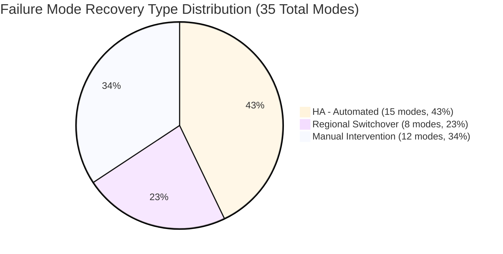
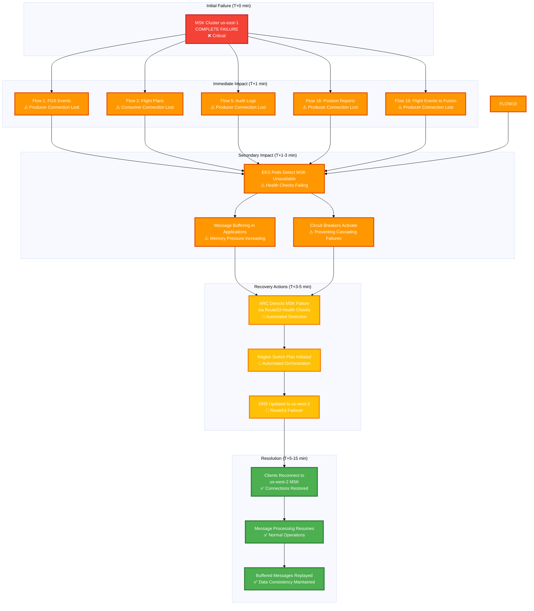

# NXOP Infrastructure Failures

**Part of**: [NXOP Resilience Analysis](../NXOP-Resilience-Analysis-v3.md)  
**Foundation**: [NXOP Message Flow Analysis](00-NXOP-Message-Flow-Analysis.md)

---

## Purpose

This document provides a comprehensive catalog of infrastructure and application-level failure modes across the NXOP platform. Each failure mode includes:
- Impact assessment and likelihood
- Prevention and detection strategies
- Recovery strategies and type
- Chaos testing experiments

**Audience**: Infrastructure engineers, SREs, operations teams, chaos engineers

---

## Failure Mode Visualization

### Infrastructure Failure Taxonomy

**Total Failure Modes**: 35 across 5 major categories

| Category | Sub-Category | Failure Modes | Count |
|----------|--------------|---------------|-------|
| **1. Infrastructure Components** | | | **14** |
| | 1.1 EKS Cluster Components | Pod Failures, Node Failures, Complete EKS Cluster Failure, Resource Exhaustion (CPU/Memory) | 4 |
| | 1.2 MSK Cluster Components | Single Broker Node Failure, Multiple Broker Failures, Complete MSK Cluster Failure, Disk Space Exhaustion | 4 |
| | 1.3 DocumentDB Cluster Components | Primary DocumentDB Cluster Failure, DocumentDB Connection Pool Exhaustion, Complete DocumentDB Global Cluster Failure | 3 |
| | 1.4 S3 Storage Components | S3 MRAP Endpoint Failure, S3 Regional Bucket Failure, S3 Object Corruption | 3 |
| **2. Network Infrastructure** | | | **8** |
| | 2.1 Load Balancer Components | NLB Target Health Degradation, Complete NLB Failure | 2 |
| | 2.2 Network Connectivity Components | Security Group Rule Issues, VPC/Subnet Failures, Cross-Account Network Issues | 3 |
| | 2.3 DNS and Traffic Routing Components | Route53 Health Check Failures, DNS Propagation Delays, Complete Route53 Service Failure | 3 |
| **3. Data Replication** | | | **3** |
| | 3.1 Cross-Region Replication Components | MSK Replicator Failure, DocumentDB Cross-Region Replication Lag, S3 Cross-Region Replication (CRR) Failure | 3 |
| **4. DR Orchestration** | | | **7** |
| | 4.1 ARC Control Components | ARC Control Cluster Degradation, ARC Routing Control Failures, Geolocation Routing Issues | 3 |
| | 4.2 Orchestration Automation Components | Region Switch Plan Execution Failure, Security Group Cordon Function Failure, Cross-Region S3 Access Issues, SSM Automation Document Failures | 4 |
| **5. Application Functionality** | | | **23** |
| | 5.1 Data Ingestion - External Integration | RabbitMQ Connection Loss, FlightKeys Regional Failover, Network Partition to FlightKeys | 3 |
| | 5.2 Data Ingestion - Processing | Message Format Schema Changes, Topic Partition Corruption, Consumer Group Offset Issues | 3 |
| | 6.1 Authentication and Authorization | Cross-Account IAM Role Failure, Pod Identity Role Chaining Failure, Authentication/Authorization Failures (RabbitMQ), DocumentDB Authentication Failures, DocumentDB Cross-Account Role Chain Failure, S3 Authentication/Authorization Issues, S3 Cross-Account Role Chain Failure, S3 Cross-Account Access Failures, DocumentDB Network Connectivity Issues | 9 |
| | 7.1 Application Processing | Application Code Bugs | 1 |
| | 8.1 Data Distribution | MSK Connector Failures, Kafka MQ Adapter Issues, Azure Event Hub Connectivity, OnPrem Connectivity Issues, FXIP Integration Failures | 5 |
| | 9.1 Cascading and Multi-Component | Regional AWS Service Outage, Network Partition Between Regions, Simultaneous Multi-Account Failures, Data Center Power/Cooling Failures, Coordinated Cyber Attack | 5 |

**Category Distribution**:
- Infrastructure Components: 14 modes (40%)
- Network Infrastructure: 8 modes (23%)
- Data Replication: 3 modes (9%)
- DR Orchestration: 7 modes (20%)
- Application Functionality: 23 modes (66%)

**Note**: Application Functionality overlaps with infrastructure as many application failures are caused by or related to infrastructure issues.

---

### Failure Modes by Recovery Type

| Recovery Type | Count | Percentage | RTO Target | Categories |
|---------------|-------|------------|------------|------------|
| **HA - Automated** | 15 | 43% | < 5 minutes | Pod restart, auto-scaling, health checks, connection retry |
| **Regional Switchover** | 8 | 23% | 5-15 minutes | ARC orchestration, DNS failover, cross-region activation |
| **Manual Intervention** | 12 | 34% | 15+ minutes | Human decision, runbook execution, emergency procedures |
| **Total** | **35** | **100%** | | |

**Recovery Type by Category**:

| Category | HA - Automated | Regional Switchover | Manual Intervention | Total |
|----------|----------------|---------------------|---------------------|-------|
| Infrastructure Components | 9 | 3 | 2 | 14 |
| Network Infrastructure | 3 | 2 | 3 | 8 |
| Data Replication | 3 | 0 | 0 | 3 |
| DR Orchestration | 0 | 0 | 7 | 7 |
| Application Functionality | 6 | 3 | 14 | 23 |

---

### Recovery Type Distribution

**Recovery Type Breakdown by Category**:

| Category | HA - Automated | Regional Switchover | Manual Intervention | Total |
|----------|----------------|---------------------|---------------------|-------|
| **Infrastructure Components** | 9 | 3 | 2 | 14 |
| **Network Infrastructure** | 3 | 2 | 3 | 8 |
| **Data Replication** | 3 | 0 | 0 | 3 |
| **DR Orchestration** | 0 | 0 | 7 | 7 |
| **Application Functionality** | 6 | 3 | 14 | 23 |

**RTO Ranges by Recovery Type**:
- **HA - Automated**: < 5 minutes (pod restart, auto-scaling, health checks)
- **Regional Switchover**: 5-15 minutes (ARC orchestration, DNS propagation)
- **Manual Intervention**: 15+ minutes (human decision, runbook execution)

---

### Failure Impact vs Likelihood Risk Matrix

**Risk Matrix**: Failure modes plotted by Impact (vertical) vs Likelihood (horizontal)

| Impact / Likelihood | **Very Low** | **Low** | **Medium** | **High** |
|---------------------|--------------|---------|------------|----------|
| **Critical** | • Network Partition Between Regions • Complete Route53 Failure • Global DocumentDB Failure • VPC/Subnet Failures | • Complete EKS Cluster Failure • Complete MSK Cluster Failure • Regional AWS Service Outage • Cross-Account IAM Role Failure • Network Partition to FlightKeys | | • RabbitMQ Connection Loss |
| **High** | • S3 Object Corruption | • Primary DocumentDB Failure • S3 MRAP Endpoint Failure • S3 Regional Bucket Failure • Complete NLB Failure • Cross-Account Network Issues | • Node Failures • Multiple Broker Failures • Disk Space Exhaustion • Connection Pool Exhaustion • Security Group Issues • MSK Replicator Failure • MSK Connector Failures • Kafka MQ Adapter Issues • Azure Event Hub Connectivity • OnPrem Connectivity Issues | • Resource Exhaustion |
| **Medium** | • Consumer Group Offset Issues | • FlightKeys Regional Failover • DocumentDB Replication Lag • S3 CRR Failure • FXIP Integration Failures | • NLB Target Health Degradation • Route53 Health Check Failures | |
| **Low** | | | | • Pod Failures • DNS Propagation Delays • Single Broker Failure |

**Risk Quadrant Analysis**:

#### Q1 - Critical Priority (High/Critical Impact, Medium/High Likelihood) - 1 Failure Mode
**Immediate Action Required**

| Failure Mode | Impact | Likelihood | Current Recovery | Recommended Actions |
|--------------|--------|------------|------------------|---------------------|
| RabbitMQ Connection Loss | Critical | Medium | HA - Automated | • Implement connection pooling with multiple endpoints • Add connection health monitoring • Configure automatic reconnection with exponential backoff • Test failover scenarios regularly |

#### Q2 - Monitor Closely (High/Critical Impact, Very Low/Low Likelihood) - 11 Failure Modes
**Maintain Strong Recovery Capabilities**

| Failure Mode | Impact | Likelihood | Current Recovery | Key Mitigation |
|--------------|--------|------------|------------------|----------------|
| Complete EKS Cluster Failure | Critical | Low | Regional Switchover | ARC-orchestrated cross-region failover |
| Complete MSK Cluster Failure | Critical | Low | Regional Switchover | Route53 health checks + ARC automation |
| Regional AWS Service Outage | Critical | Low | Regional Switchover | Multi-region architecture + ARC |
| Cross-Account IAM Role Failure | Critical | Low | Manual Intervention | Automated role validation + backup credentials |
| Network Partition to FlightKeys | Critical | Very Low | Manual Intervention | Multiple network paths + vendor escalation |
| Network Partition Between Regions | Critical | Very Low | Manual Intervention | Cross-region connectivity monitoring |
| Complete Route53 Failure | Critical | Very Low | Manual Intervention | Emergency static IP configuration |
| Global DocumentDB Failure | Critical | Very Low | Manual Intervention | Emergency database restoration from backups |
| VPC/Subnet Failures | Critical | Very Low | Regional Switchover | Alternative AZ routing |
| Primary DocumentDB Failure | High | Low | HA - Automated | Automatic failover to secondary region |
| S3 MRAP Endpoint Failure | High | Low | HA - Automated | Direct regional bucket access fallback |

#### Q3 - Accept Risk (Low/Medium Impact, Very Low/Low Likelihood) - 4 Failure Modes
**Standard Monitoring Sufficient**

| Failure Mode | Impact | Likelihood | Current Recovery | Status |
|--------------|--------|------------|------------------|--------|
| Consumer Group Offset Issues | Medium | Very Low | HA - Automated | Automated offset management in place |
| FlightKeys Regional Failover | Medium | Low | HA - Automated | Vendor-managed, transparent to NXOP |
| DocumentDB Replication Lag | Medium | Low | HA - Automated | Acceptable lag thresholds configured |
| S3 CRR Failure | Medium | Low | HA - Automated | CRR monitoring + automatic retry |

#### Q4 - Automate Recovery (Low/Medium Impact, Medium/High Likelihood) - 19 Failure Modes
**Automation Already in Place or Needed**

| Failure Mode | Impact | Likelihood | Current Recovery | Automation Status |
|--------------|--------|------------|------------------|-------------------|
| Pod Failures | Low | High | HA - Automated | ✅ HPA + pod restart policies |
| DNS Propagation Delays | Low | High | HA - Automated | ✅ Low TTL + client retry |
| Single Broker Failure | Medium | High | HA - Automated | ✅ AWS auto-replacement |
| Resource Exhaustion | High | High | HA - Automated | ✅ HPA scaling + resource monitoring |
| Node Failures | High | Medium | HA - Automated | ✅ Auto-scaling groups + pod rescheduling |
| Multiple Broker Failures | High | Medium | HA - Automated | ✅ Auto-scaling + partition rebalancing |
| Disk Space Exhaustion | High | Medium | HA - Automated | ✅ Log retention tuning + storage scaling |
| Connection Pool Exhaustion | High | Medium | HA - Automated | ✅ Connection pool scaling + recycling |
| Security Group Issues | High | Medium | HA - Automated | ✅ Automated rule restoration |
| MSK Replicator Failure | High | Medium | HA - Automated | ✅ Replicator restart + monitoring |
| MSK Connector Failures | High | Medium | HA - Automated | ✅ Connector restart + validation |
| Kafka MQ Adapter Issues | High | Medium | HA - Automated | ✅ Adapter restart + failover |
| Azure Event Hub Connectivity | High | Medium | HA - Automated | ✅ Connection retry + alternative endpoints |
| OnPrem Connectivity Issues | High | Medium | Manual Intervention | ⚠️ Need automated network path restoration |
| NLB Target Health Degradation | Medium | Medium | HA - Automated | ✅ Automatic target removal + recovery |
| Route53 Health Check Failures | Medium | Medium | HA - Automated | ✅ Health check reconfiguration |
| FXIP Integration Failures | Medium | Medium | HA - Automated | ✅ Service restart + alternative paths |
| S3 Regional Bucket Failure | High | Low | HA - Automated | ✅ MRAP automatic failover |
| Complete NLB Failure | High | Low | Regional Switchover | ✅ Cross-region DNS failover |

**Priority Actions Summary**:
1. **Critical Priority (Q1)**: 1 failure mode - Enhance RabbitMQ connection resilience
2. **Monitor Closely (Q2)**: 11 failure modes - Maintain DR readiness, regular testing
3. **Accept Risk (Q3)**: 4 failure modes - Continue standard monitoring
4. **Automate Recovery (Q4)**: 19 failure modes - 18 already automated, 1 needs automation (OnPrem Connectivity)

---

### Cascading Failure Chain Example

**Caption**: "Cascading Failure Chain - MSK Cluster Failure Impact and Recovery Timeline"

**Failure Impact Summary**:
- **Affected Flows**: 6 flows (1, 2, 5, 10, 18, 19) - 32% of NXOP-managed flows
- **Recovery Type**: Regional Switchover (ARC-orchestrated)
- **RTO**: 5-15 minutes
- **Data Loss Risk**: None (message buffering + Kafka persistence)
- **Automatic Recovery**: Yes (ARC detects and orchestrates failover)

**Key Recovery Mechanisms**:
1. **Circuit Breakers**: Prevent cascading failures to downstream systems
2. **Message Buffering**: Applications buffer messages during MSK unavailability
3. **Route53 Health Checks**: Detect MSK failure and trigger ARC
4. **ARC Orchestration**: Automated region switch plan execution
5. **DNS Failover**: Route53 updates DNS to point to us-west-2
6. **Message Replay**: Buffered messages replayed after reconnection

---

## Infrastructure Component Failures

### 1.1 EKS Cluster Components

| Failure Mode | Impact | Likelihood | Prevention/Detection | Recovery Strategy | Recovery Type | Chaos Testing Experiments |
|--------------|--------|------------|---------------------|-------------------|---------------|---------------------------|
| **Pod Failures** | Low - Reduced capacity | High | Pod health checks, readiness probes | HPA scaling, pod restart policies | HA - Automated | Kill random pods, OOM kill containers, corrupt pod configurations |
| **Node Failures** | Medium - Multiple pod loss | Medium | Node status monitoring, cluster metrics | Auto-scaling groups, pod rescheduling | HA - Automated | Terminate EC2 instances, drain nodes, simulate node resource exhaustion |
| **Complete EKS Cluster Failure** | Critical - Regional processing stops | Low | Cluster health monitoring, pod failures | Cross-region application scaling | Regional Switchover | Terminate entire node groups, delete cluster networking, corrupt cluster state |
| **Resource Exhaustion (CPU/Memory)** | High - Performance degradation | Medium | Resource utilization monitoring | HPA scaling, resource limit tuning | HA - Automated | CPU stress testing, memory exhaustion, disk space filling |

### 1.2 MSK Cluster Components

| Failure Mode | Impact | Likelihood | Prevention/Detection | Recovery Strategy | Recovery Type | Chaos Testing Experiments |
|--------------|--------|------------|---------------------|-------------------|---------------|---------------------------|
| **Single Broker Node Failure** | Medium - Partition unavailability | High | Broker health metrics, partition monitoring | AWS auto-replacement, client retry | HA - Automated | Terminate single broker instances, simulate broker process crashes |
| **Multiple Broker Failures** | High - Reduced cluster capacity | Medium | Cluster health monitoring, ISR metrics | Auto-scaling, partition rebalancing | HA - Automated | Terminate multiple brokers simultaneously, simulate AZ failures |
| **Complete MSK Cluster Failure** | Critical - Regional Kafka unavailable | Low | NLB health checks, ARC readiness | Cross-region failover via ARC | Regional Switchover | Delete entire MSK cluster, corrupt cluster configuration, simulate regional AWS outage |
| **Disk Space Exhaustion** | High - Cannot accept new messages | Medium | Disk utilization monitoring | Log retention tuning, storage scaling | HA - Automated | Fill broker disk space, disable log cleanup, create large message volumes |

### 1.3 DocumentDB Cluster Components

| Failure Mode | Impact | Likelihood | Prevention/Detection | Recovery Strategy | Recovery Type | Chaos Testing Experiments |
|--------------|--------|------------|---------------------|-------------------|---------------|---------------------------|
| **Primary DocumentDB Cluster Failure** | High - Cannot write to database | Low | Connection monitoring, write failure alerts | Automatic failover to secondary region | HA - Automated | Stop primary cluster, simulate primary region outage, corrupt primary cluster |
| **DocumentDB Connection Pool Exhaustion** | High - Applications cannot connect | Medium | Connection pool monitoring, connection count alerts | Connection pool scaling, connection recycling | HA - Automated | Exhaust connection pools, simulate connection leaks, block connection cleanup |
| **Complete DocumentDB Global Cluster Failure** | Critical - No database access | Very Low | Multi-region health monitoring, global cluster status | Emergency database restoration, backup recovery | Manual Intervention | Simulate global cluster corruption, delete all cluster instances, corrupt cluster configuration |

### 1.4 S3 Storage Components

| Failure Mode | Impact | Likelihood | Prevention/Detection | Recovery Strategy | Recovery Type | Chaos Testing Experiments |
|--------------|--------|------------|---------------------|-------------------|---------------|---------------------------|
| **S3 MRAP Endpoint Failure** | High - Cannot access S3 via MRAP | Low | MRAP health monitoring, API failure alerts | Direct regional bucket access, MRAP recreation | HA - Automated | Block MRAP endpoint, corrupt MRAP configuration, simulate MRAP service degradation |
| **S3 Regional Bucket Failure** | High - Cannot access data in specific region | Low | Bucket availability monitoring, API error tracking | MRAP automatic failover to healthy region | HA - Automated | Simulate regional S3 outage, corrupt bucket policies, delete bucket contents |
| **S3 Object Corruption** | Medium - Data integrity issues | Very Low | Object integrity checks, checksum validation | Object restoration from backup region | Manual Intervention | Corrupt S3 objects, inject invalid data, simulate bit-flip errors |

## 2. Network Infrastructure Failures

### 2.1 Load Balancer Components

| Failure Mode | Impact | Likelihood | Prevention/Detection | Recovery Strategy | Recovery Type | Chaos Testing Experiments |
|--------------|--------|------------|---------------------|-------------------|---------------|---------------------------|
| **NLB Target Health Degradation** | Medium - Reduced connection capacity | Medium | HealthyHostCount alarms | Automatic target removal, health recovery | HA - Automated | Mark NLB targets unhealthy, simulate target response delays, block health check ports |
| **Complete NLB Failure** | High - MSK inaccessible via DNS | Low | Route53 health checks, connection failures | Cross-region DNS failover | Regional Switchover | Delete NLB, corrupt NLB configuration, simulate NLB service outage |

### 2.2 Network Connectivity Components

| Failure Mode | Impact | Likelihood | Prevention/Detection | Recovery Strategy | Recovery Type | Chaos Testing Experiments |
|--------------|--------|------------|---------------------|-------------------|---------------|---------------------------|
| **Security Group Rule Issues** | High - Connectivity blocked | Low | Connection monitoring, network tests | Automated rule restoration, manual override | HA - Automated | Remove security group rules, add blocking rules, corrupt rule configurations |
| **VPC/Subnet Failures** | Critical - Network infrastructure down | Very Low | Network connectivity monitoring | Alternative AZ routing, emergency procedures | Regional Switchover | Delete subnets, corrupt route tables, simulate VPC service failures |
| **Cross-Account Network Issues** | High - KPaaS cannot reach MSK | Low | Cross-account connectivity tests | Network path restoration, backup routes | Manual Intervention | Block cross-account traffic, corrupt VPC peering, delete transit gateway routes |

### 2.3 DNS and Traffic Routing Components

| Failure Mode | Impact | Likelihood | Prevention/Detection | Recovery Strategy | Recovery Type | Chaos Testing Experiments |
|--------------|--------|------------|---------------------|-------------------|---------------|---------------------------|
| **Route53 Health Check Failures** | Medium - Incorrect DNS routing | Medium | Health check status monitoring | Health check reconfiguration, manual override | HA - Automated | Corrupt health check configurations, block health check endpoints, simulate false positives |
| **DNS Propagation Delays** | Low - Some clients use old endpoints | High | DNS resolution monitoring, TTL tracking | Low TTL configuration, client retry | HA - Automated | Increase TTL values, corrupt DNS cache, simulate DNS server delays |
| **Complete Route53 Service Failure** | Critical - DNS resolution unavailable | Very Low | DNS query monitoring from multiple locations | Emergency static IP config, alternative DNS | Manual Intervention | Block all Route53 queries, simulate Route53 service outage, corrupt hosted zone |

## 3. Data Replication Failures

### 3.1 Cross-Region Replication Components

| Failure Mode | Impact | Likelihood | Prevention/Detection | Recovery Strategy | Recovery Type | Chaos Testing Experiments |
|--------------|--------|------------|---------------------|-------------------|---------------|---------------------------|
| **MSK Replicator Failure** | High - Cross-region sync stops | Medium | Replication lag monitoring, offset tracking | Replicator restart, manual recreation | HA - Automated | Stop replicator service, corrupt replication configuration, block cross-region traffic |
| **DocumentDB Cross-Region Replication Lag** | Medium - Stale reads from secondary | Medium | Replication lag monitoring, data freshness checks | Read preference tuning, acceptable lag thresholds | HA - Automated | Throttle replication bandwidth, simulate network latency, create large write volumes |
| **S3 Cross-Region Replication (CRR) Failure** | Medium - Data not replicated to secondary region | Medium | CRR metrics monitoring, replication status checks | CRR rule recreation, manual data sync | HA - Automated | Disable CRR rules, corrupt replication configuration, block cross-region S3 traffic |

## 4. Disaster Recovery Orchestration Failures

### 4.1 ARC Control Components

| Failure Mode | Impact | Likelihood | Prevention/Detection | Recovery Strategy | Recovery Type | Chaos Testing Experiments |
|--------------|--------|------------|---------------------|-------------------|---------------|---------------------------|
| **ARC Control Cluster Degradation** | High - Cannot execute automated failover | Low | ARC API health checks, cluster monitoring | Manual failover procedures, emergency runbooks | Manual Intervention | Block ARC API access, corrupt control cluster state, simulate ARC service degradation |
| **ARC Routing Control Failures** | High - Cannot control traffic routing | Low | ARC API monitoring, control state checks | Manual routing control, direct DNS updates | Manual Intervention | Corrupt ARC routing control state, block ARC API access, simulate ARC service degradation |
| **Geolocation Routing Issues** | Medium - Suboptimal client routing | Low | Traffic pattern analysis, latency monitoring | Routing policy updates, manual record changes | Manual Intervention | Corrupt geolocation data, simulate client location spoofing, misconfigure routing policies |

### 4.2 Orchestration Automation Components

| Failure Mode | Impact | Likelihood | Prevention/Detection | Recovery Strategy | Recovery Type | Chaos Testing Experiments |
|--------------|--------|------------|---------------------|-------------------|---------------|---------------------------|
| **Region Switch Plan Execution Failure** | Critical - Failover process incomplete | Low | Plan execution monitoring, step validation | Manual step execution, rollback procedures | Manual Intervention | Corrupt region switch plan, block Lambda execution, simulate step timeouts |
| **Security Group Cordon Function Failure** | Medium - Cannot isolate failing region | Low | Lambda execution monitoring, function logs | Manual security group updates, backup functions | Manual Intervention | Corrupt Lambda function code, block S3 access, simulate IAM permission failures |
| **Cross-Region S3 Access Issues** | Medium - Cannot restore network rules | Low | S3 API monitoring, cross-region access tests | Alternative storage, local backup retrieval | Manual Intervention | Block cross-region S3 access, corrupt S3 objects, simulate S3 service failures |
| **SSM Automation Document Failures** | Medium - Cannot trigger automated procedures | Medium | Document execution monitoring, API failures | Manual procedure execution, document recreation | Manual Intervention | Corrupt SSM documents, block SSM API access, simulate execution timeouts |

## Application/Functionality-Level Failures

Application-level failures affect business functionality and data flow, often requiring application-specific recovery procedures or manual intervention.

### 5. Data Ingestion Functionality

#### 5.1 External Data Source Integration

| Failure Mode | Impact | Likelihood | Prevention/Detection | Recovery Strategy | Recovery Type | Chaos Testing Experiments |
|--------------|--------|------------|---------------------|-------------------|---------------|---------------------------|
| **RabbitMQ Connection Loss** | Critical - No flight data ingestion | Medium | Connection health monitoring, AMQP heartbeats | Connection retry with exponential backoff, multiple endpoint config | HA - Automated | Block RabbitMQ ports, terminate AMQP connections, simulate network latency |
| **FlightKeys Regional Failover** | Medium - Temporary ingestion pause | Medium | Vendor notifications, connection monitoring | Transparent via vendor-managed unified DNS | HA - Automated | Coordinate with vendor for planned failover testing, DNS resolution delays |
| **Network Partition to FlightKeys** | Critical - Complete ingestion loss | Very Low | Network connectivity monitoring | Alternative network paths, vendor escalation | Manual Intervention | Block external network routes, simulate WAN failures, DNS blackholing |

#### 5.2 Message Processing and Validation

| Failure Mode | Impact | Likelihood | Prevention/Detection | Recovery Strategy | Recovery Type | Chaos Testing Experiments |
|--------------|--------|------------|---------------------|-------------------|---------------|---------------------------|
| **Message Format Schema Changes** | High - Processing failures | Low | Schema validation, message parsing errors | Schema evolution support, backward compatibility | Manual Intervention | Inject malformed messages, change message schemas, corrupt message headers |
| **Topic Partition Corruption** | High - Data unreadable | Very Low | Consumer read errors, partition health | Partition recovery, topic recreation | Manual Intervention | Corrupt partition log files, inject invalid message formats, simulate disk corruption |
| **Consumer Group Offset Issues** | Medium - Message reprocessing | Low | Consumer lag monitoring, offset tracking | Offset reset, consumer restart | HA - Automated | Corrupt offset storage, reset consumer group offsets, simulate offset commit failures |

### 6. Authentication and Authorization Functionality

#### 6.1 Cross-Account IAM and Access Control

| Failure Mode | Impact | Likelihood | Prevention/Detection | Recovery Strategy | Recovery Type | Chaos Testing Experiments |
|--------------|--------|------------|---------------------|-------------------|---------------|---------------------------|
| **Cross-Account IAM Role Failure** | Critical - Cannot access MSK/DocumentDB/S3 | Low | Auth errors, connection failures | Role recreation, backup credentials | Manual Intervention | Delete IAM roles, corrupt trust policies, expire assume role tokens, break role chaining |
| **Pod Identity Role Chaining Failure** | Critical - Cannot assume NXOP roles | Low | AssumeRole failures, permission denied errors | Trust policy recreation, role chain validation | Manual Intervention | Corrupt trust relationships, delete intermediate roles, block cross-account assume role |
| **Authentication/Authorization Failures** | Critical - Cannot access RabbitMQ | Low | Auth failure alerts, connection errors | Credential refresh, backup auth methods | HA - Automated | Expire credentials, revoke IAM permissions, corrupt auth tokens |
| **DocumentDB Authentication Failures** | Critical - Cannot access database | Low | Auth failure monitoring, credential validation | Credential rotation, backup auth methods | Manual Intervention | Expire database credentials, corrupt connection strings, revoke database permissions, break role chaining |
| **DocumentDB Cross-Account Role Chain Failure** | Critical - Pod Identity cannot assume NXOP DocumentDB role | Low | AssumeRole failures for DocumentDB access | Trust relationship recreation, role validation | Manual Intervention | Delete NXOP DocumentDB role, corrupt trust policies, block cross-account assume role |
| **S3 Authentication/Authorization Issues** | Critical - Cannot access S3 buckets | Low | S3 API auth failures, IAM policy validation | IAM role recreation, policy correction | Manual Intervention | Corrupt S3 bucket policies, revoke IAM permissions, expire S3 access tokens, break role chaining |
| **S3 Cross-Account Role Chain Failure** | Critical - Pod Identity cannot assume NXOP S3 role | Low | AssumeRole failures for S3 access, trust policy issues | Trust relationship recreation, role chain validation | Manual Intervention | Delete NXOP S3 role, corrupt cross-account trust policies, block assume role permissions |
| **S3 Cross-Account Access Failures** | High - KPaaS cannot access NXOP S3 buckets | Low | Cross-account access monitoring, policy validation | Cross-account policy recreation, alternative access methods | Manual Intervention | Corrupt cross-account policies, block cross-account traffic, revoke bucket permissions |
| **DocumentDB Network Connectivity Issues** | High - Cross-account database access blocked | Low | Network connectivity tests, VPC endpoint monitoring | Network path restoration, alternative routing | Manual Intervention | Block VPC peering, corrupt security group rules, simulate VPC endpoint failures |

### 7. Application Processing Functionality

#### 7.1 Application Code and Logic

| Failure Mode | Impact | Likelihood | Prevention/Detection | Recovery Strategy | Recovery Type | Chaos Testing Experiments |
|--------------|--------|------------|---------------------|-------------------|---------------|---------------------------|
| **Application Code Bugs** | Medium - Processing errors | Medium | Error rate monitoring, log analysis | Code rollback, hotfix deployment | Manual Intervention | Inject application exceptions, corrupt message processing logic, memory leaks |

### 8. Data Distribution Functionality

#### 8.1 Downstream System Integration

| Failure Mode | Impact | Likelihood | Prevention/Detection | Recovery Strategy | Recovery Type | Chaos Testing Experiments |
|--------------|--------|------------|---------------------|-------------------|---------------|---------------------------|
| **MSK Connector Failures** | High - Data not reaching downstream | Medium | Connector status monitoring, throughput tracking | Connector restart, configuration validation | HA - Automated | Stop connector services, corrupt connector configurations, simulate downstream unavailability |
| **Kafka MQ Adapter Issues** | High - Azure/OnPrem integration broken | Medium | Adapter health monitoring, message flow tracking | Adapter restart, failover to backup | HA - Automated | Kill adapter processes, corrupt message transformation logic, simulate MQ unavailability |
| **Azure Event Hub Connectivity** | High - Azure integration unavailable | Medium | Connection monitoring, message delivery tracking | Connection retry, alternative endpoints | HA - Automated | Block Azure connectivity, corrupt Event Hub credentials, simulate Azure service outages |
| **OnPrem Connectivity Issues** | High - OnPrem systems not receiving data | Medium | Network connectivity tests, VPN monitoring | Network path restoration, backup connections | Manual Intervention | Block VPN connections, corrupt network routes, simulate OnPrem infrastructure failures |
| **FXIP Integration Failures** | Medium - Flight exchange platform issues | Medium | FXIP API monitoring, data flow validation | Service restart, alternative processing paths | HA - Automated | Block FXIP API access, corrupt integration credentials, simulate FXIP service degradation |

### 9. Cascading and Multi-Component Failures

#### 9.1 Regional and Multi-Service Failures

| Failure Mode | Impact | Likelihood | Prevention/Detection | Recovery Strategy | Recovery Type | Chaos Testing Experiments |
|--------------|--------|------------|---------------------|-------------------|---------------|---------------------------|
| **Regional AWS Service Outage** | Critical - Multiple services unavailable | Low | AWS Service Health Dashboard, multi-service failures | Automatic cross-region failover via ARC | Regional Switchover | Coordinate with AWS for planned outage simulation, block multiple AWS service APIs |
| **Network Partition Between Regions** | Critical - Cross-region replication stops | Very Low | Cross-region connectivity monitoring, split-brain detection | Manual region designation, emergency procedures | Manual Intervention | Block inter-region traffic, simulate WAN failures, corrupt BGP routing |
| **Simultaneous Multi-Account Failures** | Critical - Complete service unavailability | Very Low | Cross-account health monitoring, correlation analysis | Emergency procedures per account, alternative cloud | Manual Intervention | Coordinate multi-account failure simulation, corrupt cross-account IAM roles |
| **Data Center Power/Cooling Failures** | Critical - Physical infrastructure down | Very Low | Environmental monitoring, AWS infrastructure alerts | AWS managed recovery, cross-region failover | Regional Switchover | Cannot simulate (AWS managed), test via planned AZ evacuation exercises |
| **Coordinated Cyber Attack** | Critical - Security compromise across systems | Very Low | Security monitoring, anomaly detection, threat intelligence | Incident response procedures, system isolation | Manual Intervention | Red team exercises, simulate credential compromise, test security isolation procedures |

---

## Related Documentation

- **[Architecture Overview](01-Architecture-Overview.md)** - System architecture
- **[CloudWatch Metrics Strategy](04-CloudWatch-Metrics.md)** - Monitoring metrics
- **[Region Readiness Assessment](05-Region-Readiness-Assessment.md)** - Health validation
- **[Region Switch Orchestration](06-Region-Switch-Orchestration.md)** - Failover procedures

---

**Document Owner**: NXOP Platform Team  
**Last Updated**: 2026-01-19  
**Review Frequency**: Quarterly
