# NXOP Region Readiness Assessment

**Part of**: [NXOP Resilience Analysis](../NXOP-Resilience-Analysis-v3.md)  
**Foundation**: [NXOP Message Flow Analysis](00-NXOP-Message-Flow-Analysis.md)

---

## Purpose

This document defines the Region Readiness Assessment framework used to validate target region health before executing a regional failover. The framework provides:
- Hierarchical health check system (L1-L4)
- Composite scoring methodology
- Readiness thresholds and decision criteria
- CloudWatch implementation details

**Audience**: SREs, operations teams, DR coordinators

---

## Overview

Before executing a Regional Switchover, the target region must be validated as fully operational across all layers. This hierarchical health check system provides a comprehensive readiness assessment using existing CloudWatch metrics to ensure safe failover operations.


## Hierarchical Health Check Architecture

```mermaid
graph LR
    %% Master Level
    RR[🎯 Region Readiness<br/>MASTER CHECK<br/>Target: 90%+]
    
    %% Layer Headers
    RR --> L1[L1 Infrastructure<br/>Weight: 30%]
    RR --> L2[L2 Network<br/>Weight: 25%]
    RR --> L3[L3 Data<br/>Weight: 25%]
    RR --> L4[L4 Application<br/>Weight: 20%]
    
    %% L1 Infrastructure Components
    L1 --> L1_EKS[EKS Health<br/>35%<br/>• Nodes<br/>• Resources<br/>• Pods]
    L1 --> L1_MSK[MSK Health<br/>30%<br/>• Controller<br/>• Partitions<br/>• Replication]
    L1 --> L1_DDB[DocumentDB<br/>25%<br/>• CPU/Memory<br/>• Connections<br/>• Latency]
    L1 --> L1_S3[S3 Health<br/>10%<br/>• API Avail<br/>• Latency<br/>• MRAP]
    
    %% L2 Network Components
    L2 --> L2_NLB[NLB Health<br/>40%<br/>• Targets<br/>• Resets<br/>• Throughput]
    L2 --> L2_DNS[DNS Health<br/>35%<br/>• Checks<br/>• Latency]
    L2 --> L2_XACCT[Cross-Account<br/>25%<br/>• Role Chain<br/>• Auth Time<br/>• Failures]
    
    %% L3 Data Components
    L3 --> L3_REPL[Replication<br/>60%<br/>• MSK Lag<br/>• DDB Sync<br/>• S3 CRR]
    L3 --> L3_FRESH[Data Fresh<br/>40%<br/>• Age<br/>• X-Region]
    
    %% L4 Application Components
    L4 --> L4_SVC[Service<br/>40%<br/>• Readiness<br/>• Resources<br/>• Health]
    L4 --> L4_E2E[End-to-End<br/>35%<br/>• Ingestion<br/>• Latency<br/>• Errors]
    L4 --> L4_CANARY[Canary<br/>25%<br/>• Producer<br/>• Consumer<br/>• Repl Test]
    
    %% Styling
    classDef master fill:#ff6b6b,stroke:#c92a2a,stroke-width:4px,color:#fff
    classDef layer fill:#4ecdc4,stroke:#26a69a,stroke-width:3px,color:#fff
    classDef infra fill:#96ceb4,stroke:#6c7b7f,stroke-width:2px,color:#000
    classDef network fill:#ffeaa7,stroke:#fdcb6e,stroke-width:2px,color:#000
    classDef data fill:#fab1a0,stroke:#e17055,stroke-width:2px,color:#000
    classDef app fill:#a29bfe,stroke:#6c5ce7,stroke-width:2px,color:#fff
    
    class RR master
    class L1,L2,L3,L4 layer
    class L1_EKS,L1_MSK,L1_DDB,L1_S3 infra
    class L2_NLB,L2_DNS,L2_XACCT network
    class L3_REPL,L3_FRESH data
    class L4_SVC,L4_E2E,L4_CANARY app
```



## L1 - Infrastructure Layer Readiness

### EKS Cluster Health
| Check Name | Metric | Threshold | Weight | Purpose |
|------------|--------|-----------|--------|---------|
| `EKS-Node-Capacity` | `GroupInServiceInstances` | ≥ 80% of desired | 50% | Compute capacity available |
| `EKS-Pod-Capacity` | `node_cpu_utilization` | < 70% average | 30% | Resource headroom |
| `EKS-Pod-Health` | `pod_restart_count` | < 2 restarts/hour | 20% | Pod stability |

**L1-EKS Composite Score**: `(Nodes × 0.50) + (Resources × 0.30) + (Pods × 0.20)`

### MSK Cluster Health
| Check Name | Metric | Threshold | Weight | Purpose |
|------------|--------|-----------|--------|---------|
| `MSK-Controller` | `ActiveControllerCount` | = 1 | 30% | Cluster leadership |
| `MSK-Partitions` | `OfflinePartitionsCount` | = 0 | 25% | Data availability |
| `MSK-Replication` | `UnderReplicatedPartitions` | = 0 | 25% | Data durability |
| `MSK-Brokers` | `CpuIdle` | > 30% average | 20% | Broker capacity |

**L1-MSK Composite Score**: `(Controller × 0.30) + (Partitions × 0.25) + (Replication × 0.25) + (Capacity × 0.20)`

### DocumentDB Cluster Health
| Check Name | Metric | Threshold | Weight | Purpose |
|------------|--------|-----------|--------|---------|
| `DDB-CPU` | `CPUUtilization` | < 70% | 25% | Compute capacity |
| `DDB-Memory` | `FreeableMemory` | > 30% of total | 25% | Memory capacity |
| `DDB-Connections` | `DatabaseConnections` | < 80% of max | 25% | Connection capacity |
| `DDB-Latency` | `ReadLatency` + `WriteLatency` | < 50ms (P95) | 25% | Performance readiness |

**L1-DDB Composite Score**: `(CPU × 0.25) + (Memory × 0.25) + (Connections × 0.25) + (Latency × 0.25)`

### S3 Bucket Health
| Check Name | Metric | Threshold | Weight | Purpose |
|------------|--------|-----------|--------|---------|
| `S3-Availability` | `5xxErrors` | < 0.1% error rate | 40% | Service availability |
| `S3-Performance` | `FirstByteLatency` | < 200ms (P95) | 30% | Access performance |
| `S3-MRAP` | `AllRequests` via MRAP | > 0 requests/min | 30% | MRAP functionality |

**L1-S3 Composite Score**: `(Availability × 0.40) + (Performance × 0.30) + (MRAP × 0.30)`

**L1 Infrastructure Readiness**: `(EKS × 0.35) + (MSK × 0.30) + (DDB × 0.25) + (S3 × 0.10)`

## L2 - Network Layer Readiness

### Load Balancer Health
| Check Name | Metric | Threshold | Weight | Purpose |
|------------|--------|-----------|--------|---------|
| `NLB-Targets` | `HealthyHostCount` | ≥ 2 healthy targets | 50% | Target availability |
| `NLB-Resets` | `TCP_Client_Reset_Count` | < 10/min | 25% | Connection stability |
| `NLB-Throughput` | `ProcessedBytes` | > baseline | 25% | Traffic capacity |

**L2-NLB Composite Score**: `(Targets × 0.50) + (Resets × 0.25) + (Throughput × 0.25)`

### DNS Health
| Check Name | Metric | Threshold | Weight | Purpose |
|------------|--------|-----------|--------|---------|
| `DNS-HealthCheck` | `HealthCheckStatus` | = 1 (healthy) | 60% | Endpoint reachability |
| `DNS-Latency` | `ConnectionTime` | < 2000ms | 40% | DNS resolution speed |

**L2-DNS Composite Score**: `(HealthCheck × 0.60) + (Latency × 0.40)`

### Cross-Account Connectivity
| Check Name | Metric | Threshold | Weight | Purpose |
|------------|--------|-----------|--------|---------|
| `XAcct-RoleChain` | `AssumeRoleWithWebIdentity.Success` | > 95% success | 40% | IAM role chain |
| `XAcct-Latency` | `AssumeRole.CrossAccount.Duration` | < 3000ms | 30% | Auth performance |
| `XAcct-Failures` | `AssumeRole.CrossAccount.Failures` | < 2/hour | 30% | Auth reliability |

**L2-XAcct Composite Score**: `(RoleChain × 0.40) + (Latency × 0.30) + (Failures × 0.30)`

**L2 Network Readiness**: `(NLB × 0.40) + (DNS × 0.35) + (XAcct × 0.25)`

## L3 - Data Layer Readiness

### Replication Health
| Check Name | Metric | Threshold | Weight | Purpose |
|------------|--------|-----------|--------|---------|
| `MSK-ReplicationLag` | `ReplicationLatency` | < 2 seconds | 35% | MSK data sync |
| `DDB-ReplicationLag` | `GlobalClusterReplicationLag` | < 15 seconds | 35% | DocumentDB sync |
| `S3-ReplicationLag` | `ReplicationLatency` | < 300 seconds | 30% | S3 data sync |

**L3-Replication Composite Score**: `(MSK × 0.35) + (DDB × 0.35) + (S3 × 0.30)`

**L3 Data Readiness**: `(Replication × 1.00)`

## L4 - Application Layer Readiness

### Pod and Service Health
| Check Name | Metric | Threshold | Weight | Purpose |
|------------|--------|-----------|--------|---------|
| `Pod-Readiness` | `pod_restart_count` | < 2 restarts/hour | 30% | Pod stability |
| `Pod-Resources` | `pod_cpu_utilization` | < 80% | 25% | Resource availability |
| `Service-Health` | `ApplicationPrefix.HealthCheck` | = 1 (healthy) | 45% | Service functionality |

**L4-Service Composite Score**: `(Pods × 0.30) + (Resources × 0.25) + (Health × 0.45)`

### End-to-End Health (Active Region)
| Check Name | Metric | Threshold | Weight | Purpose |
|------------|--------|-----------|--------|---------|
| `E2E-Ingestion` | `ApplicationPrefix.Throughput` | > 50 messages/min | 40% | Data ingestion working |
| `E2E-Latency` | `ApplicationPrefix.Latency` | < 20000ms (P95) | 35% | Processing performance |
| `E2E-Errors` | `ApplicationPrefix.ErrorRate` | < 2% | 25% | Processing reliability |

**L4-E2E Active Composite Score**: `(Ingestion × 0.40) + (Latency × 0.35) + (Errors × 0.25)`

### End-to-End Health (Standby Region)
| Check Name | Metric | Threshold | Weight | Purpose |
|------------|--------|-----------|--------|---------|
| `E2E-AppReadiness` | `ApplicationPrefix.HealthCheck` | = 1 (healthy) | 50% | Application ready to process |
| `E2E-ResourceCapacity` | `pod_cpu_utilization` | < 70% | 30% | Sufficient capacity for traffic |
| `E2E-ConnectivityTest` | `Kafka.ConnectionErrors` | = 0 errors/5min | 20% | Can connect to data sources |

**L4-E2E Standby Composite Score**: `(AppReadiness × 0.50) + (Capacity × 0.30) + (Connectivity × 0.20)`

### Health Canary Validation
| Check Name | Metric | Threshold | Weight | Purpose |
|------------|--------|-----------|--------|---------|
| `Canary-Producer` | `BatchSuccessRate` | > 95% | 35% | MSK produce capability |
| `Canary-Consumer` | `ConsumerHealth` | = 1 (healthy) | 35% | MSK consume capability |
| `Canary-Replication` | `RealtimeReplicationLatency` | < 15000ms (P95) | 30% | Cross-region replication |

**L4-Canary Composite Score**: `(Producer × 0.35) + (Consumer × 0.35) + (Replication × 0.30)`

**L4 Application Readiness (Active Region)**: `(Service × 0.40) + (E2E-Active × 0.35) + (Canary × 0.25)`

**L4 Application Readiness (Standby Region)**: `(Service × 0.40) + (E2E-Standby × 0.35) + (Canary × 0.25)`

---

## MSK Health Canary Architecture

### Purpose

The MSK Health Canary provides continuous validation of MSK cluster health, cross-region replication, and end-to-end message flow. Unlike application metrics that depend on production traffic, the canary runs independently in both regions to validate infrastructure readiness even when a region is in standby mode.

### Architecture Overview


### Component Details

#### Producer Lambda Function

**Configuration**:
- **VPC Attachment**: Attached to NXOP VPC in each region
- **Trigger**: EventBridge scheduled rule (every 1 minute)
- **Target**: Regional MSK cluster (same region)
- **Topic**: `msk-health-canary` (bi-directionally replicated)
- **Message Format**: JSON with metadata
- **Execution Pattern**: Produces 60 messages (1 per second) per invocation
- **Security**: IAM authentication (SASL_SSL with AWS_MSK_IAM)

**Message Structure**:
```json
{
  "timestamp": 1705747800000,
  "produceStartTime": 1705747800000,
  "producerRegion": "us-east-1",
  "path": "internal",
  "messageId": "uuid-v4",
  "handler": "INTERNAL_PRODUCER",
  "sequenceNumber": 1
}
```

**Producer Metrics Published**:
| Metric Name | Namespace | Dimensions | Unit | Purpose |
|-------------|-----------|------------|------|---------|
| `BatchSuccessRate` | `MSK/Health` | Cluster, Region, Component=Producer | Percent | Producer success rate (successful/total × 100) |
| `ProducerLatency` | `MSK/Health` | Cluster, Region, Component=Producer, SequenceNumber | Milliseconds | Individual message produce latency |
| `BatchMessagesProduced` | `MSK/Health` | Cluster, Region, Component=Producer | Count | Total messages produced in batch |
| `BatchTotalLatency` | `MSK/Health` | Cluster, Region, Component=Producer | Milliseconds | Total batch execution time |
| `MemoryUsed` | `MSK/Health` | Cluster, Region, Component=Producer | Megabytes | Lambda memory consumption |
| `MemoryUtilization` | `MSK/Health` | Cluster, Region, Component=Producer | Percent | Lambda memory utilization |
| `ExecutionCount` | `MSK/Health` | Cluster, Region, Component=Producer | Count | Lambda invocation count |

**Producer Lambda Logic**:
1. **Network Connectivity Test**: Test socket connections to all bootstrap servers
2. **Kafka Admin Operations**: Verify cluster metadata and topic existence
3. **Topic Creation**: Create `msk-health-canary` topic if not exists (3 partitions, replication factor 2)
4. **Kafka Producer Setup**: Configure producer with IAM authentication and SSL
5. **Batch Message Production**: 
   - Produce 60 messages (1 per second)
   - Each message has unique key: `{region}-internal-{timestamp}-{uuid}`
   - Measure individual message latency
   - Wait 1 second between messages
6. **Metrics Emission**: Emit batch metrics and individual latency metrics to CloudWatch
7. **Resource Cleanup**: Skip producer close to avoid Lambda timeout (container cleanup handles resources)

**Key Implementation Details**:
- **Unique Message Keys**: Each message uses timestamp + UUID to ensure even partition distribution
- **Timeout Protection**: Stops production if Lambda has < 15 seconds remaining
- **Batch Metrics**: Emits all 60 latency metrics + batch summary in single CloudWatch API call
- **Error Handling**: Continues on individual message failures, reports overall batch success rate
- **Security**: Uses IAM roles for MSK authentication (no credentials in code)

#### Consumer Lambda Function

**Configuration**:
- **VPC Attachment**: Attached to NXOP VPC in each region
- **Trigger**: Event Source Mapping (ESM) from regional MSK cluster
- **Source Topic**: `msk-health-canary`
- **Batch Size**: Configurable (ESM managed, typically 10-100 messages)
- **Polling Frequency**: Continuous (ESM managed, real-time)
- **Processing Model**: Event-driven (triggered by new messages)

**Consumer Processing**:
- Consumes **locally produced** messages (same region)
- Consumes **replicated messages** from other region
- Distinguishes message origin via `producerRegion` field
- Calculates processing latency for local messages
- Calculates replication latency for cross-region messages
- Validates message format before processing
- Tracks P95 replication latency

**Consumer Metrics Published**:
| Metric Name | Namespace | Dimensions | Unit | Purpose |
|-------------|-----------|------------|------|---------|
| `ConsumerHealth` | `MSK/Health` | Cluster, Region, Component=Consumer | Binary (0/1) | Consumer operational status (1=healthy, 0=unhealthy) |
| `ProcessingLatency` | `MSK/Health` | Region, MessageType=Local, SourceRegion, Component=Consumer | Milliseconds | End-to-end latency for local messages (per message) |
| `ReplicationLatency` | `MSK/Health` | Region, MessageType=Replicated, SourceRegion, Component=Consumer | Milliseconds | End-to-end latency for replicated messages (per message) |
| `MessagesProcessed` | `MSK/Health` | Region, MessageType=Local/Replicated, Component=Consumer | Count | Message consumption count by type |

**Consumer Lambda Logic**:
1. **Receive Event**: ESM triggers Lambda with batch of Kafka records
2. **Process Each Record**:
   - Base64 decode message value
   - Parse message JSON
   - Validate message format (required fields: timestamp, producerRegion, path, messageId, handler)
   - Identify source region from `producerRegion` field
   - Calculate latency: `currentTime - record.timestamp`
   - Determine if message is local or replicated
   - Emit individual latency metric immediately
   - Log message details
3. **Calculate Aggregate Metrics**:
   - Average latency for local messages
   - Average latency for replicated messages
   - P95 replication latency
   - Total message counts by type
4. **Emit Summary Metrics**:
   - Consumer health status (1 if success, 0 if errors)
   - Message counts by type (Local/Replicated)
5. **Error Handling**: Track error count, continue processing remaining messages

**Key Implementation Details**:
- **Real-Time Processing**: Each message triggers immediate latency metric emission
- **Message Validation**: Checks for required fields before processing
- **Dual Latency Tracking**: Separate metrics for local vs replicated messages
- **P95 Calculation**: Sorts latencies and calculates 95th percentile
- **Error Resilience**: Continues processing batch even if individual messages fail
- **Detailed Logging**: Logs producer region, path, handler, latency, and replication status per message

### Message Flow Scenarios

#### Scenario 1: Local Message Flow (Same Region)

**us-east-1 Example**:
1. **T+0ms**: Producer Lambda (us-east-1) invoked by EventBridge (1-minute schedule)
2. **T+0-60s**: Producer produces 60 messages (1 per second) to MSK (us-east-1)
3. **T+0-60s**: Each message written to `msk-health-canary` topic partition
4. **T+0-60s**: Consumer Lambda (us-east-1) polls via ESM, receives messages continuously
5. **T+0-60s**: Consumer identifies `producerRegion: us-east-1` (local messages)
6. **T+60s**: Producer logs batch metrics to CloudWatch
7. **T+60s**: Consumer logs aggregate metrics to CloudWatch

**Metrics Published (Producer)**:
- `BatchSuccessRate: 100%` (60/60 messages)
- `ProducerLatency: 50-200ms` (per message, 60 data points)
- `BatchMessagesProduced: 60`
- `BatchTotalLatency: 60000ms`
- `MemoryUtilization: 45%`

**Metrics Published (Consumer)**:
- `ConsumerHealth: 1`
- `ProcessingLatency: 50-200ms` (per message, 60 data points, MessageType=Local)
- `MessagesProcessed: 60` (MessageType=Local)
- Average local processing latency: ~125ms

#### Scenario 2: Cross-Region Replicated Message Flow

**us-east-1 → us-west-2 Example**:
1. **T+0ms**: Producer Lambda (us-east-1) invoked, starts producing 60 messages
2. **T+0-60s**: Messages written to `msk-health-canary` topic in us-east-1
3. **T+0-60s**: MSK Replicator detects new messages continuously
4. **T+0.5s-61s**: Messages replicated to MSK (us-west-2) via cross-region replication (~500-800ms lag per message)
5. **T+0.5s-61s**: Consumer Lambda (us-west-2) polls via ESM, receives replicated messages
6. **T+0.5s-61s**: Consumer identifies `producerRegion: us-east-1` (replicated messages)
7. **T+0.5s-61s**: Consumer calculates replication latency: `currentTime - message.timestamp`
8. **T+61s**: Consumer logs aggregate metrics to CloudWatch (us-west-2)

**Metrics Published**:
- `ConsumerHealth: 1` (Consumer, us-west-2)
- `ReplicationLatency: 500-900ms` (Consumer, us-west-2, per message, 60 data points, MessageType=Replicated)
- `MessagesProcessed: 60` (Consumer, us-west-2, MessageType=Replicated)
- P95 replication latency: ~850ms

**Replication Lag Calculation**:
```
For each replicated message:
  replicationLatency = currentTime - record.timestamp
  
Example:
  record.timestamp = 1705747800000 (T+0ms in us-east-1)
  currentTime = 1705747800650 (T+650ms in us-west-2)
  replicationLatency = 650ms
  
P95 Calculation:
  Sort all 60 replication latencies
  P95 index = ceil(0.95 × 60) - 1 = 56
  P95 value = sorted[56] = 850ms
```

#### Scenario 3: Bi-Directional Replication

**Both Regions Active**:
- **us-east-1 Producer** → MSK (us-east-1) → Replicated to MSK (us-west-2) → Consumer (us-west-2)
- **us-west-2 Producer** → MSK (us-west-2) → Replicated to MSK (us-east-1) → Consumer (us-east-1)

**Each Consumer Receives (per minute)**:
- 60 local messages (from same-region producer, 1 per second)
- 60 replicated messages (from other-region producer, 1 per second with ~500-800ms lag)
- Total: 120 messages per minute per consumer

**Message Distribution Example (us-west-2 Consumer)**:
| Time Window | Local Messages (us-west-2) | Replicated Messages (us-east-1) | Total |
|-------------|---------------------------|----------------------------------|-------|
| T+0-10s | 10 | 9 (delayed ~500-800ms) | 19 |
| T+10-20s | 10 | 10 | 20 |
| T+20-30s | 10 | 10 | 20 |
| T+30-40s | 10 | 10 | 20 |
| T+40-50s | 10 | 10 | 20 |
| T+50-60s | 10 | 10 | 20 |
| T+60-61s | 0 (batch complete) | 1 (catching up) | 1 |
| **Total** | **60** | **60** | **120** |

**Metrics Published (us-west-2 Consumer)**:
- `ConsumerHealth: 1`
- `ProcessingLatency: 50-200ms` (average ~125ms, 60 messages, MessageType=Local)
- `ReplicationLatency: 500-900ms` (average ~650ms, 60 messages, MessageType=Replicated)
- P95 replication latency: ~850ms
- `MessagesProcessed: 120` (60 Local + 60 Replicated)

### Health Check Integration

#### L4 Canary Health Score Calculation

**Canary-Producer Score** (35% weight):
```
# Check producer success rate across both regions
AVG(BatchSuccessRate) > 95%

Metrics:
- MSK/Health.BatchSuccessRate (us-east-1, Component=Producer)
- MSK/Health.BatchSuccessRate (us-west-2, Component=Producer)

Pass Criteria: Average success rate > 95%
```

**Canary-Consumer Score** (35% weight):
```
# Check consumer health across both regions
MIN(ConsumerHealth) == 1

Metrics:
- MSK/Health.ConsumerHealth (us-east-1, Component=Consumer)
- MSK/Health.ConsumerHealth (us-west-2, Component=Consumer)

Pass Criteria: Both consumers healthy (value = 1)
```

**Canary-Replication Score** (30% weight):
```
# Check cross-region replication latency (P95)
P95(ReplicationLatency) < 2000ms

Metrics:
- MSK/Health.ReplicationLatency (us-east-1, MessageType=Replicated, SourceRegion=us-west-2)
- MSK/Health.ReplicationLatency (us-west-2, MessageType=Replicated, SourceRegion=us-east-1)

Pass Criteria: P95 replication latency < 2 seconds

Note: Use CloudWatch metric math to calculate P95 from individual ReplicationLatency data points
```

### Failure Detection Scenarios

#### Failure 1: Producer Cannot Connect to MSK

**Symptoms**:
- `BatchSuccessRate: 0%` in affected region
- `BatchMessagesProduced: 0` per invocation
- `ProducerLatency: N/A` (no successful produces)
- Lambda logs show connection errors

**Root Causes**:
- MSK cluster unavailable or all brokers down
- VPC connectivity issues (security groups, NACLs, route tables)
- Security group misconfiguration blocking port 9092
- IAM authentication failure (missing permissions)
- DNS resolution failure for bootstrap servers

**Impact**:
- L4 Canary Health Score drops (Producer component fails)
- Region readiness score decreases
- Alerts trigger for producer failures
- Cannot validate MSK produce capability in affected region

**Detection Time**: 1-2 minutes (after first failed batch)

#### Failure 2: Consumer Cannot Consume Messages

**Symptoms**:
- `ConsumerHealth: 0` in affected region
- `MessagesProcessed: 0` per invocation
- Lambda logs show processing errors or no invocations
- ESM status shows errors or disabled state

**Root Causes**:
- ESM configuration issue (disabled, incorrect topic, wrong cluster)
- Lambda function errors (code bugs, timeout, out of memory)
- VPC connectivity issues (cannot reach MSK brokers)
- Topic permissions issue (IAM policy missing consume permissions)
- Lambda concurrency limit reached (throttling)
- Dead-letter queue full (blocking further processing)

**Impact**:
- L4 Canary Health Score drops (Consumer component fails)
- Cannot validate end-to-end message flow
- Cannot measure replication latency
- Region readiness score decreases
- No visibility into MSK message delivery

**Detection Time**: 1-2 minutes (after first failed batch or no invocations)

#### Failure 3: Cross-Region Replication Lag

**Symptoms**:
- `ReplicationLatency: > 2000ms` (P95)
- `ProcessingLatency: Normal` (< 200ms)
- Consumer receives local messages quickly but replicated messages delayed

**Root Causes**:
- MSK Replicator failure or degradation
- Network bandwidth saturation between regions
- Replication lag accumulation (producer rate > replication rate)
- Cross-region connectivity issues (VPC peering, Transit Gateway)
- High partition count causing replication overhead

**Impact**:
- L4 Canary Health Score drops (Replication component fails)
- Data consistency concerns (standby region has stale data)
- Regional switchover may be delayed or blocked
- Increased risk of data loss during failover

**Detection Time**: 2-5 minutes (after replication lag exceeds threshold)

#### Failure 4: Complete Regional MSK Failure

**Symptoms**:
- `BatchSuccessRate: 0%` (Producer cannot produce)
- `ConsumerHealth: 0` (Consumer cannot consume)
- `MessagesConsumed: 0` (No messages flowing)
- All canary metrics flatline or missing
- Lambda logs show repeated connection failures

**Root Causes**:
- Complete MSK cluster failure (all brokers down)
- Regional AWS outage affecting MSK service
- All brokers down simultaneously
- Control plane failure preventing broker recovery
- Catastrophic infrastructure failure

**Impact**:
- L1 MSK Health Score drops to 0%
- L4 Canary Health Score drops to 0%
- Region readiness score drops below 50% (CRITICAL)
- Triggers automatic regional switchover (if target region READY)
- All MSK-dependent flows stop processing

**Detection Time**: 1-2 minutes (immediate alarm on first failed batch)

### CloudWatch Alarms

#### Producer Health Alarm

```yaml
AlarmName: MSK-Canary-Producer-Health-us-east-1
Namespace: MSK/Health
MetricName: BatchSuccessRate
Dimensions:
  - Name: Cluster
    Value: aot-n-us-east-1-msk
  - Name: Region
    Value: us-east-1
  - Name: Component
    Value: Producer
Statistic: Average
Period: 300  # 5 minutes
EvaluationPeriods: 2
Threshold: 95
ComparisonOperator: LessThanThreshold
TreatMissingData: breaching
```

#### Consumer Health Alarm

```yaml
AlarmName: MSK-Canary-Consumer-Health-us-east-1
Namespace: MSK/Health
MetricName: ConsumerHealth
Dimensions:
  - Name: Cluster
    Value: aot-n-us-east-1-msk
  - Name: Region
    Value: us-east-1
  - Name: Component
    Value: Consumer
Statistic: Minimum
Period: 300  # 5 minutes
EvaluationPeriods: 2
Threshold: 1
ComparisonOperator: LessThanThreshold
TreatMissingData: breaching
```

#### Replication Latency Alarm

```yaml
AlarmName: MSK-Canary-Replication-Latency-us-east-1
Namespace: MSK/Health
MetricName: ReplicationLatency
Dimensions:
  - Name: Region
    Value: us-east-1
  - Name: MessageType
    Value: Replicated
  - Name: SourceRegion
    Value: us-west-2
  - Name: Component
    Value: Consumer
ExtendedStatistic: p95
Period: 300  # 5 minutes
EvaluationPeriods: 2
Threshold: 2000  # 2 seconds
ComparisonOperator: GreaterThanThreshold
TreatMissingData: breaching
```

### Benefits of MSK Health Canary

| Benefit | Description | Impact |
|---------|-------------|--------|
| **Independent Validation** | Runs regardless of production traffic | Can validate standby region readiness |
| **End-to-End Testing** | Tests produce, consume, and replication | Comprehensive MSK health validation |
| **Real-Time Monitoring** | Continuous 1-minute intervals | Rapid failure detection |
| **Sub-Second Replication** | Replication latency < 1 second (P95 ~850ms) | Near real-time data consistency |
| **Bi-Directional Validation** | Tests replication in both directions | Ensures both regions can replicate |
| **Automated Alerting** | CloudWatch alarms on failures | Proactive issue detection |
| **Readiness Scoring** | Contributes to L4 Application Layer | Influences failover decisions |
| **Low Overhead** | Minimal resource consumption | Cost-effective monitoring |

### Operational Procedures

#### Validating Canary Health

**Pre-Failover Checklist**:
1. Check Producer success rate in target region: `BatchSuccessRate > 95%`
2. Check Producer message count: `BatchMessagesProduced = 60` per invocation
3. Check Consumer health in target region: `ConsumerHealth = 1`
4. Check Consumer message processing: `MessagesProcessed > 100` per minute (60 local + 60 replicated)
5. Check replication latency: P95 of `ReplicationLatency` < 2000ms
6. Verify messages flowing in both directions (120 messages/min per consumer)
7. Confirm no recent canary alarms in last 5 minutes
8. Verify Lambda execution success (no timeout or error logs)
9. Check ESM status (enabled, no errors, processing lag < 1000 messages)

**CloudWatch Dashboard Queries**:
```
# Producer Health (last 5 minutes)
SELECT AVG(BatchSuccessRate) 
FROM "MSK/Health" 
WHERE Cluster = 'aot-n-us-west-2-msk' 
  AND Component = 'Producer'
  AND Region = 'us-west-2'
GROUP BY Cluster, Region

# Consumer Health (last 5 minutes)
SELECT MIN(ConsumerHealth) 
FROM "MSK/Health" 
WHERE Component = 'Consumer'
  AND Region = 'us-west-2'
GROUP BY Region

# Replication Latency P95 (last 5 minutes)
SELECT PERCENTILE(ReplicationLatency, 95) 
FROM "MSK/Health" 
WHERE MessageType = 'Replicated'
  AND Region = 'us-west-2'
  AND Component = 'Consumer'
GROUP BY Region

# Message Processing Rate (last 5 minutes)
SELECT SUM(MessagesProcessed) 
FROM "MSK/Health" 
WHERE Component = 'Consumer'
  AND Region = 'us-west-2'
GROUP BY Region, MessageType
```

**Troubleshooting Steps**:
1. **Producer Failures**:
   - Check Lambda function logs for connection errors
   - Verify VPC connectivity to MSK (security groups, NACLs)
   - Validate IAM permissions for MSK produce
   - Test MSK cluster health (broker status, controller)
   - Check network connectivity test results in logs
   - Verify topic exists and has correct configuration

2. **Consumer Failures**:
   - Check ESM configuration and status (enabled, batch size)
   - Review Lambda function logs for processing errors
   - Verify topic exists and has messages
   - Check Lambda concurrency limits (not throttled)
   - Validate IAM permissions for MSK consume
   - Check Lambda timeout settings (should be > 60s)

3. **Replication Lag**:
   - Check MSK Replicator status and configuration
   - Review replication metrics (lag, throughput)
   - Verify cross-region network connectivity
   - Check for broker failures in either region
   - Monitor partition count and replication factor
   - Verify replication topic configuration

4. **Metrics Not Appearing**:
   - Check Lambda VPC endpoint for CloudWatch
   - Verify IAM permissions for CloudWatch PutMetricData
   - Review Lambda logs for metrics emission errors
   - Check CloudWatch namespace and dimensions
   - Verify metrics retention policy

5. **High Latency**:
   - Check MSK broker CPU and memory utilization
   - Review network latency between Lambda and MSK
   - Check partition distribution (hot partitions)
   - Monitor Lambda cold starts
   - Verify Lambda memory allocation (should be 512MB+)

---

## Master Region Readiness Score

**Final Region Readiness**: `(L1 × 0.30) + (L2 × 0.25) + (L3 × 0.25) + (L4 × 0.20)`

**Region State Determination**:
- **Active Region**: Use L4-Active formula (requires data processing metrics)
- **Standby Region**: Use L4-Standby formula (focuses on readiness, not processing)
- **State Detection**: Based on ARC routing control state or traffic volume metrics

## CloudWatch Implementation

### Composite Alarms Structure
```
Region-Readiness-MASTER
├── L1-Infrastructure-Ready
│   ├── EKS-Cluster-Health
│   ├── MSK-Cluster-Health
│   ├── DocumentDB-Cluster-Health
│   └── S3-Bucket-Health
├── L2-Network-Ready
│   ├── NLB-Health
│   ├── DNS-Health
│   └── Cross-Account-Connectivity
├── L3-Data-Ready
│   └── Replication-Health
└── L4-Application-Ready
    ├── Service-Health
    ├── End-to-End-Health-Active (for active regions)
    ├── End-to-End-Health-Standby (for standby regions)
    └── Health-Canary
```

### Readiness Thresholds
| Readiness Level | Score Range | Status | Failover Decision |
|----------------|-------------|--------|-------------------|
| **READY** | 90-100% | ✅ Green | Safe to failover |
| **DEGRADED** | 75-89% | ⚠️ Yellow | Conditional failover with monitoring |
| **NOT_READY** | 50-74% | 🔶 Orange | Manual assessment required |
| **CRITICAL** | 0-49% | 🔴 Red | Do not failover |

## Operational Procedures

### Pre-Failover Validation
1. **Automated Check**: Region Readiness Score ≥ 90% (using standby region metrics)
2. **Manual Verification**: Review degraded components in 75-89% range
3. **Data Validation**: Confirm replication lag < thresholds
4. **Standby Region Validation**: Verify applications are healthy but not processing data
5. **Canary Validation**: Verify health canary success in target region

### Failover Decision Matrix
| Source Region Health | Target Region Health | Decision | Action |
|---------------------|---------------------|----------|--------|
| CRITICAL (< 50%) | READY (≥ 90%) | ✅ Auto Failover | Execute ARC Region Switch Plan |
| NOT_READY (50-74%) | READY (≥ 90%) | ⚠️ Manual Review | Assess source region recovery time |
| DEGRADED (75-89%) | READY (≥ 90%) | 🔍 Conditional | Monitor source region trend |
| Any | NOT_READY (< 90%) | ❌ Block Failover | Fix target region issues first |

This hierarchical approach ensures comprehensive readiness validation before any regional switchover, preventing failover to an unhealthy region and maintaining service availability.

---

## Region Readiness Score Calculation Flow

**Calculation Hierarchy**: Individual Metrics → Component Checks → Layer Scores → Master Score → Readiness State

### Example Calculation Walkthrough

**Scenario**: Assessing us-west-2 (standby region) readiness before failover

#### Step 1: Individual Metrics Collection

| Layer | Component | Metric | Current Value | Threshold | Pass/Fail |
|-------|-----------|--------|---------------|-----------|-----------|
| L1 | EKS | `GroupInServiceInstances` | 8 of 10 nodes | ≥ 80% (8 nodes) | ✅ Pass (100%) |
| L1 | EKS | `node_cpu_utilization` | 45% average | < 70% | ✅ Pass (100%) |
| L1 | EKS | `pod_restart_count` | 1 restart/hour | < 2 restarts/hour | ✅ Pass (100%) |
| L1 | MSK | `ActiveControllerCount` | 1 | = 1 | ✅ Pass (100%) |
| L1 | MSK | `OfflinePartitionsCount` | 0 | = 0 | ✅ Pass (100%) |
| L1 | MSK | `UnderReplicatedPartitions` | 0 | = 0 | ✅ Pass (100%) |
| L1 | MSK | `CpuIdle` | 55% average | > 30% | ✅ Pass (100%) |
| L1 | DocumentDB | `CPUUtilization` | 42% | < 70% | ✅ Pass (100%) |
| L1 | DocumentDB | `FreeableMemory` | 45% of total | > 30% | ✅ Pass (100%) |
| L1 | DocumentDB | `DatabaseConnections` | 120 of 200 (60%) | < 80% | ✅ Pass (100%) |
| L1 | DocumentDB | `ReadLatency` + `WriteLatency` | 28ms (P95) | < 50ms | ✅ Pass (100%) |
| L1 | S3 | `5xxErrors` | 0.02% | < 0.1% | ✅ Pass (100%) |
| L1 | S3 | `FirstByteLatency` | 85ms (P95) | < 200ms | ✅ Pass (100%) |
| L1 | S3 | `AllRequests` (MRAP) | 150 req/min | > 0 | ✅ Pass (100%) |

#### Step 2: Component Health Scores

| Component | Calculation | Score |
|-----------|-------------|-------|
| **EKS Health** | (Nodes: 100% × 0.50) + (Resources: 100% × 0.30) + (Pods: 100% × 0.20) | **100%** |
| **MSK Health** | (Controller: 100% × 0.30) + (Partitions: 100% × 0.25) + (Replication: 100% × 0.25) + (Capacity: 100% × 0.20) | **100%** |
| **DocumentDB Health** | (CPU: 100% × 0.25) + (Memory: 100% × 0.25) + (Connections: 100% × 0.25) + (Latency: 100% × 0.25) | **100%** |
| **S3 Health** | (Availability: 100% × 0.40) + (Performance: 100% × 0.30) + (MRAP: 100% × 0.30) | **100%** |

#### Step 3: Layer Composite Scores

| Layer | Calculation | Score |
|-------|-------------|-------|
| **L1 Infrastructure** | (EKS: 100% × 0.35) + (MSK: 100% × 0.30) + (DDB: 100% × 0.25) + (S3: 100% × 0.10) | **100%** |
| **L2 Network** | (NLB: 100% × 0.40) + (DNS: 100% × 0.35) + (XAcct: 95% × 0.25) | **98.75%** |
| **L3 Data** | (Replication: 100% × 1.00) | **100%** |
| **L4 Application** | (Service: 100% × 0.40) + (E2E-Standby: 100% × 0.35) + (Canary: 100% × 0.25) | **100%** |

**Note**: L2 Network shows 95% for Cross-Account due to occasional AssumeRole latency spikes (still within threshold).

#### Step 4: Master Region Readiness Score

```
Final Score = (L1 × 0.30) + (L2 × 0.25) + (L3 × 0.25) + (L4 × 0.20)
            = (100% × 0.30) + (98.75% × 0.25) + (100% × 0.25) + (100% × 0.20)
            = 30.00 + 24.69 + 25.00 + 20.00
            = 99.69%
```

#### Step 5: Readiness State Determination

| Score | State | Color | Failover Decision |
|-------|-------|-------|-------------------|
| 99.69% | **READY** | 🟢 Green | ✅ Safe to failover |

**Conclusion**: us-west-2 is READY to accept traffic. All layers are healthy, and the region can safely become the active region.

---

## Active vs Standby Region Readiness Comparison

**Key Difference**: Active regions measure actual processing metrics, standby regions measure readiness without traffic.

### Side-by-Side Comparison

| Assessment Area | Active Region (us-east-1) | Standby Region (us-west-2) |
|----------------|---------------------------|----------------------------|
| **Region Status** | Processing live traffic | Ready but not processing |
| **L1 Infrastructure** | Same metrics | Same metrics |
| **L2 Network** | Same metrics | Same metrics |
| **L3 Data Replication** | Same metrics | Same metrics |
| **L4 Application - Service Health** | Same metrics | Same metrics |
| **L4 Application - End-to-End** | **Different metrics** ⚠️ | **Different metrics** ⚠️ |

### L4 End-to-End Metrics Comparison

#### Active Region (us-east-1) - Processing Metrics

| Metric | Threshold | Current Value | Status | Purpose |
|--------|-----------|---------------|--------|---------|
| `ApplicationPrefix.Throughput` | > 50 msg/min | 450 msg/min | ✅ Pass | Verify data ingestion working |
| `ApplicationPrefix.Latency` (P95) | < 20000ms | 2,340ms | ✅ Pass | Verify processing performance |
| `ApplicationPrefix.ErrorRate` | < 2% | 1.2% | ✅ Pass | Verify processing reliability |

**Active Region Score**: 95% (READY) - Processing traffic successfully

#### Standby Region (us-west-2) - Readiness Metrics

| Metric | Threshold | Current Value | Status | Purpose |
|--------|-----------|---------------|--------|---------|
| `ApplicationPrefix.HealthCheck` | = 1 (healthy) | 1 (healthy) | ✅ Pass | Verify application ready to process |
| `pod_cpu_utilization` | < 70% | 35% | ✅ Pass | Verify sufficient capacity for traffic |
| `Kafka.ConnectionErrors` | = 0 errors/5min | 0 errors | ✅ Pass | Verify can connect to data sources |

**Standby Region Score**: 92% (READY) - Ready to accept traffic

### Why Different Metrics?

| Aspect | Active Region | Standby Region | Rationale |
|--------|---------------|----------------|-----------|
| **Traffic** | Processing live messages | No live traffic | Standby doesn't receive production traffic |
| **Throughput** | Must measure actual msg/min | Cannot measure (no traffic) | Use health checks instead |
| **Latency** | Must measure actual processing time | Cannot measure (no processing) | Use resource capacity instead |
| **Errors** | Must measure actual error rate | Cannot measure (no processing) | Use connectivity tests instead |
| **Readiness** | Proven by actual processing | Proven by health checks + capacity | Different validation approaches |

### State Detection Logic

**How to determine if a region is Active or Standby**:

```
IF (ARC Routing Control State = "ON") THEN
    Region is Active → Use L4-Active metrics
ELSE IF (ApplicationPrefix.Throughput > 10 msg/min) THEN
    Region is Active → Use L4-Active metrics
ELSE
    Region is Standby → Use L4-Standby metrics
END IF
```

**Implementation**:
- Check ARC routing control state via AWS CLI or CloudWatch metric
- Fallback to traffic volume if ARC state unavailable
- Use appropriate L4 metrics based on region state

---

## Failover Decision Matrix

**Decision Framework**: Source region health × Target region health → Failover action

### Complete Decision Matrix

| Source Region Health | Target Region Health | Decision | Action | RTO | Risk Level |
|---------------------|---------------------|----------|--------|-----|------------|
| **CRITICAL (0-49%)** | READY (90-100%) | ✅ **Auto Failover** | Execute ARC Region Switch Plan immediately | 5-15 min | Low |
| **CRITICAL (0-49%)** | DEGRADED (75-89%) | ⚠️ **Manual Review** | Assess target region issues, consider failover if critical | 15-30 min | Medium |
| **CRITICAL (0-49%)** | NOT_READY (50-74%) | ❌ **Block Failover** | Fix target region first, investigate source region | N/A | High |
| **CRITICAL (0-49%)** | CRITICAL (0-49%) | 🚨 **Emergency** | Both regions down, escalate to incident commander | N/A | Critical |
| **NOT_READY (50-74%)** | READY (90-100%) | ⚠️ **Manual Review** | Assess source region recovery time vs failover time | 15-30 min | Medium |
| **NOT_READY (50-74%)** | DEGRADED (75-89%) | 🔍 **Conditional** | Monitor both regions, prepare for failover | 30+ min | Medium |
| **NOT_READY (50-74%)** | NOT_READY (50-74%) | ❌ **Block Failover** | Fix healthier region first | N/A | High |
| **NOT_READY (50-74%)** | CRITICAL (0-49%) | ❌ **Block Failover** | Fix target region first | N/A | High |
| **DEGRADED (75-89%)** | READY (90-100%) | 🔍 **Conditional** | Monitor source region trend, prepare for failover | 30+ min | Low |
| **DEGRADED (75-89%)** | DEGRADED (75-89%) | 🔍 **Conditional** | Monitor both regions, no action unless deteriorating | 30+ min | Medium |
| **DEGRADED (75-89%)** | NOT_READY (50-74%) | ❌ **Block Failover** | Fix target region first | N/A | Medium |
| **DEGRADED (75-89%)** | CRITICAL (0-49%) | ❌ **Block Failover** | Fix target region first | N/A | High |
| **READY (90-100%)** | READY (90-100%) | ℹ️ **No Action** | Both regions healthy, no failover needed | N/A | None |
| **READY (90-100%)** | DEGRADED (75-89%) | ℹ️ **No Action** | Source region healthy, monitor target region | N/A | None |
| **READY (90-100%)** | NOT_READY (50-74%) | ℹ️ **No Action** | Source region healthy, fix target region | N/A | None |
| **READY (90-100%)** | CRITICAL (0-49%) | ℹ️ **No Action** | Source region healthy, fix target region | N/A | None |

### Decision Matrix Visualization

**Matrix Format**: Source Region Health (rows) × Target Region Health (columns) = Decision

| Source Region Health ↓ / Target Region Health → | **CRITICAL (0-49%)** | **NOT_READY (50-74%)** | **DEGRADED (75-89%)** | **READY (90-100%)** |
|------------------------------------------------|----------------------|------------------------|-----------------------|---------------------|
| **READY (90-100%)** | ℹ️ **No Action**<br/>Source healthy, fix target<br/>RTO: N/A<br/>🟢 Low Risk | ℹ️ **No Action**<br/>Source healthy, fix target<br/>RTO: N/A<br/>🟢 Low Risk | ℹ️ **No Action**<br/>Source healthy, monitor target<br/>RTO: N/A<br/>🟢 Low Risk | ℹ️ **No Action**<br/>Both regions healthy<br/>RTO: N/A<br/>🟢 Low Risk |
| **DEGRADED (75-89%)** | ❌ **Block Failover**<br/>Fix target region first<br/>RTO: N/A<br/>🔴 High Risk | ❌ **Block Failover**<br/>Fix target region first<br/>RTO: N/A<br/>🟠 Medium Risk | 🔍 **Conditional**<br/>Monitor both regions<br/>RTO: 30+ min<br/>🟡 Medium Risk | 🔍 **Conditional**<br/>Prepare for failover<br/>RTO: 30+ min<br/>🟢 Low Risk |
| **NOT_READY (50-74%)** | ❌ **Block Failover**<br/>Fix target region first<br/>RTO: N/A<br/>🔴 High Risk | ❌ **Block Failover**<br/>Fix healthier region first<br/>RTO: N/A<br/>🔴 High Risk | 🔍 **Conditional**<br/>Monitor both, prepare<br/>RTO: 30+ min<br/>🟠 Medium Risk | ⚠️ **Manual Review**<br/>Assess recovery time<br/>RTO: 15-30 min<br/>🟠 Medium Risk |
| **CRITICAL (0-49%)** | 🚨 **Emergency**<br/>Escalate to incident commander<br/>RTO: N/A<br/>🔴 Critical | ❌ **Block Failover**<br/>Fix target first, investigate source<br/>RTO: N/A<br/>🔴 High Risk | ⚠️ **Manual Review**<br/>Assess target issues<br/>RTO: 15-30 min<br/>🟠 Medium Risk | ✅ **Auto Failover**<br/>Execute ARC immediately<br/>RTO: 5-15 min<br/>🟢 Low Risk |

**Decision Legend**:
- ✅ **Auto Failover**: Execute ARC Region Switch Plan immediately (automated)
- ⚠️ **Manual Review**: Human decision required, assess situation
- 🔍 **Conditional**: Monitor and prepare, failover if deteriorating
- ❌ **Block Failover**: Do not failover, fix target region first
- ℹ️ **No Action**: No failover needed, source region is healthy
- 🚨 **Emergency**: Both regions critical, escalate to incident commander

**Risk Level Legend**:
- 🟢 **Low Risk**: Safe to proceed with decision
- 🟡 **Medium Risk**: Proceed with caution, monitor closely
- 🟠 **Medium Risk**: Requires careful assessment
- 🔴 **High Risk**: Dangerous situation, fix issues first
- 🔴 **Critical**: Emergency situation, both regions compromised

**RTO (Recovery Time Objective)**:
- **5-15 min**: Automated ARC failover
- **15-30 min**: Manual review and decision
- **30+ min**: Conditional monitoring and preparation
- **N/A**: No failover action taken

### Common Scenarios

#### Scenario 1: MSK Cluster Failure (Auto Failover)
- **Source**: us-east-1 CRITICAL (45%) - MSK OfflinePartitionsCount > 0
- **Target**: us-west-2 READY (98%)
- **Decision**: ✅ Auto Failover
- **Action**: Execute ARC Region Switch Plan
- **RTO**: 5-15 minutes
- **Outcome**: Traffic switches to us-west-2, us-east-1 recovers in background

#### Scenario 2: Planned Maintenance (Conditional)
- **Source**: us-east-1 DEGRADED (85%) - Planned maintenance window
- **Target**: us-west-2 READY (95%)
- **Decision**: 🔍 Conditional
- **Action**: Monitor source region, prepare for failover if score drops below 75%
- **RTO**: 30+ minutes (if needed)
- **Outcome**: Maintenance completes, us-east-1 returns to READY (98%)

#### Scenario 3: Both Regions Degraded (Block Failover)
- **Source**: us-east-1 DEGRADED (78%) - High CPU utilization
- **Target**: us-west-2 DEGRADED (82%) - High memory utilization
- **Decision**: ❌ Block Failover
- **Action**: Fix healthier region (us-west-2) first, then assess
- **RTO**: N/A
- **Outcome**: Scale up resources in us-west-2, then monitor us-east-1

---

## CloudWatch Metric Math Expressions

### Component Health Score Calculations

CloudWatch Composite Alarms and Metric Math can be used to calculate component health scores automatically.

#### L1 - EKS Cluster Health Score

**EKS-Node-Capacity Score** (50% weight):
```
# Metric Math Expression ID: eks_node_capacity_score
# Calculate percentage of in-service nodes
(m1 / m2) * 100

WHERE:
  m1 = SEARCH('{AWS/AutoScaling,AutoScalingGroupName} MetricName="GroupInServiceInstances"', 'Average', 300)
  m2 = SEARCH('{AWS/AutoScaling,AutoScalingGroupName} MetricName="GroupDesiredCapacity"', 'Average', 300)

# Pass/Fail threshold
IF(eks_node_capacity_score >= 80, 100, 0)
```

**EKS-Pod-Capacity Score** (30% weight):
```
# Metric Math Expression ID: eks_pod_capacity_score
# Calculate average node CPU utilization across cluster
AVG(SEARCH('{ContainerInsights,ClusterName} MetricName="node_cpu_utilization"', 'Average', 300))

# Pass/Fail threshold (inverted - lower is better)
IF(eks_pod_capacity_score < 70, 100, 0)
```

**EKS-Pod-Health Score** (20% weight):
```
# Metric Math Expression ID: eks_pod_health_score
# Calculate pod restarts per hour
RATE(SEARCH('{ContainerInsights,ClusterName,Namespace,PodName} MetricName="pod_restart_count"', 'Sum', 3600))

# Pass/Fail threshold
IF(eks_pod_health_score < 2, 100, 0)
```

**EKS Composite Health Score**:
```
# Metric Math Expression ID: l1_eks_health
# Weighted average of EKS health checks
(eks_node_capacity_pass * 0.50) + (eks_pod_capacity_pass * 0.30) + (eks_pod_health_pass * 0.20)

WHERE:
  eks_node_capacity_pass = IF((m1/m2)*100 >= 80, 100, 0)
  eks_pod_capacity_pass = IF(AVG(m3) < 70, 100, 0)
  eks_pod_health_pass = IF(RATE(m4) < 2, 100, 0)
```

#### L1 - MSK Cluster Health Score

**MSK-Controller Score** (30% weight):
```
# Metric Math Expression ID: msk_controller_score
# Check if exactly 1 active controller exists
m1

WHERE:
  m1 = SEARCH('{AWS/Kafka,Cluster Name} MetricName="ActiveControllerCount"', 'Maximum', 300)

# Pass/Fail threshold
IF(msk_controller_score == 1, 100, 0)
```

**MSK-Partitions Score** (25% weight):
```
# Metric Math Expression ID: msk_partitions_score
# Check for offline partitions
m1

WHERE:
  m1 = SEARCH('{AWS/Kafka,Cluster Name} MetricName="OfflinePartitionsCount"', 'Maximum', 60)

# Pass/Fail threshold
IF(msk_partitions_score == 0, 100, 0)
```

**MSK-Replication Score** (25% weight):
```
# Metric Math Expression ID: msk_replication_score
# Check for under-replicated partitions
m1

WHERE:
  m1 = SEARCH('{AWS/Kafka,Cluster Name} MetricName="UnderReplicatedPartitions"', 'Maximum', 60)

# Pass/Fail threshold
IF(msk_replication_score == 0, 100, 0)
```

**MSK-Brokers Score** (20% weight):
```
# Metric Math Expression ID: msk_brokers_score
# Calculate average CPU idle across all brokers
AVG(SEARCH('{AWS/Kafka,Cluster Name,Broker ID} MetricName="CpuIdle"', 'Average', 300))

# Pass/Fail threshold
IF(msk_brokers_score > 30, 100, 0)
```

**MSK Composite Health Score**:
```
# Metric Math Expression ID: l1_msk_health
# Weighted average of MSK health checks
(msk_controller_pass * 0.30) + (msk_partitions_pass * 0.25) + (msk_replication_pass * 0.25) + (msk_brokers_pass * 0.20)

WHERE:
  msk_controller_pass = IF(m1 == 1, 100, 0)
  msk_partitions_pass = IF(m2 == 0, 100, 0)
  msk_replication_pass = IF(m3 == 0, 100, 0)
  msk_brokers_pass = IF(AVG(m4) > 30, 100, 0)
```

#### L1 - DocumentDB Cluster Health Score

**DocumentDB Composite Health Score**:
```
# Metric Math Expression ID: l1_ddb_health
# Weighted average of DocumentDB health checks
(ddb_cpu_pass * 0.25) + (ddb_memory_pass * 0.25) + (ddb_connections_pass * 0.25) + (ddb_latency_pass * 0.25)

WHERE:
  ddb_cpu_pass = IF(m1 < 70, 100, 0)
  ddb_memory_pass = IF((m2 / m3) * 100 > 30, 100, 0)
  ddb_connections_pass = IF((m4 / m5) * 100 < 80, 100, 0)
  ddb_latency_pass = IF((m6 + m7) < 50, 100, 0)

  m1 = SEARCH('{AWS/DocDB,DBClusterIdentifier} MetricName="CPUUtilization"', 'Average', 300)
  m2 = SEARCH('{AWS/DocDB,DBClusterIdentifier} MetricName="FreeableMemory"', 'Average', 300)
  m3 = Total memory (constant, e.g., 16GB = 16000000000 bytes)
  m4 = SEARCH('{AWS/DocDB,DBClusterIdentifier} MetricName="DatabaseConnections"', 'Average', 300)
  m5 = Max connections (constant, e.g., 200)
  m6 = SEARCH('{AWS/DocDB,DBClusterIdentifier} MetricName="ReadLatency"', 'Average', 300)
  m7 = SEARCH('{AWS/DocDB,DBClusterIdentifier} MetricName="WriteLatency"', 'Average', 300)
```

#### L1 - S3 Bucket Health Score

**S3 Composite Health Score**:
```
# Metric Math Expression ID: l1_s3_health
# Weighted average of S3 health checks
(s3_availability_pass * 0.40) + (s3_performance_pass * 0.30) + (s3_mrap_pass * 0.30)

WHERE:
  s3_availability_pass = IF((m1 / m2) * 100 < 0.1, 100, 0)
  s3_performance_pass = IF(m3 < 200, 100, 0)
  s3_mrap_pass = IF(m4 > 0, 100, 0)

  m1 = SEARCH('{AWS/S3,MultiRegionAccessPointName} MetricName="5xxErrors"', 'Sum', 300)
  m2 = SEARCH('{AWS/S3,MultiRegionAccessPointName} MetricName="AllRequests"', 'Sum', 300)
  m3 = SEARCH('{AWS/S3,MultiRegionAccessPointName} MetricName="FirstByteLatency"', 'Average', 300)
  m4 = SEARCH('{AWS/S3,MultiRegionAccessPointName} MetricName="AllRequests"', 'Sum', 60)
```

### Layer Composite Scores

#### L1 - Infrastructure Layer Score

```
# Metric Math Expression ID: l1_infrastructure_readiness
# Weighted average of all L1 components
(l1_eks_health * 0.35) + (l1_msk_health * 0.30) + (l1_ddb_health * 0.25) + (l1_s3_health * 0.10)

WHERE:
  l1_eks_health = EKS composite score (0-100)
  l1_msk_health = MSK composite score (0-100)
  l1_ddb_health = DocumentDB composite score (0-100)
  l1_s3_health = S3 composite score (0-100)
```

#### L2 - Network Layer Score

```
# Metric Math Expression ID: l2_network_readiness
# Weighted average of all L2 components
(l2_nlb_health * 0.40) + (l2_dns_health * 0.35) + (l2_xacct_health * 0.25)

WHERE:
  l2_nlb_health = NLB composite score (0-100)
  l2_dns_health = DNS composite score (0-100)
  l2_xacct_health = Cross-account composite score (0-100)
```

**NLB Health Score**:
```
# Metric Math Expression ID: l2_nlb_health
(nlb_targets_pass * 0.50) + (nlb_resets_pass * 0.25) + (nlb_throughput_pass * 0.25)

WHERE:
  nlb_targets_pass = IF(m1 >= 2, 100, 0)
  nlb_resets_pass = IF(m2 < 10, 100, 0)
  nlb_throughput_pass = IF(m3 > baseline, 100, 0)

  m1 = SEARCH('{AWS/NetworkELB,TargetGroup,LoadBalancer} MetricName="HealthyHostCount"', 'Average', 300)
  m2 = SEARCH('{AWS/NetworkELB,LoadBalancer} MetricName="TCP_Client_Reset_Count"', 'Sum', 60)
  m3 = SEARCH('{AWS/NetworkELB,LoadBalancer} MetricName="ProcessedBytes"', 'Sum', 300)
```

**DNS Health Score**:
```
# Metric Math Expression ID: l2_dns_health
(dns_healthcheck_pass * 0.60) + (dns_latency_pass * 0.40)

WHERE:
  dns_healthcheck_pass = IF(m1 == 1, 100, 0)
  dns_latency_pass = IF(m2 < 2000, 100, 0)

  m1 = SEARCH('{AWS/Route53,HealthCheckId} MetricName="HealthCheckStatus"', 'Minimum', 300)
  m2 = SEARCH('{AWS/Route53,HealthCheckId} MetricName="ConnectionTime"', 'Average', 300)
```

#### L3 - Data Layer Score

```
# Metric Math Expression ID: l3_data_readiness
# Weighted average of replication health
(msk_repl_pass * 0.35) + (ddb_repl_pass * 0.35) + (s3_repl_pass * 0.30)

WHERE:
  msk_repl_pass = IF(m1 < 2, 100, 0)
  ddb_repl_pass = IF(m2 < 15, 100, 0)
  s3_repl_pass = IF(m3 < 300, 100, 0)

  m1 = SEARCH('{AWS/Kafka,ReplicatorName} MetricName="ReplicationLatency"', 'Average', 60)
  m2 = SEARCH('{AWS/DocDB,DBClusterIdentifier,SecondaryRegion} MetricName="GlobalClusterReplicationLag"', 'Average', 60)
  m3 = SEARCH('{AWS/S3,SourceBucket,DestinationBucket} MetricName="ReplicationLatency"', 'Average', 300)
```

#### L4 - Application Layer Score (Active Region)

```
# Metric Math Expression ID: l4_application_readiness_active
# Weighted average for active region
(l4_service_health * 0.40) + (l4_e2e_active_health * 0.35) + (l4_canary_health * 0.25)

WHERE:
  l4_service_health = Service health composite (0-100)
  l4_e2e_active_health = End-to-end active composite (0-100)
  l4_canary_health = Canary health composite (0-100)
```

**L4 End-to-End Active Health**:
```
# Metric Math Expression ID: l4_e2e_active_health
(e2e_ingestion_pass * 0.40) + (e2e_latency_pass * 0.35) + (e2e_errors_pass * 0.25)

WHERE:
  e2e_ingestion_pass = IF(m1 > 50, 100, 0)
  e2e_latency_pass = IF(m2 < 20000, 100, 0)
  e2e_errors_pass = IF((m3 / m1) * 100 < 2, 100, 0)

  m1 = SEARCH('{NXOP/Processing,Environment,Region,ServiceName} MetricName="ApplicationPrefix.Throughput"', 'Sum', 300)
  m2 = SEARCH('{NXOP/Processing,Environment,Region,ServiceName} MetricName="ApplicationPrefix.Latency"', 'Average', 300)
  m3 = SEARCH('{NXOP/Processing,Environment,Region,ServiceName} MetricName="ApplicationPrefix.ErrorRate"', 'Sum', 300)
```

#### L4 - Application Layer Score (Standby Region)

```
# Metric Math Expression ID: l4_application_readiness_standby
# Weighted average for standby region
(l4_service_health * 0.40) + (l4_e2e_standby_health * 0.35) + (l4_canary_health * 0.25)

WHERE:
  l4_service_health = Service health composite (0-100)
  l4_e2e_standby_health = End-to-end standby composite (0-100)
  l4_canary_health = Canary health composite (0-100)
```

**L4 End-to-End Standby Health**:
```
# Metric Math Expression ID: l4_e2e_standby_health
(e2e_app_readiness_pass * 0.50) + (e2e_capacity_pass * 0.30) + (e2e_connectivity_pass * 0.20)

WHERE:
  e2e_app_readiness_pass = IF(m1 == 1, 100, 0)
  e2e_capacity_pass = IF(m2 < 70, 100, 0)
  e2e_connectivity_pass = IF(m3 == 0, 100, 0)

  m1 = SEARCH('{NXOP/Processing,Environment,Region,ServiceName} MetricName="ApplicationPrefix.HealthCheck"', 'Minimum', 300)
  m2 = SEARCH('{ContainerInsights,ClusterName,Namespace,PodName} MetricName="pod_cpu_utilization"', 'Average', 300)
  m3 = SEARCH('{NXOP/Messaging,Environment,Region,ClientType} MetricName="Kafka.ConnectionErrors"', 'Sum', 300)
```

**L4 Canary Health**:
```
# Metric Math Expression ID: l4_canary_health
(canary_producer_pass * 0.35) + (canary_consumer_pass * 0.35) + (canary_replication_pass * 0.30)

WHERE:
  canary_producer_pass = IF(m1 > 95, 100, 0)
  canary_consumer_pass = IF(m2 == 1, 100, 0)
  canary_replication_pass = IF(PERCENTILE(m3, 95) < 2000, 100, 0)

  m1 = SEARCH('{MSK/Health,Cluster,Region,Component} MetricName="BatchSuccessRate"', 'Average', 60)
  m2 = SEARCH('{MSK/Health,Region,Component} MetricName="ConsumerHealth"', 'Minimum', 60)
  m3 = SEARCH('{MSK/Health,Region,MessageType,SourceRegion,Component} MetricName="ReplicationLatency" MessageType="Replicated"', 'Average', 60)
```

### Master Region Readiness Score

```
# Metric Math Expression ID: master_region_readiness
# Final weighted average of all layers
(l1_infrastructure_readiness * 0.30) + (l2_network_readiness * 0.25) + (l3_data_readiness * 0.25) + (l4_application_readiness * 0.20)

WHERE:
  l1_infrastructure_readiness = L1 composite score (0-100)
  l2_network_readiness = L2 composite score (0-100)
  l3_data_readiness = L3 composite score (0-100)
  l4_application_readiness = L4 composite score (0-100) - use active or standby based on region state
```

### Region State Detection

```
# Metric Math Expression ID: region_state
# Determine if region is active (1) or standby (0)
IF(m1 > 10, 1, 0)

WHERE:
  m1 = SEARCH('{NXOP/Processing,Environment,Region} MetricName="ApplicationPrefix.Throughput"', 'Sum', 300)

# Use this to select appropriate L4 metrics:
# IF(region_state == 1, l4_application_readiness_active, l4_application_readiness_standby)
```

### Readiness State Classification

```
# Metric Math Expression ID: readiness_state
# Convert score to state (4=READY, 3=DEGRADED, 2=NOT_READY, 1=CRITICAL)
IF(master_region_readiness >= 90, 4,
  IF(master_region_readiness >= 75, 3,
    IF(master_region_readiness >= 50, 2, 1)))

# State mapping:
# 4 = READY (90-100%)
# 3 = DEGRADED (75-89%)
# 2 = NOT_READY (50-74%)
# 1 = CRITICAL (0-49%)
```

### Example: Complete us-west-2 Readiness Calculation

```json
{
  "metrics": [
    {
      "id": "m1",
      "expression": "SEARCH('{AWS/AutoScaling,AutoScalingGroupName=\"eks-node-group-usw2\"} MetricName=\"GroupInServiceInstances\"', 'Average', 300)"
    },
    {
      "id": "m2",
      "expression": "SEARCH('{AWS/AutoScaling,AutoScalingGroupName=\"eks-node-group-usw2\"} MetricName=\"GroupDesiredCapacity\"', 'Average', 300)"
    },
    {
      "id": "eks_node_capacity",
      "expression": "(m1 / m2) * 100"
    },
    {
      "id": "eks_node_pass",
      "expression": "IF(eks_node_capacity >= 80, 100, 0)"
    },
    {
      "id": "m3",
      "expression": "SEARCH('{AWS/Kafka,Cluster Name=\"aot-n-us-west-2-msk\"} MetricName=\"ActiveControllerCount\"', 'Maximum', 300)"
    },
    {
      "id": "msk_controller_pass",
      "expression": "IF(m3 == 1, 100, 0)"
    },
    {
      "id": "l1_eks_health",
      "expression": "(eks_node_pass * 0.50) + (eks_pod_pass * 0.30) + (eks_health_pass * 0.20)"
    },
    {
      "id": "l1_msk_health",
      "expression": "(msk_controller_pass * 0.30) + (msk_partitions_pass * 0.25) + (msk_replication_pass * 0.25) + (msk_brokers_pass * 0.20)"
    },
    {
      "id": "l1_infrastructure_readiness",
      "expression": "(l1_eks_health * 0.35) + (l1_msk_health * 0.30) + (l1_ddb_health * 0.25) + (l1_s3_health * 0.10)"
    },
    {
      "id": "master_region_readiness",
      "expression": "(l1_infrastructure_readiness * 0.30) + (l2_network_readiness * 0.25) + (l3_data_readiness * 0.25) + (l4_application_readiness * 0.20)",
      "label": "us-west-2 Region Readiness Score"
    },
    {
      "id": "readiness_state",
      "expression": "IF(master_region_readiness >= 90, 4, IF(master_region_readiness >= 75, 3, IF(master_region_readiness >= 50, 2, 1)))",
      "label": "us-west-2 Readiness State (4=READY, 3=DEGRADED, 2=NOT_READY, 1=CRITICAL)"
    }
  ]
}
```

---

## Related Documentation

- **[Architecture Overview](01-Architecture-Overview.md)** - System architecture
- **[CloudWatch Metrics Strategy](04-CloudWatch-Metrics.md)** - Metrics used in assessment
- **[Region Switch Orchestration](06-Region-Switch-Orchestration.md)** - Failover procedures
- **[Infrastructure Failures](03-Infrastructure-Failures.md)** - Failure modes

---

**Document Owner**: NXOP Platform Team  
**Last Updated**: 2026-01-21  
**Review Frequency**: Quarterly
