# NXOP Region Switch Orchestration

**Part of**: [NXOP Resilience Analysis](../NXOP-Resilience-Analysis-v3.md)  
**Foundation**: [NXOP Message Flow Analysis](00-NXOP-Message-Flow-Analysis.md)

---

## Purpose

This document provides step-by-step procedures for executing a regional failover from us-east-1 to us-west-2. The orchestration includes:
- Pre-failover validation
- Concurrent infrastructure isolation
- Sequential application failover
- Post-failover validation
- Rollback procedures

**Audience**: Operations teams, DR coordinators, incident commanders

**Prerequisites**: 
- Target region must have Region Readiness Score ≥ 90% (see [Region Readiness Assessment](05-Region-Readiness-Assessment.md))
- ARC Region Switch Plan must be tested and validated

---

## Overview

The Region Switch Orchestration executes a coordinated failover sequence that transitions traffic and processing from the primary region (us-east-1) to the recovery region (us-west-2). The orchestration follows a carefully sequenced approach to minimize data loss and service disruption.

**Key Features**:
- **Continuous Readiness Monitoring**: Phase 0 validation runs continuously, eliminating pre-flight checks during failover
- **Reduced Failover Time**: Target < 10 minutes (down from 15 minutes with automated Phase 0 and concurrent Phase 2)
- **Concurrent Execution**: Phase 1 runs MSK and DocumentDB failover in parallel; Phase 2 runs Akamai GTM and AMQP listeners in parallel
- **Automatic Reconnection**: Connectors and AMQP listeners reconnect automatically without manual intervention
- **Comprehensive Validation**: Phase 3 validates all integration patterns

## High-Level Orchestration Flow

```mermaid
flowchart TD
    CONTINUOUS[🔄 CONTINUOUS MONITORING<br/>Phase 0: Readiness Validation] --> READY_STATE[✅ Both Regions Ready]
    
    START([Failover Initiated]) --> CHECK{Readiness<br/>Dashboard<br/>Green?}
    
    CHECK -->|Yes| PHASE1[🔄 PHASE 1: CONCURRENT<br/>Infrastructure Isolation]
    CHECK -->|No| BLOCK([❌ Failover Blocked])
    
    %% Phase 1: Concurrent
    PHASE1 --> MSK_PATH[1A: MSK]
    PHASE1 --> DDB_PATH[1B: DocumentDB]
    
    MSK_PATH --> ARC[ARC Toggle<br/>West ON, East OFF]
    ARC --> SG[Security Group Cordon]
    SG --> MSK_DONE[MSK Clients<br/>Reconnected to West]
    
    DDB_PATH --> FXIP[Update FXIP Collection]
    FXIP --> DDB_FAILOVER[DocumentDB Failover]
    DDB_FAILOVER --> DDB_DONE[West is Primary]
    
    MSK_DONE --> P1_DONE{Phase 1<br/>Complete?}
    DDB_DONE --> P1_DONE
    
    %% Phase 2: Concurrent
    P1_DONE -->|Yes| PHASE2[🔄 PHASE 2: CONCURRENT<br/>Application Failover]
    P1_DONE -->|No/Error| ROLLBACK[🔄 Rollback]
    
    PHASE2 --> AKAMAI_PATH[2A: Akamai GTM]
    PHASE2 --> AMQP_PATH[2B: AMQP Listeners]
    
    AKAMAI_PATH --> AKAMAI[Update Akamai GTM<br/>Point to West NLB]
    AKAMAI --> AKAMAI_DONE[GTM Updated]
    
    AMQP_PATH --> AMQP[Trigger AMQP Listeners<br/>EKS Apps Subscribe]
    AMQP --> AMQP_DONE[AMQP Connected]
    
    AKAMAI_DONE --> P2_DONE{Phase 2<br/>Complete?}
    AMQP_DONE --> P2_DONE
    
    P2_DONE -->|Yes| VALIDATE[Validate Connections<br/>Connectors Auto-Reconnect]
    P2_DONE -->|No/Error| ROLLBACK
    
    %% Phase 3: Validation
    VALIDATE --> PHASE3[🔍 PHASE 3: VALIDATION<br/>Application Health Check]
    
    PHASE3 --> HEALTH[Validate L1-L4<br/>Health Alarms]
    
    HEALTH --> P3_DONE{Phase 3<br/>Passed?}
    P3_DONE -->|No| ROLLBACK
    P3_DONE -->|Yes| SUCCESS([✅ Failover Complete])
    
    %% Rollback
    ROLLBACK --> RB_AKAMAI[Revert Akamai GTM to East]
    RB_AKAMAI --> RB_DDB[DocumentDB Failover to East]
    RB_DDB --> RB_ARC[ARC Toggle: East ON, West OFF]
    RB_ARC --> RB_DONE([❌ Rollback Complete])
    
    %% Styling
    classDef startEnd fill:#e1f5fe,stroke:#0277bd,stroke-width:3px,color:#000
    classDef decision fill:#fff3e0,stroke:#ef6c00,stroke-width:2px,color:#000
    classDef phase fill:#e8f5e8,stroke:#2e7d32,stroke-width:2px,color:#000
    classDef concurrent fill:#f3e5f5,stroke:#7b1fa2,stroke-width:2px,color:#000
    classDef validation fill:#fff9c4,stroke:#f57f17,stroke-width:2px,color:#000
    classDef error fill:#ffebee,stroke:#c62828,stroke-width:2px,color:#000
    classDef continuous fill:#e0f2f1,stroke:#00695c,stroke-width:2px,color:#000
    
    class START,SUCCESS,BLOCK,RB_DONE startEnd
    class CHECK,P1_DONE,P2_DONE,P3_DONE decision
    class PHASE1,PHASE2,PHASE3 phase
    class CONTINUOUS,READY_STATE continuous
    class MSK_PATH,DDB_PATH,ARC,SG,MSK_DONE,FXIP,DDB_FAILOVER,DDB_DONE,AKAMAI_PATH,AMQP_PATH,AKAMAI,AKAMAI_DONE,AMQP,AMQP_DONE concurrent
    class VALIDATE,HEALTH validation
    class ROLLBACK,RB_AKAMAI,RB_DDB,RB_ARC error
```

## Detailed Phase Breakdown

### Phase 0: Pre-Failover Validation (Continuous)

**Purpose**: Continuously monitor target region readiness to enable immediate failover when needed

**Automation Strategy**: Phase 0 validation runs continuously via CloudWatch alarms and Lambda functions, eliminating the need for manual pre-flight checks during failover execution.

#### Continuous Validation Components

| Component | Validation | Monitoring Method | Alert Threshold | Update Frequency |
|-----------|------------|-------------------|-----------------|------------------|
| **Region Readiness Score** | L1-L4 health checks | CloudWatch Composite Alarm | Score < 90% | 1 minute |
| **ARC Safety Rules** | Safety rule compliance | CloudWatch Event Rule | Rule not deployed | Real-time |
| **MSK Replication Lag** | Cross-region replication | CloudWatch Metric Alarm | Lag > 30 seconds | 1 minute |
| **DocumentDB Replication Lag** | Global cluster sync | CloudWatch Metric Alarm | Lag > 15 seconds | 1 minute |
| **S3 MRAP Replication** | Multi-region replication | CloudWatch Metric Alarm | Lag > 300 seconds | 5 minutes |
| **Backup Recency** | Automated backup status | Lambda function (scheduled) | Backup > 24 hours old | 1 hour |

#### Failover Readiness Dashboard

**Purpose**: Real-time visibility into both regions' readiness status

| Widget | Metric | Visualization | Interpretation |
|--------|--------|---------------|----------------|
| **Failover Ready Indicator** | Composite readiness status | Green/Red status light | Green = Ready to failover |
| **Region Readiness Scores** | us-east-1 vs us-west-2 scores | Side-by-side gauges | Both should be ≥ 90% |
| **Replication Lag** | MSK, DocumentDB, S3 lag | Multi-line chart | All should be within thresholds |
| **Last Backup Time** | Hours since last backup | Single value | Should be < 24 hours |
| **ARC Safety Rules** | Safety rule status | Status indicator | Should be "Deployed" |

#### Automated Readiness Checks

**Implementation**: Lambda function runs every 1 minute to aggregate readiness status

| Check | Data Source | Pass Criteria | Fail Action |
|-------|-------------|---------------|-------------|
| **Region Readiness** | CloudWatch `master_region_readiness` metric | us-west-2 ≥ 90% | Publish SNS alert |
| **Replication Lag** | CloudWatch MSK/DocumentDB/S3 metrics | All within thresholds | Publish SNS alert |
| **Backup Status** | AWS Backup API | Latest backup < 24h | Publish SNS alert |
| **ARC Compliance** | Route53 ARC API | Safety rules deployed | Publish SNS alert |

#### Failover Decision Point

**When Phase 0 is Automated**:
- **Before Failover**: Check Failover Readiness Dashboard
- **If Green**: Proceed directly to Phase 1 (skip manual validation)
- **If Red**: Investigate alerts, resolve issues, then proceed

**Time Saved**: ~2-3 minutes eliminated from failover execution

#### Stakeholder Notification (Manual Step)

| Step | Action | Method | Timing |
|------|--------|--------|--------|
| **0.1** | Alert operations team of impending failover | Send SNS notification | Immediately before Phase 1 |
| **0.2** | Confirm acknowledgment | Wait for response | 30 seconds timeout |

#### Implementation: Continuous Readiness Monitoring

**Architecture Components**:

| Component | Purpose | Trigger | Output |
|-----------|---------|---------|--------|
| **CloudWatch Composite Alarm** | Aggregate L1-L4 health checks | 1-minute evaluation | Region readiness score |
| **Lambda Function** | Aggregate all validation checks | EventBridge (1-minute schedule) | Failover readiness status |
| **CloudWatch Dashboard** | Display readiness status | Real-time | Green/Red indicator |
| **SNS Topic** | Alert on readiness changes | Alarm state change | Email/SMS notification |

**Lambda Function Logic**:
1. Query CloudWatch for region readiness score (us-west-2)
2. Check MSK replication lag metric
3. Check DocumentDB replication lag metric
4. Check S3 MRAP replication lag metric
5. Query AWS Backup API for latest backup timestamp
6. Query Route53 ARC API for safety rule status
7. Aggregate results into single "Failover Ready" metric (0 or 1)
8. Publish metric to CloudWatch namespace `NXOP/Failover`
9. If status changes from Ready to Not Ready, publish SNS alert

**CloudWatch Alarm Configuration**:
- **Alarm Name**: `NXOP-Failover-Readiness-us-west-2`
- **Metric**: `NXOP/Failover/FailoverReady`
- **Threshold**: Value = 1 (Ready)
- **Evaluation**: 1 datapoint within 1 minute
- **Actions**: SNS notification on state change

**Benefits**:
- **Zero Wait Time**: No need to run Phase 0 checks during failover
- **Proactive Alerting**: Get notified immediately if target region becomes unready
- **Historical Tracking**: Track readiness trends over time
- **Confidence**: Always know if you can failover safely

---

### Phase 1: Concurrent Infrastructure Isolation

**Purpose**: Isolate source region infrastructure and prepare target region to accept traffic

#### 1A. MSK Infrastructure Failover (Concurrent)

| Step | Component | Action | Command/Procedure | Success Criteria | Timeout |
|------|-----------|--------|-------------------|------------------|---------|
| **1A.1** | ARC Routing Control | Toggle West ON, East OFF | `aws route53-recovery-cluster update-routing-control-states` | ARC control state updated | 30 seconds |
| **1A.2** | Route53 DNS Propagation | Wait for DNS propagation | Monitor Route53 health checks | Health checks point to West | 2 minutes |
| **1A.3** | Security Group Cordon | Execute sg-cordon Lambda | Invoke Lambda function | Rules updated, clients disconnected | 2 minutes |
| **1A.4** | Client Reconnection | Monitor client reconnection | CloudWatch `ClientConnectionCount` | Connection count > 80% of baseline | 3 minutes |

#### 1B. DocumentDB Global Cluster Failover (Concurrent)

| Step | Component | Action | Command/Procedure | Success Criteria | Timeout |
|------|-----------|--------|-------------------|------------------|---------|
| **1B.1** | FXIP Collection Update | Update active region flag | MongoDB update command | Collection updated successfully | 30 seconds |
| **1B.2** | Global Cluster Failover | Trigger DocumentDB failover | `aws docdb failover-global-cluster` | Primary role transferred to West | 5 minutes |
| **1B.3** | Connection Validation | Validate application connections | Test connection from EKS pods | Connection success rate > 95% | 2 minutes |
| **1B.4** | Replication Lag Check | Verify replication lag | CloudWatch `GlobalClusterReplicationLag` | Lag < 5 seconds | 1 minute |

---

### Phase 2: Concurrent Application Failover

**Purpose**: Failover application layer components concurrently to minimize downtime

#### 2A. Akamai GTM (Concurrent)

| Step | Component | Action | Command/Procedure | Success Criteria | Timeout |
|------|-----------|--------|-------------------|------------------|---------|
| **2A.1** | Akamai GTM | Update Akamai GTM to West | Update Akamai GTM configuration | DNS points to West NLB | 5 minutes |

#### 2B. AMQP Listeners (Concurrent)

| Step | Component | Action | Command/Procedure | Success Criteria | Timeout |
|------|-----------|--------|-------------------|------------------|---------|
| **2B.1** | AMQP Listeners | Failover AMQP listeners | Send event/signal to EKS apps | FlightKeys connection established | 2 minutes |

#### 2C. Connectors Validation (After Phase 2A & 2B)

| Step | Component | Action | Command/Procedure | Success Criteria | Timeout |
|------|-----------|--------|-------------------|------------------|---------|
| **2C.1** | Connectors | Validate auto-reconnection | Monitor connector status and logs | MSK Connector and MQ Adapter connected to West | 2 minutes |
| **2C.2** | Downstream | Validate data flow | Check Azure Event Hubs, OnPrem | Message delivery confirmed | 2 minutes |

---

### Phase 3: Post-Failover Validation

**Purpose**: Validate that the target region is fully operational and processing traffic correctly

| Step | Component | Action | Command/Procedure | Success Criteria | Timeout |
|------|-----------|--------|-------------------|------------------|---------|
| **3.1** | Application Health | Validate overall application health | Check CloudWatch composite alarm | L1-L4 health checks all green in West | 5 minutes |

---

## Rollback Procedures

**Purpose**: Restore service to the original region (us-east-1) if failover encounters critical issues

### Rollback Trigger Conditions

| Trigger Condition | Severity | Rollback Type | Recovery Time |
|-------------------|----------|---------------|---------------|
| **Concurrent Phase Timeout** | High | Partial Rollback | 3 minutes |
| **Sequential Phase Failure** | Critical | Full Rollback | 8 minutes |
| **Validation Failure** | High | Full Rollback with Data Check | 10 minutes |
| **Manual Abort** | Variable | Immediate Rollback | 5 minutes |
| **Data Corruption Detected** | Critical | Emergency Rollback | 15 minutes |

### Rollback Decision Matrix

| Phase Failed | ARC State | DocumentDB State | Rollback Strategy |
|--------------|-----------|------------------|-------------------|
| **Phase 0** | Unchanged | Unchanged | No rollback needed |
| **Phase 1A** | West ON, East OFF | Unchanged | Restore ARC only |
| **Phase 1B** | West ON, East OFF | West Primary | Full rollback required |
| **Phase 2A** | West ON, East OFF | West Primary | Full rollback required |
| **Phase 2B** | West ON, East OFF | West Primary | Full rollback required |
| **Phase 3** | West ON, East OFF | West Primary | Full rollback + data validation |

### Rollback Procedure: Partial (Phase 1A Failure)

**Scenario**: MSK failover failed, DocumentDB unchanged

| Step | Component | Action | Command/Procedure | Success Criteria | Timeout |
|------|-----------|--------|-------------------|------------------|---------|
| **R1.1** | ARC Routing Control | Restore East ON, West OFF | `aws route53-recovery-cluster update-routing-control-states` | ARC controls restored | 30 seconds |
| **R1.2** | Security Group Cordon | Remove cordon rules | Invoke Lambda with "uncordon" action | Rules removed | 1 minute |
| **R1.3** | Client Reconnection | Verify clients reconnect to East | Monitor CloudWatch metrics | Connection count restored | 2 minutes |

### Rollback Procedure: Full (Phase 1B+ Failure)

**Scenario**: DocumentDB failover completed, need to restore East as primary

| Step | Component | Action | Command/Procedure | Success Criteria | Timeout |
|------|-----------|--------|-------------------|------------------|---------|
| **R2.1** | Akamai GTM | Revert to East | Update GTM to point to East | DNS propagation complete | 5 minutes |
| **R2.2** | DocumentDB | Failover back to East | `aws docdb failover-global-cluster` | East is primary | 5 minutes |
| **R2.3** | FXIP Collection | Update active region flag | MongoDB update command | Collection updated | 30 seconds |
| **R2.4** | ARC Routing Control | Restore East ON, West OFF | `aws route53-recovery-cluster update-routing-control-states` | ARC controls restored | 30 seconds |
| **R2.5** | Security Group Cordon | Remove cordon rules | Invoke Lambda with "uncordon" action | Rules removed | 1 minute |
| **R2.6** | Data Consistency | Verify data consistency | Check replication lag, run data validation | No data loss detected | 5 minutes |
| **R2.7** | Health Validation | Validate East region health | Run L1-L4 health checks | All systems green | 2 minutes |

**Note**: Connectors (MSK Connector, Kafka MQ Adapter) will automatically reconnect to East MSK after ARC toggle. AMQP listeners in EKS apps will disconnect when Akamai GTM points back to East.

### Emergency Rollback (Data Corruption Detected)

**Scenario**: Data corruption or security compromise detected during failover

| Step | Component | Action | Command/Procedure | Success Criteria | Timeout |
|------|-----------|--------|-------------------|------------------|---------|
| **R3.1** | Immediate Isolation | Isolate West region | Block all traffic to West | Traffic stopped | 1 minute |
| **R3.2** | Data Snapshot | Create emergency snapshots | Snapshot MSK, DocumentDB, S3 | Snapshots created | 5 minutes |
| **R3.3** | Full Rollback | Execute full rollback procedure | Run full rollback script | East restored | 8 minutes |
| **R3.4** | Data Validation | Validate data integrity | Run data consistency checks | No corruption in East | 10 minutes |
| **R3.5** | Incident Response | Initiate incident response | Notify security team, preserve logs | Incident logged | Immediate |

### Rollback Validation Checklist

After any rollback procedure, validate the following:

| Check | Component | Validation Method | Expected Result |
|-------|-----------|-------------------|-----------------|
| **ARC State** | Route53 ARC | Query routing control states | East ON, West OFF |
| **DNS Resolution** | Route53 | `dig kafka.nxop.com` | Points to East NLB |
| **MSK Connections** | MSK | CloudWatch `ClientConnectionCount` | > 80% baseline in East |
| **DocumentDB Primary** | DocumentDB | Query global cluster status | East is writer |
| **Application Health** | EKS | `kubectl get pods` | All pods running in East |
| **Data Consistency** | All | Replication lag metrics | Lag < 30s |
| **API Availability** | Akamai/NLB | HTTP health checks | 200 OK responses |
| **Message Flow** | MSK | Consumer lag metrics | Lag < 1000 messages |

---

## Monitoring and Alerting During Failover

**Purpose**: Provide real-time visibility into failover progress and enable rapid response to issues

### Real-Time Dashboards

#### 1. Failover Progress Dashboard

**Purpose**: Track step-by-step completion status of failover phases

| Widget | Metric | Visualization | Update Frequency |
|--------|--------|---------------|------------------|
| **Phase Status** | Current phase and step | Status indicator | Real-time |
| **Phase Timeline** | Time elapsed per phase | Timeline chart | 10 seconds |
| **Step Completion** | Completed vs total steps | Progress bar | Real-time |
| **Error Count** | Failed steps and retries | Counter | Real-time |
| **Rollback Trigger** | Conditions met for rollback | Alert indicator | Real-time |

#### 2. Health Metrics Dashboard

**Purpose**: Monitor L1-L4 readiness scores for both regions during failover

| Widget | Metric | Visualization | Update Frequency |
|--------|--------|---------------|------------------|
| **Region Comparison** | East vs West readiness scores | Side-by-side gauges | 30 seconds |
| **Layer Health** | L1-L4 health per region | Stacked bar chart | 30 seconds |
| **Component Status** | MSK, DocumentDB, EKS, NLB | Status grid | 30 seconds |
| **Alarm State** | Critical alarms per region | Alarm list | Real-time |

#### 4. Error Tracking Dashboard

**Purpose**: Track failed steps, retry attempts, and error patterns

| Widget | Metric | Visualization | Update Frequency |
|--------|--------|---------------|------------------|
| **Failed Steps** | Count of failed steps per phase | Counter | Real-time |
| **Retry Attempts** | Retry count per step | Bar chart | Real-time |
| **Error Types** | Error classification | Pie chart | 1 minute |
| **Error Timeline** | Errors over time | Timeline | 1 minute |

### Critical Alerts

#### Alert Configuration

| Alert | Condition | Threshold | Action | Priority |
|-------|-----------|-----------|--------|----------|
| **Failover Timeout** | Any phase exceeds timeout | Phase 0: 3min, Phase 1: 7min, Phase 2: 10min, Phase 3: 10min | Trigger rollback procedure | P1 - Critical |
| **Data Loss Risk** | Replication lag exceeds limit | MSK: 60s, DocumentDB: 30s, S3: 600s | Pause failover, investigate | P1 - Critical |
| **Health Degradation** | Target region score drops | Score < 85% | Abort failover | P1 - Critical |
| **Connection Failure** | Client connections drop | < 50% of baseline | Investigate connectivity | P2 - High |
| **API Error Spike** | Error rate increases | > 5% | Check application logs | P2 - High |
| **Rollback Required** | Manual intervention needed | Operator triggered | Execute rollback plan | P1 - Critical |

### Alert Response Procedures

| Alert Triggered | Immediate Action | Investigation Steps | Resolution |
|-----------------|------------------|---------------------|------------|
| **Failover Timeout** | Pause current phase | Check CloudWatch logs, identify blocking step | Resolve blocker or trigger rollback |
| **Data Loss Risk** | Pause failover immediately | Check replication status, verify data consistency | Wait for replication to catch up or abort |
| **Health Degradation** | Abort failover | Run diagnostic scripts, check component health | Fix health issues before retry |
| **Connection Failure** | Investigate connectivity | Check security groups, NLB health, DNS | Restore connectivity or rollback |
| **API Error Spike** | Check application logs | Review EKS pod logs, check database connections | Fix application issues or rollback |

### Notification Channels

| Channel | Audience | Alert Types | Delivery Method |
|---------|----------|-------------|-----------------|
| **SNS Topic** | Operations team | All critical alerts | Email, SMS |
| **PagerDuty** | On-call engineer | P1 alerts only | Push notification |
| **Slack** | Engineering team | All alerts | Slack webhook |
| **CloudWatch Dashboard** | Incident commander | Real-time status | Web console |

## Success Criteria and Validation

**Purpose**: Define measurable criteria for successful failover completion and operational readiness

### Failover Success Metrics

| Metric | Target | Measurement Window | Measurement Method |
|--------|--------|-------------------|-------------------|
| **Total Failover Time** | < 10 minutes | Phase 1 start to Phase 3 completion | CloudWatch metric: `FailoverDuration` |
| **Data Loss** | 0 messages | During transition | Compare message counts pre/post failover |
| **Service Availability** | > 99.9% | 24 hours post-failover | CloudWatch metric: `ServiceAvailability` |
| **Performance Impact** | < 10% latency increase | First hour post-failover | Compare P95 latency vs baseline |
| **Error Rate** | < 1% | First hour post-failover | CloudWatch metric: `ErrorRate` |
| **Client Reconnection** | > 95% within 5 minutes | Post-failover | CloudWatch metric: `ClientConnectionCount` |
| **Replication Lag** | < 30 seconds | Post-failover steady state | MSK, DocumentDB replication metrics |

### Phase-Specific Success Criteria

#### Phase 0: Continuous Readiness Validation (Automated)
| Criterion | Target | Validation Method |
|-----------|--------|-------------------|
| Region Readiness Score | ≥ 90% continuously | CloudWatch composite alarm |
| ARC Safety Rules | Deployed and active | CloudWatch Event Rule |
| Replication Lag | MSK < 30s, DocumentDB < 15s, S3 < 300s | CloudWatch metric alarms |
| Backup Recency | < 24 hours old | Lambda function check (hourly) |
| Dashboard Status | Green indicator | Failover Readiness Dashboard |

#### Phase 1: Concurrent Infrastructure Isolation
| Criterion | Target | Validation Method |
|-----------|--------|-------------------|
| ARC Control State | West ON, East OFF | `get-routing-control-state` API |
| DNS Propagation | < 2 minutes | Route53 health check status |
| Security Group Cordon | Rules applied, clients disconnected | Lambda execution logs |
| Client Reconnection | > 80% to West within 3 minutes | CloudWatch `ClientConnectionCount` |
| DocumentDB Failover | West is primary writer | `describe-global-clusters` API |
| DocumentDB Replication Lag | < 5 seconds | CloudWatch metric |

#### Phase 2: Concurrent Application Failover
| Criterion | Target | Validation Method |
|-----------|--------|-------------------|
| Akamai GTM Update | DNS points to West NLB | `dig` command verification |
| AMQP Subscription | FlightKeys connection established | Application logs |
| EKS Pod Health | All pods ready and healthy | `kubectl get pods` |
| API Endpoints | HTTP 200 responses | Health check tests |
| Connector Status | MSK Connector and MQ Adapter running | Connector status API |
| Downstream Data Flow | Messages delivered to Azure/OnPrem | CloudWatch metrics |

#### Phase 3: Post-Failover Validation
| Criterion | Target | Validation Method |
|-----------|--------|-------------------|
| Application Health | L1-L4 composite alarms all green | CloudWatch composite alarm status |

### Post-Failover Operational State

#### Expected State After Successful Failover

| Component | us-west-2 (Active) | us-east-1 (Standby) |
|-----------|-------------------|---------------------|
| **ARC Routing Control** | ON | OFF |
| **Route53 DNS** | Points to West NLB | Points to East NLB (inactive) |
| **MSK Cluster** | Accepting connections | Replicating from West |
| **DocumentDB** | Primary (writer) | Secondary (reader) |
| **S3 MRAP** | Active writes | Replicating from West |
| **EKS Applications** | Running and processing | Running but idle |
| **Akamai GTM** | Points to West | Points to East (inactive) |
| **AMQP Connections** | Connected to FlightKeys | Disconnected |
| **MSK Connector** | Consuming from West | Stopped |
| **Kafka MQ Adapter** | Connected to West | Stopped |

#### Data Replication State

| Data Store | Replication Direction | Expected Lag | Monitoring Metric |
|------------|----------------------|--------------|-------------------|
| **MSK** | West → East | < 30 seconds | `ReplicationLatency` |
| **DocumentDB** | West → East | < 5 seconds | `GlobalClusterReplicationLag` |
| **S3 MRAP** | West → East | < 300 seconds | `ReplicationLatency` |

#### Monitoring State

| Dashboard | Status | Update Frequency |
|-----------|--------|------------------|
| **Region Readiness** | West: Active, East: Standby | 1 minute |
| **Health Checks** | All green in West | 30 seconds |
| **Data Flow** | Normal throughput in West | 1 minute |
| **Error Tracking** | Error rate < 1% | 1 minute |

## Summary

This Region Switch Orchestration document provides a comprehensive, executable framework for failing over NXOP services from us-east-1 to us-west-2. The orchestration is designed to:

- **Enable Rapid Failover**: Target < 10 minutes total failover time (Phase 0 automated, Phase 2 concurrent)
- **Continuous Readiness**: Phase 0 validation runs continuously, eliminating pre-flight checks
- **Prevent Data Loss**: 0 message loss through careful sequencing and validation
- **Enable Rollback**: Comprehensive rollback procedures for any failure scenario
- **Provide Visibility**: Real-time dashboards and alerts for failover progress
- **Ensure Success**: Detailed validation tests and success criteria

The orchestration framework ensures a coordinated, monitored, and reversible failover process that minimizes service disruption while maintaining data consistency across the multi-region architecture.

### Key Takeaways

1. **Continuous Readiness Monitoring**: Phase 0 runs automatically every minute, providing instant failover readiness status
2. **Faster Failover**: Automated Phase 0 and concurrent Phase 2 reduce total failover time from 15 to 10 minutes
3. **Concurrent Execution**: Phase 1 runs MSK and DocumentDB in parallel; Phase 2 runs Akamai GTM and AMQP listeners in parallel
4. **Automatic Reconnection**: Connectors and AMQP listeners reconnect automatically without manual intervention
5. **Comprehensive Testing**: Phase 3 validates all integration patterns and data flows
6. **Rollback Readiness**: Multiple rollback procedures for different failure scenarios
7. **Real-Time Monitoring**: Dashboards and alerts provide visibility throughout the process

---

## Decision Tree for Recovery Strategy Selection

| Question | Yes → | No → |
|----------|-------|------|
| **Is the failure isolated to a single component/service?** | Consider HA - Automated | Continue to next question |
| **Are health checks and monitoring providing clear signals?** | HA - Automated | Manual Intervention |
| **Is the entire regional infrastructure affected?** | Regional Switchover | Continue to next question |
| **Is there potential for data corruption or security compromise?** | Manual Intervention | HA - Automated |
| **Can the failure be resolved by scaling/restarting services?** | HA - Automated | Manual Intervention |
| **Is cross-region failover the appropriate response?** | Regional Switchover | Manual Intervention |

---

## Related Documentation

- **[Region Readiness Assessment](05-Region-Readiness-Assessment.md)** - Pre-failover validation
- **[Architecture Overview](01-Architecture-Overview.md)** - ARC control states
- **[Infrastructure Failures](03-Infrastructure-Failures.md)** - Failure scenarios
- **[Message Flow Recovery Mapping](07-Message-Flow-Recovery-Mapping.md)** - Flow impact

---

**Document Owner**: NXOP Platform Team  
**Last Updated**: 2026-01-20  
**Review Frequency**: Quarterly
