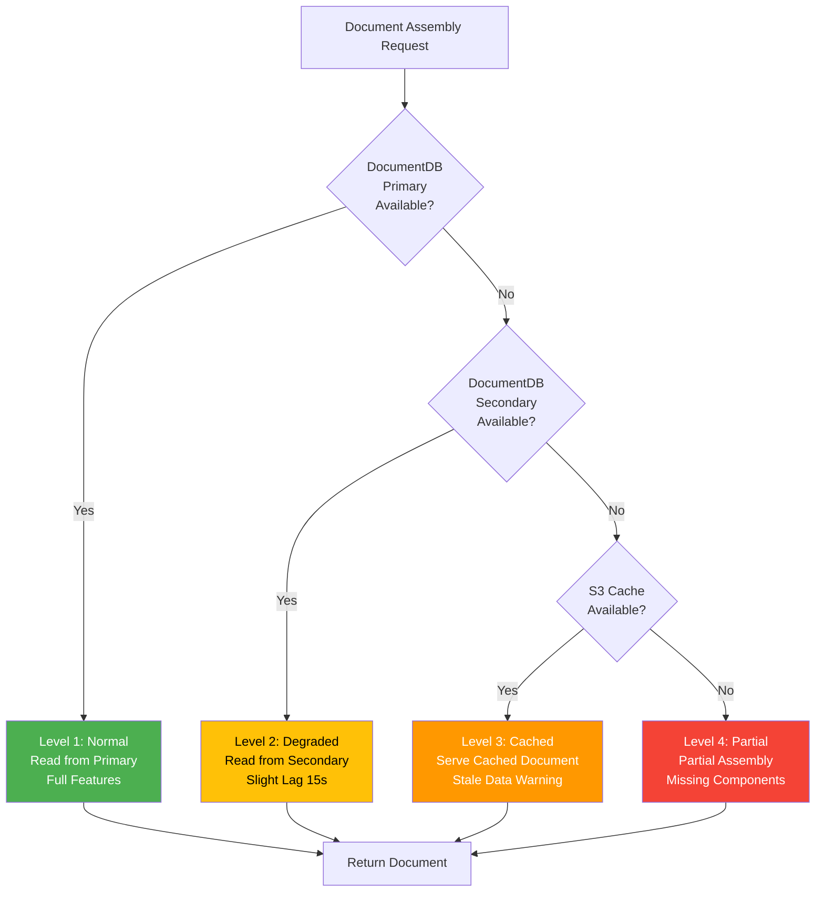

# NXOP Message Flow Recovery Mapping

**Part of**: [NXOP Resilience Analysis](../NXOP-Resilience-Analysis-v3.md)  
**Foundation**: [NXOP Message Flow Analysis](00-NXOP-Message-Flow-Analysis.md)

---

## Purpose

This document maps all 25 NXOP message flows (documented in the Message Flow Analysis) to their applicable failure modes and recovery strategies. For each flow, we provide:
- Primary and secondary failure modes
- Recovery type and RTO
- Applicable component and application failures
- Dependency impact analysis

**Audience**: Application teams, product owners, business stakeholders, operations

**Prerequisites**: Familiarity with the [25 message flows](00-NXOP-Message-Flow-Analysis.md)

---

## Flow Recovery Visualization

### Message Flow Recovery Type Distribution

**NXOP Message Flow Recovery Strategy Distribution - 25 Flows Categorized**

**Recovery Type Breakdown:**

| Recovery Type | Flow Count | Percentage | RTO | Flow Numbers |
|---------------|------------|------------|-----|--------------|
| **HA - Automated** (Green) | 19 flows | 76% | < 5 min | 1, 2, 5, 6, 8, 11, 14, 15, 16, 17, 18, 19, 20, 21, 22, 23, 24, 25 |
| **Regional Switchover** (Yellow) | 4 flows | 16% | < 10 min | 3, 4, 7, 13 |
| **Manual Intervention** (Red) | 2 flows | 8% | 15+ min | 9, 10 |

**Key Insight**: 76% of NXOP message flows have automated recovery with < 5 minute RTO, ensuring high availability for the majority of operations.

---

### Message Flow Dependency Heat Map

**Component Failure Impact Matrix - Which Flows Are Affected by Which Component Failures**

| Flow # | Flow Name | EKS | MSK | DocumentDB | S3 | Network | Data Repl | DR Orch | IAM | Recovery |
|--------|-----------|-----|-----|------------|----|---------|-----------|---------|----|----------|
| 1 | FOS Events to FK | 🔴 | 🔴 | 🔴 | ⚪ | 🟡 | 🟡 | ⚪ | 🔴 | ✓ HA |
| 2 | Flight Plans from FK | 🔴 | 🔴 | ⚪ | ⚪ | 🟡 | 🟡 | ⚪ | 🔴 | ✓ HA |
| 3 | FK Events to FOS | 🔴 | ⚪ | ⚪ | ⚪ | 🔴 | ⚪ | 🟡 | 🔴 | ⟳ Regional |
| 4 | Flightplan Data to FOS | 🔴 | ⚪ | ⚪ | ⚪ | 🔴 | ⚪ | 🟡 | 🔴 | ⟳ Regional |
| 5 | Audit Logs, Weather, OFP | 🔴 | 🔴 | ⚪ | ⚪ | 🟡 | 🟡 | ⚪ | 🔴 | ✓ HA |
| 6 | Summary Flight Plans | 🔴 | ⚪ | ⚪ | ⚪ | 🟡 | ⚪ | ⚪ | 🔴 | ✓ HA |
| 7 | Flight Release Notif | 🔴 | ⚪ | ⚪ | ⚪ | 🔴 | ⚪ | 🟡 | 🔴 | ⟳ Regional |
| 8 | Pilot Briefing Package | 🔴 | ⚪ | 🔴 | 🔴 | 🟡 | 🟡 | ⚪ | 🔴 | ✓ HA |
| 9 | eSignature - CCI | 🔴 | ⚪ | ⚪ | ⚪ | 🟡 | ⚪ | 🟡 | 🔴 | ⚠ Manual |
| 10 | eSignature - ACARS | 🔴 | ⚪ | 🔴 | ⚪ | 🟡 | ⚪ | 🟡 | 🔴 | ⚠ Manual |
| 11 | Events to CyberJet | 🔴 | ⚪ | ⚪ | ⚪ | 🟡 | ⚪ | ⚪ | 🔴 | ✓ HA |
| 12 | Flight Plans to CyberJet | 🔴 | ⚪ | ⚪ | ⚪ | 🟡 | ⚪ | ⚪ | 🔴 | ✓ HA |
| 13 | FMS Init & ACARS Req | 🔴 | ⚪ | ⚪ | ⚪ | 🔴 | ⚪ | 🟡 | 🔴 | ⟳ Regional |
| 14 | ACARS Free Text | 🔴 | ⚪ | ⚪ | ⚪ | 🟡 | ⚪ | ⚪ | 🔴 | ✓ HA |
| 15 | Flight Progress Reports | 🔴 | ⚪ | ⚪ | ⚪ | 🟡 | ⚪ | ⚪ | 🔴 | ✓ HA |
| 16 | Fleet Reference Data | 🔴 | ⚪ | ⚪ | ⚪ | 🟡 | ⚪ | ⚪ | 🔴 | ✓ HA |
| 17 | Fuel Data Updates | 🔴 | ⚪ | ⚪ | ⚪ | 🟡 | ⚪ | ⚪ | 🔴 | ✓ HA |
| 18 | Position Reports to FK | 🔴 | 🔴 | 🔴 | ⚪ | 🟡 | 🟡 | ⚪ | 🔴 | ✓ HA |
| 19 | Events to Fusion | 🔴 | 🔴 | 🔴 | ⚪ | 🟡 | 🟡 | ⚪ | 🔴 | ✓ HA |
| 20 | Flight Plans to Fusion | 🔴 | ⚪ | ⚪ | ⚪ | 🟡 | ⚪ | ⚪ | 🔴 | ✓ HA |
| 21 | Position Reports to Fusion | 🔴 | ⚪ | ⚪ | ⚪ | 🟡 | ⚪ | ⚪ | 🔴 | ✓ HA |
| 22 | Fusion ACARS Messaging | 🔴 | ⚪ | ⚪ | ⚪ | 🟡 | ⚪ | ⚪ | 🔴 | ✓ HA |
| 23 | Special Info Messages | 🔴 | ⚪ | ⚪ | ⚪ | 🟡 | ⚪ | ⚪ | 🔴 | ✓ HA |
| 24 | TAF Deletions | 🔴 | ⚪ | ⚪ | ⚪ | 🟡 | ⚪ | ⚪ | 🔴 | ✓ HA |
| 25 | ACARS REQLDI | 🔴 | ⚪ | ⚪ | ⚪ | 🟡 | ⚪ | ⚪ | 🔴 | ✓ HA |

**Legend:**
- 🔴 **Critical Impact**: Flow stops completely
- 🟠 **High Impact**: Degraded performance
- 🟡 **Medium Impact**: Some features unavailable
- 🟢 **Low Impact**: Minimal effect
- ⚪ **No Impact**: Component not used by flow

**Recovery Types:**
- ✓ = HA Automated
- ⟳ = Regional Switchover
- ⚠ = Manual Intervention

**Key Insights:**
- **MSK-Dependent Flows**: 5 flows (1, 2, 5, 18, 19) - 20% of total
- **DocumentDB-Dependent Flows**: 5 flows (1, 8, 10, 18, 19) - 20% of total
- **S3-Dependent Flow**: 1 flow (8) - 4% of total (Pilot Briefing Package)
- **All Components Critical**: Flow 10 (eSignature ACARS) affected by most component types
- **EKS Universal**: All 25 flows depend on EKS (100%)
- **IAM Universal**: All 25 flows depend on Cross-Account IAM (100%)

---

### Recovery Time Objective (RTO) Timeline

**Message Flow Recovery Timeline - RTO by Recovery Type with Example Scenarios**

**Scenario Breakdown:**

#### Scenario 1: HA - Automated Recovery (Flow 1: FOS Events to Flightkeys)
**Failure**: EKS pod failure  
**Total RTO**: < 5 minutes

| Phase | Duration | Activities | Status |
|-------|----------|------------|--------|
| Detection | 0-1 min | Health check fails, K8s detects unhealthy pod | 🔴 Critical |
| Execution | 1-2 min | Kubernetes automatically restarts pod | 🟠 Active |
| Ready | 2-3 min | Pod passes readiness probe, joins service | 🟠 Active |
| Verification | 3-5 min | Traffic resumes, health checks pass | 🟢 Complete |

#### Scenario 2: Regional Switchover (Flow 3: Flightkeys Events to FOS)
**Failure**: Complete EKS cluster failure in us-east-1  
**Total RTO**: < 10 minutes

| Phase | Duration | Activities | Status |
|-------|----------|------------|--------|
| Detection | 0-1 min | Continuous monitoring detects cluster failure | 🔴 Critical |
| Phase 1 | 1-2 min | ARC toggle, SG cordon, DocumentDB failover (concurrent) | 🟠 Active |
| Phase 2 | 2-7 min | Akamai GTM update, AMQP listeners, connectors (concurrent) | 🟠 Active |
| Phase 3 | 7-10 min | L1-L4 health check validation | 🟢 Complete |

#### Scenario 3: Manual Intervention (Flow 9: eSignature - CCI)
**Failure**: Cross-account IAM role chain failure  
**Total RTO**: 15-20+ minutes

| Phase | Duration | Activities | Status |
|-------|----------|------------|--------|
| Detection | 0-5 min | Alarm triggers, PagerDuty alert, engineer notified | 🔴 Critical |
| Investigation | 5-10 min | Engineer reviews logs, identifies IAM issue | 🟠 Active |
| Remediation | 10-15 min | Manual IAM role fix, policy update | 🟠 Active |
| Validation | 15-20 min | Test signature flow, monitor for errors | 🟢 Complete |

**Key Observations:**
- **HA Automated**: Fastest recovery, no human intervention required
- **Regional Switchover**: Automated but requires infrastructure changes across regions
- **Manual Intervention**: Slowest, requires engineer investigation and remediation

---

## Recovery Strategy Distribution by Flow

| Recovery Type | Flow Count | Percentage | RTO | Flow Numbers |
|---------------|------------|------------|-----|--------------|
| **HA - Automated** | 19 flows | 76% | < 5 min | 1, 2, 5, 6, 8, 11, 14-24 |
| **Regional Switchover** | 4 flows | 16% | < 10 min | 3, 4, 7, 13 |
| **Manual Intervention** | 2 flows | 8% | 15+ min | 9, 10 |

## Flow-to-Failure Mode Mapping

| Flow # | Flow Name | Primary Failure Mode | Secondary Failure Mode | Recovery Type | Applicable Component Failures | Applicable Application Failures |
|--------|-----------|---------------------|------------------------|---------------|------------------------------|--------------------------------|
| 1 | FOS Events to Flightkeys | MSK cluster failure | DocumentDB failure | HA - Automated | MSK (1.2), DocumentDB (1.3), EKS (1.1) | Data Distribution (8.1) |
| 2 | Flight Plans from Flightkeys | Flight Plan Processor failure | MSK failure | HA - Automated | MSK (1.2), EKS (1.1) | Data Ingestion (5.1), Message Processing (5.2) |
| 3 | Flightkeys Events to FOS | LCA Proxy failure | Regional outage | Regional Switchover | Complete EKS Cluster (1.1), Regional AWS Outage (9.1) | Data Ingestion (5.1) |
| 4 | Flightplan Data to FOS | FTM Proxy failure | Regional outage | Regional Switchover | Complete EKS Cluster (1.1), Regional AWS Outage (9.1) | Data Ingestion (5.1) |
| 5 | Audit Logs, Weather, OFP | Audit Log Processor failure | MSK failure | HA - Automated | MSK (1.2), EKS (1.1) | Data Ingestion (5.1), Data Distribution (8.1) |
| 6 | Summary Flight Plans | Text Processor failure | Print Proxy failure | HA - Automated | EKS (1.1) | Data Ingestion (5.1) |
| 7 | Flight Release Notifications | Notification Service failure | AIRCOM failure | Regional Switchover | Complete EKS Cluster (1.1), Regional AWS Outage (9.1) | Data Distribution (8.1) |
| 8 | Pilot Briefing Package | Document assembly failure | S3 failure | HA - Automated | S3 (1.4), DocumentDB (1.3), EKS (1.1) | Application Processing (7.1) |
| 9 | eSignature - CCI | CCI signature capture failure | Event Processor failure | Manual Intervention | EKS (1.1) | Authentication/Authorization (6.1), Application Processing (7.1) |
| 10 | eSignature - ACARS | ACARS signature failure | AIRCOM failure | Manual Intervention | MSK (1.2), DocumentDB (1.3), EKS (1.1) | Authentication/Authorization (6.1), Data Distribution (8.1) |
| 11 | Events to CyberJet | FXIP ACARS Adapter failure | CyberJet FMS failure | HA - Automated | EKS (1.1) | Data Distribution (8.1) |
| 12 | Flight Plans to CyberJet | CyberJet FMS failure | Flightkeys failure | HA - Automated | EKS (1.1) | Data Ingestion (5.1), Data Distribution (8.1) |
| 13 | FMS Init & ACARS Requests | FXIP ACARS Adapter failure | AIRCOM failure | Regional Switchover | Complete EKS Cluster (1.1), Regional AWS Outage (9.1) | Data Distribution (8.1) |
| 14 | ACARS Free Text | Text Processor failure | FTM Proxy failure | HA - Automated | EKS (1.1) | Data Ingestion (5.1), Data Distribution (8.1) |
| 15 | Flight Progress Reports | FXIP ACARS Adapter failure | AIRCOM failure | HA - Automated | EKS (1.1) | Data Distribution (8.1) |
| 16 | Fleet Reference Data | Aircraft Data Service failure | Regional outage | HA - Automated | EKS (1.1) | Data Ingestion (5.1) |
| 17 | Fuel Data Updates | Nav Data Service failure | Regional outage | HA - Automated | EKS (1.1) | Data Ingestion (5.1) |
| 18 | Position Reports to FK | Aircraft Data Adapter failure | MSK failure | HA - Automated | MSK (1.2), DocumentDB (1.3), EKS (1.1) | Data Distribution (8.1) |
| 19 | Events to Fusion | Fusion Adapter failure | MSK failure | HA - Automated | MSK (1.2), DocumentDB (1.3), EKS (1.1) | Data Ingestion (5.1), Data Distribution (8.1) |
| 20 | Flight Plans to Fusion | Fusion Integration Adapter failure | IBM Fusion failure | HA - Automated | EKS (1.1) | Data Ingestion (5.1), Data Distribution (8.1) |
| 21 | Position Reports to Fusion | IBM Fusion failure | AIRCOM failure | HA - Automated | EKS (1.1) | Data Distribution (8.1) |
| 22 | Fusion ACARS Messaging | Fusion ACARS Service failure | AIRCOM failure | HA - Automated | EKS (1.1) | Data Distribution (8.1) |
| 23 | Special Info Messages | Data Maintenance Service failure | Regional outage | HA - Automated | EKS (1.1) | Data Ingestion (5.1) |
| 24 | TAF Deletions | TAF UI failure | Regional outage | HA - Automated | EKS (1.1) | Data Ingestion (5.1) |
| 25 | ACARS REQLDI | AIRCOM failure | FOS failure | HA - Automated | EKS (1.1) | Data Distribution (8.1) |

## Recovery Characteristics by Flow Type

### High Availability (HA) Automated Recovery Flows
**Flows**: 1, 2, 5, 6, 8, 11, 14, 15, 16, 17, 18, 19, 20, 21, 22, 23, 24, 25

**Characteristics**:
- Auto-scaling (EKS HPA)
- Health checks and automatic restarts
- Load balancing (NLB)
- Multi-region active-active (AWS + Azure)
- Automatic failover within region

**Recovery Mechanisms**:
1. **Pod Failures**: Kubernetes automatic restart
2. **Service Failures**: Health check-based traffic routing
3. **Broker Failures**: MSK automatic replacement
4. **Database Failures**: DocumentDB automatic failover

**Applicable Component Failures**:
- Pod Failures (1.1)
- Node Failures (1.1)
- Single Broker Node Failure (1.2)
- Multiple Broker Failures (1.2)
- DocumentDB Connection Pool Exhaustion (1.3)
- S3 MRAP Endpoint Failure (1.4)
- NLB Target Health Degradation (2.1)
- Security Group Rule Issues (2.2)
- MSK Replicator Failure (3.1)
- DocumentDB Cross-Region Replication Lag (3.1)

**Applicable Application Failures**:
- RabbitMQ Connection Loss (5.1)
- FlightKeys Regional Failover (5.1)
- Consumer Group Offset Issues (5.2)
- MSK Connector Failures (8.1)
- Kafka MQ Adapter Issues (8.1)
- Azure Event Hub Connectivity (8.1)
- FXIP Integration Failures (8.1)

### Regional Switchover Flows
**Flows**: 3, 4, 7, 13

**Characteristics**:
- Requires cross-region failover
- ARC (Application Recovery Controller) orchestration
- Route53 DNS updates for MSK bootstrap
- Akamai GTM updates for API endpoints
- Automated execution with continuous readiness monitoring

**Trigger Conditions**:
1. Complete regional AWS service outage
2. Major infrastructure failures (complete EKS cluster, MSK cluster, or NLB failure)
3. Network partition between regions
4. Planned maintenance requiring region evacuation

**Recovery Steps**:
1. Validate target region readiness (continuous monitoring - Phase 0)
2. Execute Phase 1: Concurrent Infrastructure Isolation
   - Toggle ARC controls (West ON, East OFF)
   - Security group cordon to force MSK client reconnections
   - DocumentDB global cluster failover
3. Execute Phase 2: Concurrent Application Failover
   - Update Akamai GTM to point to West NLB
   - Trigger AMQP listeners in West region
   - Validate connector auto-reconnection
4. Execute Phase 3: Post-Failover Validation
   - Validate L1-L4 composite health alarms

**Applicable Component Failures**:
- Complete EKS Cluster Failure (1.1)
- Complete MSK Cluster Failure (1.2)
- Complete NLB Failure (2.1)
- VPC/Subnet Failures (2.2)
- Complete Route53 Service Failure (2.3)
- ARC Control Cluster Degradation (4.1)
- Region Switch Plan Execution Failure (4.2)
- Regional AWS Service Outage (9.1)
- Data Center Power/Cooling Failures (9.1)

**Applicable Application Failures**:
- Network Partition to FlightKeys (5.1)
- OnPrem Connectivity Issues (8.1)

### Manual Intervention Flows
**Flows**: 9, 10

**Characteristics**:
- Complex authorization workflows
- Requires human validation
- Regulatory compliance considerations
- Signature verification and audit

**Scenarios Requiring Manual Intervention**:
1. Electronic signature validation failures
2. Authorization workflow corruption
3. Compliance audit requirements
4. Data integrity verification

**Applicable Component Failures**:
- Complete DocumentDB Global Cluster Failure (1.3)
- S3 Object Corruption (1.4)
- Cross-Account Network Issues (2.2)
- S3 Cross-Region Replication Failure (3.1)
- ARC Routing Control Failures (4.1)
- Security Group Cordon Function Failure (4.2)
- SSM Automation Document Failures (4.2)

**Applicable Application Failures**:
- Network Partition to FlightKeys (5.1)
- Message Format Schema Changes (5.2)
- Topic Partition Corruption (5.2)
- Cross-Account IAM Role Failure (6.1)
- Pod Identity Role Chaining Failure (6.1)
- DocumentDB Authentication Failures (6.1)
- DocumentDB Cross-Account Role Chain Failure (6.1)
- S3 Authentication/Authorization Issues (6.1)
- S3 Cross-Account Role Chain Failure (6.1)
- S3 Cross-Account Access Failures (6.1)
- DocumentDB Network Connectivity Issues (6.1)
- Application Code Bugs (7.1)
- OnPrem Connectivity Issues (8.1)
- Network Partition Between Regions (9.1)
- Simultaneous Multi-Account Failures (9.1)
- Coordinated Cyber Attack (9.1)

## Cascading Failure Prevention for Message Flows

### Circuit Breaker Patterns
**Applicable Flows**: All flows with external dependencies (1-25)

**Implementation**:
- Timeout configurations on all external calls
- Retry with exponential backoff
- Fallback to cached data where applicable
- Health check-based traffic routing

**Prevents Failure Modes**:
- RabbitMQ Connection Loss (5.1)
- MSK Connector Failures (8.1)
- Azure Event Hub Connectivity (8.1)
- FXIP Integration Failures (8.1)

### Bulkhead Patterns
**Applicable Flows**: Flows with shared resources - MSK (1, 2, 5, 10, 18, 19), DocumentDB (1, 8, 10, 18, 19)

**Implementation**:
- Resource isolation per service
- Connection pool limits
- Rate limiting on shared services
- Dedicated Kafka topics per flow

**Prevents Failure Modes**:
- MSK Disk Space Exhaustion (1.2)
- DocumentDB Connection Pool Exhaustion (1.3)
- Multiple Broker Failures (1.2)

### Graceful Degradation
**Applicable Flows**: 8 (Document Assembly), 16, 17 (Engineering Data)

**Implementation**:
- Serve cached/stale data when fresh data unavailable
- Partial document assembly if some components fail
- Read-only mode for data maintenance services

**Prevents Failure Modes**:
- DocumentDB Primary Cluster Failure (1.3)
- S3 Regional Bucket Failure (1.4)
- DocumentDB Cross-Region Replication Lag (3.1)

## Flow Dependency Impact Analysis

### MSK-Dependent Flows (6 flows: 1, 2, 5, 10, 18, 19)
**Critical Failure Modes**:
- Complete MSK Cluster Failure (1.2) → Regional Switchover required
- MSK Replicator Failure (3.1) → HA automated recovery
- Multiple Broker Failures (1.2) → HA automated recovery

**Recovery Priority**: HIGH - 24% of flows affected

### DocumentDB-Dependent Flows (5 flows: 1, 8, 10, 18, 19)
**Critical Failure Modes**:
- Primary DocumentDB Cluster Failure (1.3) → HA automated recovery
- Complete DocumentDB Global Cluster Failure (1.3) → Manual intervention
- DocumentDB Cross-Region Replication Lag (3.1) → HA automated recovery

**Recovery Priority**: HIGH - 20% of flows affected

### Cross-Account IAM-Dependent Flows (All 25 flows)
**Critical Failure Modes**:
- Cross-Account IAM Role Failure (6.1) → Manual intervention
- Pod Identity Role Chaining Failure (6.1) → Manual intervention

**Recovery Priority**: CRITICAL - 100% of flows affected

## Integration with Region Readiness Assessment

The Region Readiness Assessment Framework (documented in [Region Readiness Assessment](05-Region-Readiness-Assessment.md)) continuously validates target region health to enable immediate Regional Switchover for flows 3, 4, 7, and 13. The continuous assessment ensures:

1. **L1 Infrastructure**: EKS, MSK, DocumentDB, S3 health for all flow dependencies
2. **L2 Data**: Replication lag acceptable for MSK and DocumentDB flows
3. **L3 Application**: Service health and connectivity for all flows
4. **L4 Integration**: End-to-end validation for external integrations

**Readiness Threshold**: ≥90% composite score required before Regional Switchover execution

**Continuous Monitoring**: Phase 0 validation runs every minute, eliminating pre-flight checks during failover and reducing total failover time to < 10 minutes.

---

### Cascading Failure Prevention Patterns

**Message Flow Resilience Patterns - Circuit Breaker, Bulkhead, and Graceful Degradation**

#### Pattern 1: Circuit Breaker

**Scenario**: Flow 1 (FOS Events to Flightkeys) - RabbitMQ Connection Loss

```mermaid
stateDiagram-v2
    [*] --> Closed: Normal Operation
    Closed --> Open: Failures ≥ 5 in 10s
    Open --> HalfOpen: After 30s timeout
    HalfOpen --> Closed: Test request succeeds
    HalfOpen --> Open: Test request fails
    
    note right of Closed
        ✅ Requests pass through
        Monitor failure rate
    end note
    
    note right of Open
        ❌ Fail fast
        No requests to RabbitMQ
        Prevents cascading failure
    end note
    
    note right of HalfOpen
        🔄 Testing recovery
        Single test request
    end note
```

**Circuit Breaker Configuration:**
- **Threshold**: 5 failures in 10 seconds
- **Timeout**: 30 seconds before testing recovery
- **Prevents**: RabbitMQ Connection Loss (5.1), cascading failures to downstream services
- **Applicable Flows**: All flows with external dependencies (1-25)

**State Transitions:**
1. **Closed (Normal)**: All requests pass through, monitor failure rate
2. **Open (Failure)**: Stop sending requests, fail fast, prevent resource exhaustion
3. **Half-Open (Testing)**: Send single test request to check if service recovered
4. **Back to Closed**: If test succeeds, resume normal operation

---

#### Pattern 2: Bulkhead

**Scenario**: Flows 1, 2, 5, 10, 18, 19 Sharing MSK Cluster

**Bulkhead Configuration:**
- **Connection Pool Limits**: 10 connections per service
- **Dedicated Topics**: Each flow has its own Kafka topic
- **Resource Isolation**: Flow 1 exhaustion doesn't affect Flow 2-19
- **Prevents**: MSK Disk Space Exhaustion (1.2), Connection Pool Exhaustion (1.3)

**Isolation Benefits:**
- **Fault Containment**: One flow's failure doesn't cascade to others
- **Resource Fairness**: Each flow gets guaranteed resources
- **Predictable Performance**: No resource starvation

---

#### Pattern 3: Graceful Degradation

**Scenario**: Flow 8 (Pilot Briefing Package) - DocumentDB Primary Failure

**Graceful Degradation Levels:**

| Level | Source | Data Freshness | User Experience | Availability |
|-------|--------|----------------|-----------------|--------------|
| **Level 1** | Primary DocumentDB | Real-time | Full features | 99.9% |
| **Level 2** | Secondary DocumentDB | 15s lag | Slight delay notice | 99.5% |
| **Level 3** | S3 Cache | 5 min stale | Stale data warning | 99.0% |
| **Level 4** | Partial Assembly | Incomplete | Missing components notice | 95.0% |

**Configuration:**
- **Acceptable Staleness**: 15 seconds for secondary reads
- **Cache TTL**: 5 minutes for S3 cached documents
- **Prevents**: DocumentDB Primary Cluster Failure (1.3), S3 Regional Bucket Failure (1.4)
- **Applicable Flows**: 8 (Document Assembly), 16, 17 (Engineering Data)

**Degradation Strategy:**
1. **Try Primary**: Attempt to read from primary DocumentDB cluster
2. **Fallback to Secondary**: If primary fails, read from secondary with lag warning
3. **Use Cache**: If both clusters fail, serve cached document from S3
4. **Partial Assembly**: If cache miss, assemble partial document with available data

---

## Chaos Engineering Experiments

### Top 10 High-Risk Failure Modes

This section identifies the top 10 failure modes prioritized by impact and likelihood, with AWS Fault Injection Simulator (FIS) feasibility analysis and integration pattern coverage.

| # | Failure Mode | Impact | Likelihood | Account | AWS FIS | FIS Action | Patterns Tested | Affected Flows |
|---|--------------|--------|------------|---------|---------|------------|-----------------|----------------|
| **1** | **Single MSK Broker Failure** | Medium | High | NXOP | ✅ Yes | `aws:lambda:invoke-function` → RebootBroker API | Outbound Publishing (4), Bidirectional Sync (1) | 1, 2, 5, 18, 19 |
| **2** | **MSK Network Latency** | High | Medium | NXOP | ✅ Yes | `aws:network:disrupt-connectivity` with latency | Outbound Publishing (4), Bidirectional Sync (1) | 1, 2, 5, 18, 19 |
| **3** | **DocumentDB Primary Failover** | High | Medium | NXOP | ✅ Yes | `aws:lambda:invoke-function` → FailoverDBCluster API | Outbound Publishing (3), Document Assembly (1), Bidirectional Sync (1) | 1, 8, 10, 18, 19 |
| **4** | **Security Group Rule Misconfiguration** | High | Medium | NXOP | ✅ Yes | `aws:lambda:invoke-function` → Modify SG rules | All 7 patterns | All 19 NXOP flows |
| **5** | **DNS Propagation Delay** | Low | High | NXOP | ✅ Yes | `aws:lambda:invoke-function` → Update Route53 | Outbound Publishing (4), Bidirectional Sync (1) | 1, 2, 5, 18, 19 |
| **6** | **RabbitMQ Connection Loss** | Critical | High | KPaaS | ⚠️ Partial | `aws:network:disrupt-connectivity` | Inbound Ingestion (7), Bidirectional Sync (2) | 2, 3, 4, 6, 7, 9, 14 |
| **7** | **Pod Resource Exhaustion** | High | High | KPaaS | ✅ Yes | `aws:eks:inject-kubernetes-custom-resource` | All 7 patterns | All 19 NXOP flows |
| **8** | **Random Pod Termination** | Low-Medium | High | KPaaS | ✅ Yes | `aws:eks:inject-kubernetes-custom-resource` | All 7 patterns | All 19 NXOP flows |
| **9** | **Node Failures** | High | Medium | KPaaS | ✅ Yes | `aws:eks:terminate-nodegroup-instances` | All 7 patterns | All 19 NXOP flows |
| **10** | **NLB Target Health Degradation** | Medium | Medium | KPaaS | ⚠️ Partial | `aws:network:disrupt-connectivity` | Inbound Ingestion (10) | All 19 NXOP flows |

**Legend:**
- ✅ **Full FIS Support**: Native FIS action or Lambda wrapper available
- ⚠️ **Partial FIS Support**: Can simulate but not exact behavior
- **Account**: NXOP (can run directly) vs KPaaS (requires coordination)

**Integration Pattern Coverage:**
- **Pattern 1**: Inbound Ingestion (HTTPS) - 10 flows
- **Pattern 2**: Outbound Data Publishing - 4 flows (1, 18, 23, 24)
- **Pattern 3**: Bidirectional Sync - 4 flows (9, 10, 16, 17)
- **Pattern 4**: Inbound Ingestion (AMQP) - 7 flows (2, 3, 4, 6, 7, 9, 14)
- **Pattern 5**: Notification/Alert - 1 flow (7)
- **Pattern 6**: Authorization - 2 flows (9, 10)
- **Pattern 7**: Document Assembly - 1 flow (8)

### Experiment Prioritization

**Phase 1: NXOP Account (Direct Execution)**
- Experiments #1-5 can be executed directly in NXOP account
- Focus on infrastructure components under NXOP control
- No cross-account coordination required

**Phase 2: KPaaS Account (Coordination Required)**
- Experiments #6-10 require KPaaS team coordination
- Focus on EKS runtime and application layer
- Requires shared experiment planning

**AWS FIS Implementation:**
- **8 experiments** fully FIS-compatible (via native actions or Lambda wrappers)
- **2 experiments** partially supported (network disruption approximates behavior)
- All experiments can be automated through FIS experiment templates

### Chaos Experiment Execution Strategy

**Recommended Approach:**
1. Start with **NXOP experiments** (#1-5) to validate infrastructure resilience
2. Progress to **KPaaS experiments** (#7-9) for application layer testing
3. Coordinate **cross-account experiments** (#6, #10) for end-to-end validation

**Success Criteria:**
- All flows recover within documented RTO
- CloudWatch alarms fire as expected
- No data loss or corruption
- Automated recovery mechanisms function correctly

---

## Related Documentation

- **[NXOP Message Flow Analysis](00-NXOP-Message-Flow-Analysis.md)** - Complete flow catalog
- **[Integration Pattern Resilience](02-Integration-Pattern-Resilience.md)** - Pattern-level analysis
- **[Infrastructure Failures](03-Infrastructure-Failures.md)** - Component failures
- **[Region Switch Orchestration](06-Region-Switch-Orchestration.md)** - Failover procedures

---

**Document Owner**: NXOP Platform Team  
**Last Updated**: 2026-01-20  
**Review Frequency**: Quarterly
