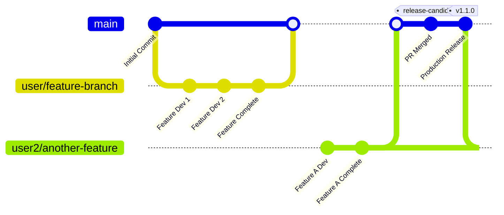

# Branching Strategy - NXOP Projects

## Overview

This document defines the branching strategy and Git workflow for NXOP (Next Gen Operations Platform) projects within American Airlines. Our approach ensures code quality, collaboration efficiency, and deployment reliability across all development teams.

## Git Workflow - Fork-Based Development

Our branching strategy follows a fork-based development model with the following workflow:



## Fork-Based Workflow Process

```mermaid
flowchart LR
    A[AAInternal/nxop-wiki<br/>Main Repository] --> B[Developer forks to<br/>username/nxop-wiki]
    B --> C[Clone fork locally]
    C --> D{Work directly on<br/>fork main or<br/>create feature branch?}
    D -->|Feature Branch| E[Create feature branch<br/>git checkout -b feature/xyz]
    D -->|Fork Main| F[Work on fork/main<br/>directly]
    E --> G[Development work<br/>commits & pushes]
    F --> G
    G --> H[Create Pull Request<br/>from fork to AAInternal/main]
    H --> I{Code Review &<br/>CI Checks Pass?}
    I -->|No| J[Address feedback<br/>& update PR]
    J --> I
    I -->|Yes| K[Merge PR to main]
    K --> L[Automatic release<br/>candidate created]
    L --> M[Production deployment]
    M --> N[Create version tag<br/>v1.x.x]
    N --> O[Tag pushed to main]
    
    style A fill:#e1f5fe
    style K fill:#c8e6c9
    style N fill:#fff3e0
```



## Repository Structure

- **Main Repository**: `AAInternal/nxop-wiki` (main branch)
- **Developer Forks**: `username/nxop-wiki` (individual developer repositories)
- **Branch Options**: Developers can work on either:
  - Fork's main branch directly (for simple changes)
  - Feature branches within fork (for complex features or when multiple features are in development)

## Branch Naming Conventions (Optional for Feature Branches)

- **Feature branches**: `feature/description` or `feature/JIRA-123`
- **Bug fixes**: `bugfix/description` or `bugfix/JIRA-456`
- **Hotfixes**: `hotfix/description` or `hotfix/JIRA-789`

### Examples
```bash
# Feature development
git checkout -b feature/flight-delay-notifications
git checkout -b feature/NXOP-456-passenger-alerts

# Bug fixes
git checkout -b bugfix/fix-scheduling-overlap
git checkout -b bugfix/NXOP-789-data-validation

# Hotfixes
git checkout -b hotfix/critical-security-patch
git checkout -b hotfix/NXOP-999-production-issue
```

## Workflow Steps

1. **Fork**: Developer creates fork of `AAInternal/nxop-wiki`
2. **Branch (Optional)**: 
   - **Option A**: Work directly on fork's main branch for simple changes
   - **Option B**: Create feature branch in fork from latest main for complex features
3. **Develop**: Make changes and commit to chosen branch (fork main or feature branch)
4. **Push**: Push commits to developer's fork
5. **Pull Request**: Create PR from fork branch (main or feature) to `AAInternal/main`
6. **Review**: Code review and automated testing
7. **Merge**: PR merged to main branch triggers release candidate
8. **Deploy**: Production deployment from main branch
9. **Tag**: Version tag created post-production deployment

## Development Branch Strategy

### When to Use Fork Main Branch
- **Simple Changes**: Documentation updates, minor bug fixes
- **Small Features**: Single-file changes or simple enhancements
- **Quick Fixes**: Urgent patches that don't require complex development

### When to Use Feature Branches
- **Complex Features**: Multi-file changes or significant functionality
- **Multiple Features**: When working on several features simultaneously
- **Team Collaboration**: When multiple developers work on the same feature
- **Long-Running Development**: Features that take several days or weeks

### Best Practices
- **Keep Forks Updated**: Regularly sync your fork with the main repository
- **Small Commits**: Make frequent, small commits with descriptive messages
- **Test Before PR**: Ensure all tests pass before creating a pull request
- **Clean History**: Consider squashing commits for cleaner history

## Branch Protection Rules

### Main Branch Protection
- **Required Reviews**: TBD (minimum reviewers required)
- **Status Checks**: TBD (CI/CD pipeline requirements)
- **Force Push Protection**: Enabled (prevents force pushes to main)
- **Delete Protection**: Enabled (prevents accidental branch deletion)

### Pull Request Requirements
- **Reviewer Assignment**: At least one team member must review
- **Status Checks**: All CI/CD checks must pass
- **Up-to-Date Requirement**: Branch must be up-to-date with main
- **Conversation Resolution**: All review comments must be resolved

## Commit Standards

### Commit Message Format
Follow the Conventional Commits specification:

```
<type>[optional scope]: <description>

[optional body]

[optional footer(s)]
```

### Commit Types
- **feat**: New feature
- **fix**: Bug fix
- **docs**: Documentation changes
- **style**: Code style changes (formatting, etc.)
- **refactor**: Code refactoring
- **test**: Adding or updating tests
- **chore**: Maintenance tasks

### Examples
```bash
feat(flight-service): add real-time delay notifications
fix(api): resolve passenger data validation issue
docs(readme): update installation instructions
refactor(scheduler): improve performance of flight matching
test(integration): add tests for booking workflow
chore(deps): update Spring Boot to 3.1.0
```

### Commit Message Guidelines
- Use imperative mood ("add feature" not "added feature")
- Keep first line under 50 characters
- Use body to explain what and why, not how
- Reference issue numbers when applicable

## Release Management

### Version Tagging Strategy
- **Semantic Versioning**: Use MAJOR.MINOR.PATCH format
- **Release Candidates**: Tag as `v1.0.0-rc.1` for pre-release testing
- **Production Releases**: Tag as `v1.0.0` after successful deployment

### Release Process
1. **Merge to Main**: All features merged through PRs
2. **Automated Testing**: CI/CD pipeline runs full test suite
3. **Release Candidate**: Create RC tag for staging deployment
4. **Production Deployment**: Deploy to production environment
5. **Version Tag**: Create final version tag after successful deployment
6. **Release Notes**: Generate changelog from commit messages

## Hotfix Workflow

For critical production issues that require immediate attention:

1. **Create Hotfix Branch**: From the latest production tag
   ```bash
   git checkout v1.0.0
   git checkout -b hotfix/critical-security-fix
   ```

2. **Apply Fix**: Make minimal changes to resolve the issue

3. **Test Thoroughly**: Ensure fix doesn't introduce new issues

4. **Create PR**: Target main branch for review

5. **Emergency Merge**: Fast-track review for critical issues

6. **Deploy and Tag**: Deploy to production and create new tag

## Conflict Resolution

### Handling Merge Conflicts
1. **Fetch Latest**: Update your fork with latest changes
   ```bash
   git fetch upstream
   git checkout main
   git merge upstream/main
   ```

2. **Rebase Feature Branch**: Rebase your feature branch on latest main
   ```bash
   git checkout feature/your-feature
   git rebase main
   ```

3. **Resolve Conflicts**: Manually resolve any conflicts

4. **Test After Resolution**: Ensure functionality still works

5. **Force Push**: Update your fork (only for feature branches)
   ```bash
   git push --force-with-lease origin feature/your-feature
   ```

## Tools and Automation

### Required Git Configuration
```bash
# Set up user information
git config --global user.name "Your Name"
git config --global user.email "your.email@aa.com"

# Enable helpful features
git config --global core.autocrlf input
git config --global push.default simple
git config --global pull.rebase true
```

### Recommended Git Aliases
```bash
git config --global alias.co checkout
git config --global alias.br branch
git config --global alias.ci commit
git config --global alias.st status
git config --global alias.unstage 'reset HEAD --'
git config --global alias.last 'log -1 HEAD'
git config --global alias.visual '!gitk'
```

### Git Hooks (Future Implementation)
- **Pre-commit**: Code formatting and linting
- **Pre-push**: Run unit tests before push
- **Commit-msg**: Validate commit message format

## Troubleshooting Common Issues

### Fork Out of Sync
```bash
# Add upstream remote (one time setup)
git remote add upstream https://github.com/AAInternal/nxop-wiki.git

# Sync your fork
git fetch upstream
git checkout main
git merge upstream/main
git push origin main
```

### Accidental Commit to Wrong Branch
```bash
# Move commits to correct branch
git log --oneline  # note commit hash
git checkout correct-branch
git cherry-pick <commit-hash>
git checkout wrong-branch
git reset --hard HEAD~1  # remove from wrong branch
```

### Large Files or Sensitive Data
- Use `.gitignore` to prevent committing large files
- Remove sensitive data immediately and contact security team
- Consider using Git LFS for large binary files

## References and Resources

- [Git Best Practices](https://git-scm.com/book/en/v2)
- [Conventional Commits](https://www.conventionalcommits.org/)
- [GitHub Flow](https://guides.github.com/introduction/flow/)
- [Semantic Versioning](https://semver.org/)

---

**Note**: This branching strategy should be reviewed quarterly and updated based on team feedback and evolving best practices.
