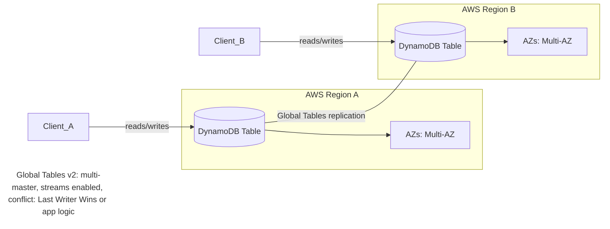
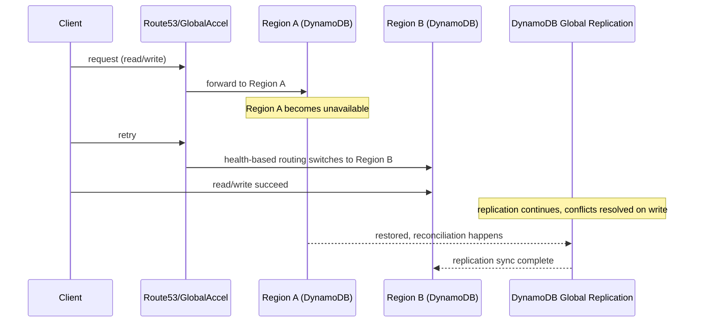
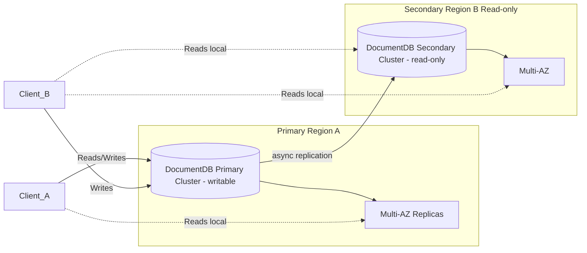
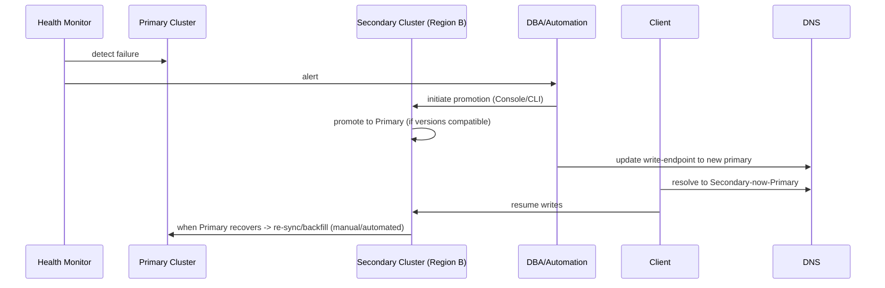
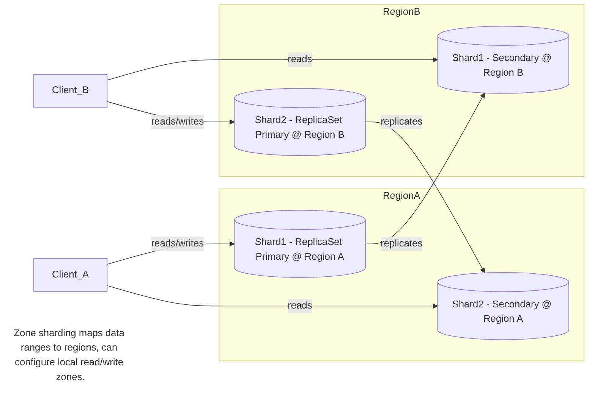
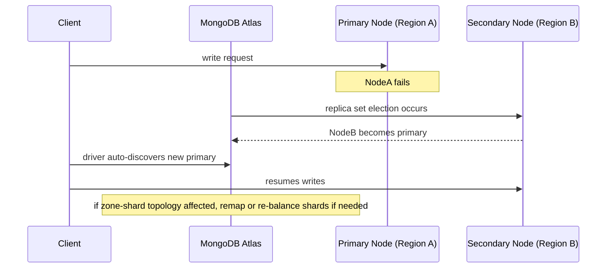
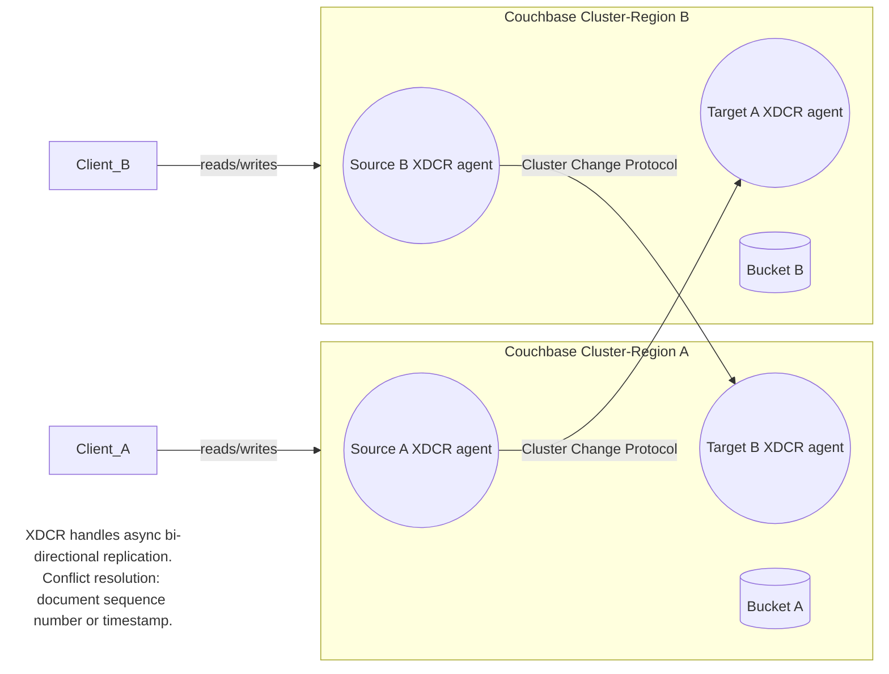
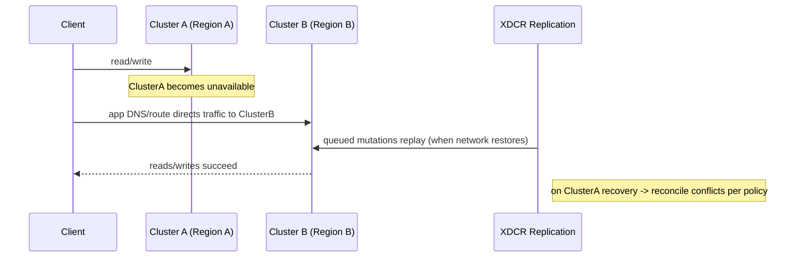

# Database High Availability Comparison

Table of Contents

- [Database High Availability Comparison](#database-high-availability-comparison)
  - [DynamoDB](#dynamodb)
    - [Architecture](#architecture)
    - [Amazon DynamoDB Global Tables](#amazon-dynamodb-global-tables)
    - [Multi-Region Design](#multi-region-design)
    - [DynamoDB — Active‑Active Architecture](#dynamodb--activeactive-architecture)
    - [DynamoDB – Failover Process](#dynamodb--failover-process)
  - [DocumentDB](#documentdb)
    - [Multi-AZ deployment within a region](#multi-az-deployment-within-a-region)
    - [Multi-Region deployment with global clusters](#multi-region-deployment-with-global-clusters)
    - [DocumentDB — Multi‑Region Architecture (read‑replica model)](#documentdb--multiregion-architecture-readreplica-model)
    - [DocumentDB – Failover Process](#documentdb--failover-process)
  - [MongoDB Atlas](#mongodb-atlas)
    - [Architecture](#architecture-1)
    - [Data and disaster recovery](#data-and-disaster-recovery)
    - [Performance and optimization](#performance-and-optimization)
    - [MongoDB Atlas — Multi‑Region Active‑Active (zone sharded / global clusters)](#mongodb-atlas--multiregion-activeactive-zone-sharded--global-clusters)
    - [MongoDB Atlas — Failover Process (replica election + zone remapping)](#mongodb-atlas--failover-process-replica-election--zone-remapping)
  - [Couchbase Capella](#couchbase-capella)
    - [Multi-Availability Zone (AZ) Deployment within a Region](#multi-availability-zone-az-deployment-within-a-region)
    - [Cross Data Center Replication (XDCR) for Cross-Region Availability](#cross-data-center-replication-xdcr-for-cross-region-availability)
    - [Couchbase Capella — Active‑Active Architecture (XDCR)](#couchbase-capella--activeactive-architecture-xdcr)
    - [Couchbase Capella – Failover Process](#couchbase-capella--failover-process)
  - [Summary – Complexity \& Configurations](#summary--complexity--configurations)
  - [Deep-Dive Comparison](#deep-dive-comparison)
  - [CDC Support](#cdc-support)
  - [Appendix](#appendix)

## DynamoDB

### Architecture
- Global Tables replicate across AWS regions
- Multi-AZ within each region
- Writes accepted in all participating regions
- Strong or eventual consistency options
- Streams enable event-driven patterns

- RTO: Zero or near zero.
- RPO: [Sub-second.](https://docs.aws.amazon.com/prescriptive-guidance/latest/strategy-database-disaster-recovery/choosing-database.html)

Achieving 99.999% availability for an Amazon DynamoDB architecture primarily relies on leveraging its built-in features and strategically designing your application to utilize them.

### Amazon DynamoDB Global Tables
- This is the cornerstone for high availability with DynamoDB. Global Tables automatically replicate your DynamoDB tables across multiple AWS Regions, providing a multi-active, multi-Region setup. This allows for fast local read and write performance and ensures that if one Region experiences an outage, your application can seamlessly redirect to a replica in another Region, maintaining business continuity and contributing significantly to the 99.999% availability target.

### Multi-Region Design
- Beyond Global Tables, building your application to be inherently multi-Region aware is crucial. This involves deploying your application logic and other dependent services across multiple AWS Regions and implementing intelligent routing mechanisms (e.g., using Amazon Route 53 with health-based routing) to direct user traffic to the closest healthy Region.

Leveraging Availability Zones (AZs) within a Region:
- DynamoDB inherently replicates data synchronously across three Availability Zones within a single Region. This protects against failures within a single AZ and is a fundamental layer of resilience.

### DynamoDB — Active‑Active Architecture

DynamoDB Global Tables keep a replica table in each region and allow reads/writes in each region. Client routing (Route53 or Global Accelerator) directs app traffic to nearest healthy region.

Reference:  https://medium.com/@joudwawad/dynamodb-global-tables-e62f2dce5f76

### DynamoDB – Failover Process
- DynamoDB Global Tables automatically route writes to available regions
- If a region is unavailable:
  - Application retries to another region endpoint
  - No manual failover required
- Recovery:
  - AWS restores connectivity automatically
  - Writes replayed from Streams

No manual DB promotion — failover is client/routing driven. When a region fails, Route53/Global Accelerator should route clients to other regions. When the failed region returns, DynamoDB reconciles replicas.

## DocumentDB

- RTO: Typically under 1 minute.
- RPO: In seconds.

### Multi-AZ deployment within a region

- DocumentDB Cluster: Deploy your Amazon DocumentDB cluster across at least two Availability Zones (AZs) within a chosen AWS Region.
- Multiple Instances: Ensure your DocumentDB cluster has multiple instances (primary and replicas) distributed across these AZs.
- Primary instance: Handles read and write traffic.
- Replica instances: Handle read traffic and serve as failover targets.
- Fault Tolerance and Automatic Failover: DocumentDB clusters are inherently fault-tolerant. If the primary instance fails, DocumentDB automatically promotes a replica instance in another AZ to become the new primary, usually within 30 seconds.
- Highly Durable Storage: DocumentDB's storage volume is replicated six ways across three Availability Zones for high durability, even with a single instance.

### Multi-Region deployment with global clusters

- DocumentDB Global Clusters: Amazon DocumentDB Global Clusters span multiple AWS Regions, but the high availability SLA remains the same as the standard Multi-AZ deployment (maximum 99.99%) and applies per region. Global clusters are designed for disaster recovery and global reads, not for increasing the overall availability SLA beyond 99.99%.

- Cross-Region Replication: DocumentDB Global Clusters use storage-based, fast replication with sub-second latency to replicate data from the primary region to secondary regions, according to Amazon Web Services.

- Disaster Recovery (DR): In the event of a Region-wide outage, a secondary cluster can be promoted to become the primary with read/write capabilities within minutes.
- Global Reads: Leverage secondary regions for low-latency global reads by directing user traffic to the closest Region with a secondary cluster.

### DocumentDB — Multi‑Region Architecture (read‑replica model)

DocumentDB Global Clusters are single‑writer: one primary that accepts writes, and multiple asynchronous read‑only replicas in other regions for low‑latency reads and DR.

### DocumentDB – Failover Process
- Application detects primary region failure
- Promote a secondary cluster to primary
- Update connection string to point to new primary
- AWS CLI or Console used for promotion
- DNS updates propagate in ~1 minute

Notes & caveats: Cross-region promotion may require engine-version parity and manual steps or AWS‑managed promotion. Applications must be able to update the write endpoint.

## MongoDB Atlas

- RTO: depends on primary re-election duration ~ 12 seconds
- RPO: 0 with "majority" write concern, >0 for default write concern (commit-> ack)

### Architecture
- Multi-AZ Replica Sets: At a minimum, deploy a replica set with nodes distributed across at least three Availability Zones (AZs) within a single region. Atlas automatically handles this for dedicated clusters in regions with multiple AZs. This provides resilience against single AZ outages.
- Replication and Automatic Failover: MongoDB's replica sets automatically elect a new primary if the current primary fails, ensuring continuous operation. Atlas simplifies this by managing the failover process automatically.
- Deploy at least [as many shards as data centers](https://www.mongodb.com/company/blog/technical/active-active-application-architectures-with-mongodb) and placing the primaries for the shards so that each data center has at least one replica (copy of the data) in each of the data centers

- Dedicated Search Nodes: If utilizing Atlas Search, separate search nodes from database nodes for improved performance and scalability, preventing resource contention and enabling independent scaling. 

### Data and disaster recovery

- Continuous Cloud Backups: Enable continuous cloud backups for point-in-time recovery and to minimize data loss in case of a disaster. This allows restoration to a specific moment before an event, with RPOs as low as 1 minute.
- Snapshot Distribution: For increased resilience and compliance, distribute backup snapshots and oplogs across multiple geographic regions.
- WORM Compliance for Backups: Implement backup compliance policies that prevent modification or deletion of snapshots and oplogs for a defined retention period. 

### Performance and optimization

- Shard Key Selection: Carefully choose shard keys to ensure even distribution of data and avoid hotspots. Use hashed shard keys or a combination of fields for uniform distribution and optimize for common queries.
- Monitoring and Tuning: Regularly monitor shard usage, query performance, and overall cluster health. Utilize MongoDB's tools like Atlas, Compass, or command-line utilities for detailed monitoring and insights.
- Indexing Strategies: Ensure all sharded collections have indexes that support the shard key, use compound indexes where appropriate, and regularly assess and remove unnecessary indexes.
- Query Optimization: Optimize queries by including the shard key in the filter to avoid scatter-gather queries, limit results using projection, and use explain plans to analyze and optimize query performance.

  Data Distribution and Balancing: Monitor data distribution across shards and manually redistribute data if necessary, or configure the balancer to run during off-peak hours.

### MongoDB Atlas — Multi‑Region Active‑Active (zone sharded / global clusters)

Atlas supports flexible multi‑region deployments. With zone sharding and global clusters you can place shards/zones near users and optionally permit writes in multiple regions (careful application-level design required).

### MongoDB Atlas — Failover Process (replica election + zone remapping)

- Replica set election triggers upon primary failure
- Client drivers auto-discover new primary
- Writes paused during election (few seconds)
- Reads continue from secondaries if configured

## Couchbase Capella

### Multi-Availability Zone (AZ) Deployment within a Region
- Couchbase Capella clusters: Deploy your Couchbase Capella clusters across multiple Availability Zones within a chosen AWS region.
- Automatic distribution: Capella can automatically distribute cluster nodes across multiple AZs to ensure that even if one AZ experiences an outage, your application remains available.
- Minimum Node Count: Each operational Capella cluster is deployed with a minimum of 3 nodes to support this architecture.
- Support Plan: Ensure you're on a Developer Pro or Enterprise Support Plan for Capella, as the multi-AZ deployment option is only available with these plans.

### Cross Data Center Replication (XDCR) for Cross-Region Availability
- Replicate data across regions: Utilize Couchbase's XDCR (Cross Data Center Replication) to replicate data between Capella clusters deployed in different AWS regions.
- Protection against regional failures: This provides protection against data center failures and ensures high-performance data access for globally distributed applications.
- Disaster Recovery: XDCR is a crucial component for disaster recovery, allowing you to restore operations in another region quickly in case of a major regional outage.

### Couchbase Capella — Active‑Active Architecture (XDCR)

Capella uses XDCR for bidirectional replication between independent clusters in each region. Each cluster is active and serves local traffic. Conflict resolution strategy: document sequence number or timestamp.

### Couchbase Capella – Failover Process
- If a cluster is unavailable:
  - Application reroutes to another active cluster
  - XDCR queues changes for replay
- Manual intervention may be required to restore replication

For region failures, application routing must point clients to the surviving cluster. XDCR will queue/attempt replication and reconciliation when connectivity is restored; ops must resolve conflicts and rebuild rebalances if needed.

## Summary – Complexity & Configurations
| Database         | HA Complexity   | Active-Active Setup Effort | AWS Service Integration | Automation Level |
|------------------|-----------------|----------------------------|-------------------------|------------------|
| DynamoDB         | Low             | Low                        | High                    | Fully automatic  |
| DocumentDB       | Medium          | Medium                     | High                    | Semi-automatic   |
| MongoDB Atlas    | Medium          | Medium                     | Medium                  | Automatic        |
| Couchbase Capella| High            | High                       | Low                     | Partially manual |

---

## Deep-Dive Comparison
**Availability**
- DynamoDB: 99.999% SLA, Global Tables
- DocumentDB: 99.99% SLA, Global Clusters
- MongoDB Atlas: 99.995% SLA, Multi-region clusters
- Couchbase Capella: ~99.99% SLA, XDCR

**Scalability**
- DynamoDB: Horizontal partitions, auto-scaling
- DocumentDB: Vertical for writes, replicas for reads
- MongoDB Atlas: Sharding, flexible scaling
- Couchbase Capella: Node addition & rebalance

**Maintenance**
- DynamoDB: Fully managed
- DocumentDB: Fully managed, patch scheduling
- MongoDB Atlas: Managed with control over windows
- Couchbase Capella: Managed infra but manual XDCR ops

**Capabilities/Features**
- DynamoDB: Serverless; Global Tables (multi-master), Streams, DAX (in-memory cache), TTL per item, fine-grained IAM auth, integration with AWS ecosystem
- DocumentDB: MongoDB API compatibility (subset), Global Clusters, multi-AZ failover, integrated with AWS monitoring and security services
- MongoDB Atlas: Flexible schema, Global Clusters with zone sharding, tunable consistency, multi-cloud clusters, Realm for serverless triggers/functions, BI Connector
- Couchbase Capella: Key-value + query (SQL++), full-text search, analytics, eventing, mobile sync (Sync Gateway), XDCR active-active, multi-model (KV, document, graph-like)

## CDC Support
| Database              | Native CDC Support | Mechanism                        | Notes                     |
| --------------------- | ------------------ | -------------------------------- | ------------------------- |
| **DynamoDB**          | Yes                | DynamoDB Streams                 | Item-level only           |
| **MongoDB Atlas**     | Yes                | Change Streams                   | Full doc-level changes    |
| **DocumentDB**        | Partial            | Limited Change Streams           | No sharded cluster support; limited resume token; some event types missing     |
| **Couchbase Capella** | Yes                | DCP / Eventing / Kafka Connector | Flexible, requires tuning |

## Appendix

Recovery time objective (RTO) — The time it takes a system to return to a working state after a disaster. In other words, RTO measures downtime.

Recovery point objective (RPO) — The amount of data that can be lost (measured in time).